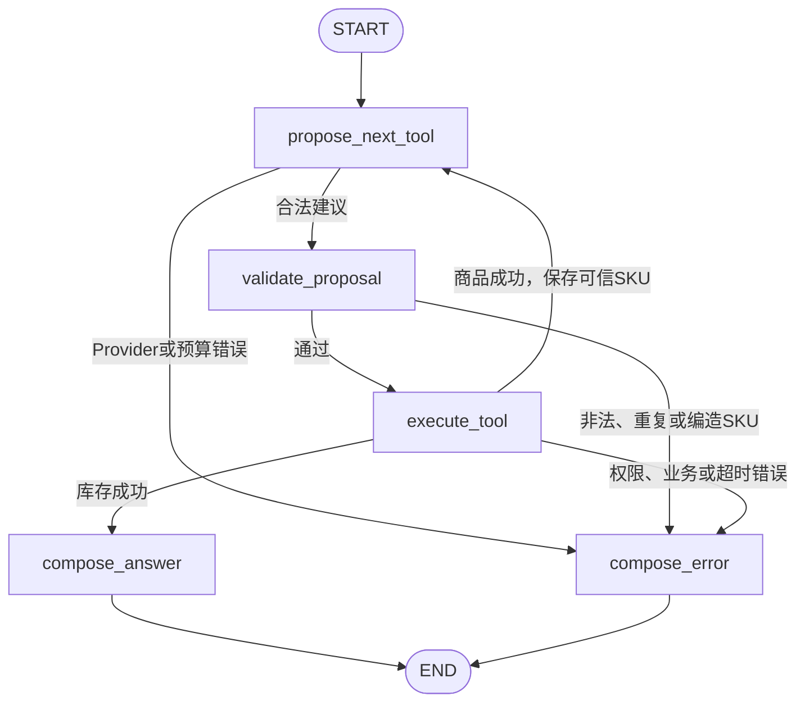

# M1库存查询垂直切片（已完成）

> 当前项目已经完成“库存查询垂直切片”M1-01至M1-21。
>
> M1新后端入口是`app.main:app`；下方原README暂时保留，用于说明旧`agent/api/tools`原型，不能作为M1启动说明。

## M1当前可运行范围

截至M1-21，项目具备：

- 可导入的FastAPI新入口和会检查数据库的`/health`接口；
- 集中的M1环境变量配置；
- Docker Compose管理的单个PostgreSQL服务；
- SQLAlchemy连接管理、请求级事务提交/回滚和连接释放；
- Alembic管理的租户、用户、角色和市场范围表结构；
- Alembic管理的商品、SKU、规格、仓库和库存快照表结构；
- Alembic管理的会话、消息摘要、Agent运行、Tool审计和数据库Evidence表结构；
- 版本化的`m1-v1`合成演示数据、可重复Seed脚本和结果manifest；
- 严格的认证、聊天、商品、库存、Evidence、Tool成功/失败和公共错误Pydantic Schema；
- 使用固定参数化SELECT、租户/市场过滤和数据库超时的商品与库存Repository；
- 将商品词安全解析为唯一SKU和规格，并明确处理未找到、歧义和内部数据异常的商品Service；
- 从最新库存快照计算可售数量、映射安全错误，并在成功返回前写入数据库Evidence的库存Service；
- 使用Argon2密码哈希验证、短期签名JWT、数据库身份刷新和请求隔离RunContext的认证内核；
- 严格只登记两个只读Tool的版本化ToolRegistry，以及检查Tool、tenant、角色和市场范围的PermissionGuard；
- 限制模型/Tool次数、重复调用和总时间的ExecutionBudget，以及持久化AgentRun/ToolCall的基础Trace与同步Harness执行外壳；
- 通过Harness调用真实商品/库存Service并返回统一ToolEnvelope的两个正式Agent Tool；
- 不联网的确定性Mock Provider，以及只返回当前白名单内强类型Tool调用建议的Qwen Provider边界；
- 五节点LangGraph库存流程：审核Tool建议、执行Harness、保存可信SKU、返回库存Evidence或安全错误；
- 版本化FastAPI登录、当前身份、会话、同步聊天和Evidence详情接口；
- 会话所有权、Evidence租户/市场范围、统一HTTP错误、请求级提交/回滚、OpenAPI和CORS保护；
- 最小Next.js桌面端页面：登录、会话、自然语言提问、执行状态、回答和数据库Evidence侧栏；
- 只保存在当前浏览器内存中的登录Token、键盘发送规则、加载/错误/空状态和合成演示数据标识；
- M1基础配置、导入边界和真实PostgreSQL集成测试；
- 覆盖成功、跨市场拒绝、无效Token和PostgreSQL中断的Playwright Chromium端到端回归，以及零库存、无记录、商品歧义和数据库超时API集成测试；
- 只通过公开HTTP接口执行健康检查、DE成功查询、Evidence核验和FR越权拒绝的安全演示脚本。

执行本页Seed命令后，PostgreSQL会包含四个演示账号、蘑菇灯商品、DE/FR仓库和库存快照。当前可以通过网页或HTTP完成登录、创建会话、自然语言查询和Evidence查看；标准问题通过Mock依次调用`get_product_spec`和`search_inventory`，返回DE-FRA可售125、数据时间和数据库Evidence。M1已经用真实Chromium、Next.js生产构建、FastAPI和PostgreSQL验证这条链路及故障矩阵，并从全新PostgreSQL数据卷复现迁移、Seed和公开API演示。真实Qwen调用需要另行配置API Key并显式运行付费冒烟测试。

## M1本地准备

建议环境：Python 3.11、Node.js 20.9或更高版本、npm，以及支持Compose的Docker Desktop。首次准备时先确认：

```powershell
python --version
node --version
npm --version
docker version
docker compose version
```

### 1. 安装Python开发依赖

```powershell
py -3.11 -m venv .venv
.venv\Scripts\python.exe -m pip install -r requirements-dev.txt
```

如果`.venv`已经存在，不要重复创建，直接执行第二条安装命令。

### 2. 准备本地环境变量

如果仓库还没有`.env`，复制模板：

```powershell
Copy-Item .env.example .env
```

如果`.env`已经存在，不要直接覆盖；请对照`.env.example`补充M1配置。真实密码和API Key禁止提交Git。

### 3. 启动PostgreSQL

```powershell
docker compose up -d postgres
docker compose ps
```

`STATUS`显示`healthy`表示PostgreSQL已经能够接受连接。进一步验证：

```powershell
docker compose exec -T postgres pg_isready -U deep_search_app -d deep_search_pro
```

本项目默认把宿主机`127.0.0.1:5433`映射到容器内的标准`5432`，避免与本机其他PostgreSQL项目占用的`5432`冲突，并避免把开发数据库暴露给局域网。应用应使用`.env.example`中的`DATABASE_URL`连接`127.0.0.1:5433`；明确使用IPv4也能避免部分Windows环境把`localhost`优先解析到未绑定的IPv6地址。

### 4. 升级数据库结构

```powershell
.venv\Scripts\python.exe -m alembic upgrade head
.venv\Scripts\python.exe -m alembic current
```

`current`显示`20260828_0003 (head)`，表示M1计划的14张业务表已经全部建立：四张身份表、五张商品库存表和五张运行/Evidence表。Alembic从应用的`DATABASE_URL`读取数据库地址，密码不会写进`alembic.ini`。

`alembic downgrade 20260828_0002`只回退M1-06运行/Evidence表，继续回退到`0001`会删除商品库存表，回退到`base`会继续删除身份表。这些命令只用于迁移验证，正常开发不要随意执行；回退会删除对应表中的Seed数据，需要重新升级并运行Seed。

库存表只保存`on_hand`、`reserved`和`unsellable`等原始数量，不重复保存`available`。`InventoryService`统一按照`available = on_hand - reserved - unsellable`计算可售库存。

M1 Evidence表目前只允许`database`来源，并强制`synthetic_data=true`。Tool参数、查询条件和访问范围只预留结构化JSON摘要，不保存数据库连接串、原始SQL或无限制的完整模型输入输出。

### 5. 生成M1合成演示数据

```powershell
.venv\Scripts\python.exe -m scripts.seed_m1
```

Seed就是“把固定的演示样本装进数据库”。这条命令可以重复执行：已有数据与`m1-v1`定义一致时只做核对，不会重复增加SKU或库存；已有数据被手工改坏时会明确报冲突，不会悄悄覆盖。输入定义在`data/seed/m1_seed.json`，执行结果摘要在`data/seed/m1_manifest.json`。

四个本地演示账号共用`.env`中的`M1_DEMO_PASSWORD`，模板默认值为`M1-demo-only-change-me`，只限本地演示。数据库不保存这个明文，只保存Argon2密码哈希：

| 账号 | 角色 | 市场范围 |
|---|---|---|
| `owner@demo.deepsearch.local` | 公司负责人 | DE、FR |
| `scout@demo.deepsearch.local` | 选品人员 | DE、FR |
| `de.operator@demo.deepsearch.local` | Amazon运营 | DE |
| `fr.operator@demo.deepsearch.local` | Amazon运营 | FR |

关键演示事实是：`LR-TL-MUSH-OR01`在`DE-FRA`仓期末150、预留20、不可售5，因此可售库存为125；数据时间为`2026-08-28T06:00:00Z`，等于德国夏令时`08:00`。这些数据全部是合成演示数据，不代表真实Amazon经营数据。

### M1严格数据合同

`app/schemas/`保存M1各层共用的Pydantic Schema。Schema可以理解成后端的数据安检规则：字段缺失、非法SKU、非法市场、仓库与市场不一致、未知字段、错误的库存公式或没有时区的时间都会在进入业务逻辑前被拒绝。

关键安全边界：

- 商品Tool输入只接受`product_query`，不接受前端或模型传入`tenant_id`；
- 库存Tool输入只接受合法SKU、`DE|FR`和匹配该市场的可选仓库代码；
- `InventoryIntent`不提供SQL、数据库连接或租户字段；
- 成功Tool结果必须有`data`且不能有`error`，失败结果必须有标准错误且不能夹带数据或Evidence ID；
- Error只允许固定错误码和安全公开字段，没有堆栈、连接串、API Key或原始SQL字段；
- 库存结果强制核对`available = on_hand - reserved - unsellable`；
- Evidence只允许M1数据库合成来源，并强制`synthetic_data=true`。

Schema本身只负责检查格式，不会读取PostgreSQL。Repository和Service负责固定数据库查询、库存计算、错误脱敏和Evidence；PermissionGuard已经在每次正式Tool执行前检查角色、租户和市场范围。

### M1受控Repository查询

Repository可以理解为“只会按照固定取货单去数据库取数据的工作人员”。它使用开发者预先写好的SQLAlchemy查询，调用方只能提供已经校验的租户、SKU、市场和仓库参数，不能提供SQL文本。

- `ProductRepository.find_candidates`先查租户内精确SKU，再查中文名、大小写不敏感的英文全名和受控别名；如果同一个宽泛名称命中多个SKU，会把所有候选交给后续Service判断，不自行猜测；
- `ProductRepository.list_specs`必须同时匹配租户和SKU变体ID，不能跨租户读取规格；
- `InventoryRepository.find_latest`固定带租户、SKU、市场、活动仓库和可选仓库代码；同一SKU在一个市场有多个仓库时，每个仓库只返回时间最新的一条快照；
- 查询参数由数据库驱动绑定，不拼接进SQL字符串；
- 每次查询通过`set_config`设置事务内`statement_timeout`，默认值由`.env`中的`DATABASE_STATEMENT_TIMEOUT_MS=2000`控制；
- Repository返回冻结的只读记录，不把SQLAlchemy ORM对象、Session或数据库连接交给上层；
- 库存记录故意不包含`available`，由`InventoryService`统一计算并生成Evidence。

Repository没有执行用户角色权限判断。未来PermissionGuard负责“当前用户能不能查DE”，Repository负责“即使允许查询，也只能在指定tenant和market内读取”。两层不能互相替代。

### M1商品规格Service

Service可以理解为Repository上面的“业务主管”。Repository只返回候选和原始规格，`ProductSpecService`负责把数量转换成业务结论：

```text
0个候选 → PRODUCT_NOT_FOUND
1个候选 → 读取规格并返回严格ProductSpecResult
多个候选 → AMBIGUOUS_PRODUCT，不擅自选择第一条
商品没有规格 → PRODUCT_NOT_FOUND并说明规格不可用
数据库事实不符合M1 Schema → 安全INTERNAL_ERROR
```

Service接收后端可信的`tenant_id`和已经通过Pydantic的`GetProductSpecInput`。使用当前Seed时，“蘑菇灯”会解析为`LR-TL-MUSH-OR01`，并返回color、diameter、height和voltage四条合成规格。

商品规格Service目前没有创建Evidence。库存Service已经支持使用调用方提供的真实`agent_run_id`和`tool_call_id`写入库存Evidence；正式运行标识仍要等后续Harness和Tool执行器产生，不能在商品Service中伪造。

### M1库存与Evidence Service

`InventoryService`接收后端可信的运行标识和已经通过Pydantic校验的库存参数。它不接收自然语言或SQL，而是按固定顺序工作：

```text
InventoryRepository读取最新快照
→ 无记录：INVENTORY_NOT_FOUND
→ 同一市场命中多个仓：要求补充warehouse_code
→ 唯一记录：available = on_hand - reserved - unsellable
→ InventoryResult再次校验公式、非负数量、时区和合成数据标记
→ EvidenceService写入并flush数据库Evidence
→ Evidence成功后才把库存结果返回上层
```

`flush`可以理解为“把本次证据先送到数据库检查并取得确认”，最终由M1-18 API请求最外层事务决定是否永久保存：整次请求成功才提交，任何后续步骤失败就整体回滚。Evidence记录包含库存快照定位、查询条件摘要、实际访问的tenant和市场、数据时间、完整库存结构及`synthetic_data=true`，不保存原始SQL或数据库连接串。

当前错误规则是：没有库存与库存为0是两件事，0库存仍返回成功；市场内多个仓库时不擅自相加或选第一条；PostgreSQL语句超时映射为可重试的`DATABASE_TIMEOUT`；其他数据库细节和驱动异常转换为安全错误。库存Tool、统一执行器、LangGraph和HTTP聊天接口现已接通。

### M1认证与RunContext

认证Service可以理解为“后端门卫”。它先用Argon2验证数据库中的密码哈希，再签发短期JWT。JWT是后端签名的临时身份证，M1只放入用户ID、租户ID、签发/过期时间和令牌编号，不放密码、角色或市场权限。

```text
规范化邮箱 + 密码
→ IdentityRepository固定查询PostgreSQL
→ Argon2验证密码哈希
→ 读取当前角色和市场范围
→ 签发60分钟JWT

后续请求携带JWT
→ 验证签名、有效期、签发方和用途
→ 再次查询PostgreSQL刷新账号状态、角色和市场范围
→ 建立不可变RunContext
```

RunContext保存当前`user_id`、`tenant_id`、角色、市场范围、`thread_id`和`trace_id`。`thread_id`是聊天会话编号，`trace_id`是一次执行的追踪编号。上下文使用Python `ContextVar`隔离，可以理解为每个并发请求各用一个身份抽屉，不使用会让不同用户串线的全局变量。

账号被禁用后，即使手里还有未过期Token，数据库刷新也会立即拒绝；角色或市场范围变化后，同一个Token会取得新范围。`POST /api/v1/auth/login`负责登录，`GET /api/v1/me`负责查看刷新后的当前身份。

### M1 ToolRegistry与PermissionGuard

ToolRegistry可以理解为“系统批准使用的工具白名单和说明书”。M1默认Registry严格只有：

| Tool | 输入Schema | 输出Schema | 版本 | 总超时 | 数据范围 | 副作用 |
|---|---|---|---|---:|---|---|
| `get_product_spec` | `GetProductSpecInput` | `ProductSpecResult` | 1.0.0 | 3000ms | tenant | read |
| `search_inventory` | `SearchInventoryInput` | `InventoryResult` | 1.0.0 | 3000ms | market | read |

PermissionGuard可以理解为“Tool执行前的门禁”。它按顺序检查：Tool是否登记、系统是否只读、目标tenant是否与登录tenant一致、当前角色是否允许，以及请求市场是否在RunContext的最新范围内。任何一项失败都返回安全`FORBIDDEN`，后续业务Service和PostgreSQL查询不应执行。

三类M1角色都可以使用两个查询Tool；负责人和选品人员的Seed市场范围为DE+FR，德国运营只有DE，法国运营只有FR。商品规格是租户公共目录，没有市场参数，所以`get_product_spec`检查Tool、只读、tenant和角色；库存是市场数据，所以`search_inventory`还必须检查市场范围。

Registry和PermissionGuard已经通过独立及真实Seed身份验证。两个正式Agent Tool绑定同一份Registry元数据和Harness执行外壳；M1-17 LangGraph与M1-18聊天API调用它们时，权限、预算和Trace固定发生在业务查询之前。

### M1 ExecutionBudget、Trace与Harness执行外壳

ExecutionBudget可以理解为“每次Agent任务的次数和时间额度”，Trace可以理解为“这次任务发生了什么的结构化审计单”。M1默认预算来自`.env`：

| 预算 | 默认值 |
|---|---:|
| 模型调用上限 | 2次 |
| Tool调用上限 | 2次 |
| 相同Tool+相同参数 | 1次 |
| 整次运行总时间 | 8000ms |
| 单个Tool时间 | Registry中各3000ms |

Harness执行顺序固定为：

```text
创建AgentRun Trace
→ 预留次数/检查总时间
→ 从Tool参数本身提取market_code
→ PermissionGuard检查
→ 创建running ToolCall
→ 执行确定性业务回调
→ 记录success/error/denied/timeout
→ 完成AgentRun
```

模型/前端不能另外传一份市场给权限系统，因此不会出现“权限检查DE、业务实际查询FR”的双参数不一致。重复调用使用Tool名称和脱敏参数摘要生成稳定签名；同一参数第二次调用会以`BUDGET_EXCEEDED`停止。

Trace只保存最多20个参数字段和有界值。包含`password/token/secret/api_key/authorization/connection/database_url/sql`等名称的字段统一写为`[REDACTED]`，未知异常只记录安全`INTERNAL_ERROR/Tool执行失败`，不保存原异常、密码、SQL或连接串。

`agent_runs/tool_calls`使用独立短事务持久化，因此业务事务回滚后失败审计仍可保留；成功Evidence可以引用已提交的ToolCall。M1同步执行器在回调前后检查单Tool和总时间，超时结果不会返回并应触发业务事务回滚；它不会用后台线程强行终止共享SQLAlchemy Session。数据库慢查询继续由PostgreSQL `statement_timeout`真正取消，未来Provider使用自身HTTP超时。

当前执行外壳已经承载M1-15的`get_product_spec`和`search_inventory`正式Agent Tool。

### M1两个正式Agent Tool

Agent Tool可以理解为“只向Agent开放的受控业务按钮”。它不接收SQL、不自己访问ORM，也不允许模型提供tenant；可信tenant来自RunContext，实际数据读取继续由Service和Repository完成。

```text
严格Pydantic Tool输入
→ Harness预算和权限检查
→ 正式Agent Tool适配层
→ 商品或库存Service
→ 固定Repository查询
→ PostgreSQL合成演示数据
→ 统一ToolEnvelope
```

`get_product_spec`接收商品名称或SKU，返回唯一SKU及规格；M1当前不为商品规格单独写Evidence。`search_inventory`接收SKU、市场和可选仓库，返回可售库存、库存快照时间，并在成功返回前生成关联当前AgentRun和ToolCall的数据库Evidence。

两个Tool都返回`ToolEnvelope`。成功盒子包含严格业务数据、工具名称、版本、耗时、trace ID、合成数据标志和可选Evidence ID；失败盒子只包含安全`ErrorDetail`，不会返回原始异常、SQL、密码或连接信息。正式Tool代码通过各自模块显式导入，`app.tools`包入口保持轻量，避免权限Registry加载时产生循环依赖。

Registry中的Tool描述明确包含“什么时候使用、返回什么、不做什么和限制条件”。`parameters`和`required`不手写第二份配置，而是由已登记的Pydantic `input_schema`生成：

| Tool | 必填参数 | 可选参数 | 关键限制 |
|---|---|---|---|
| `get_product_spec` | `product_query` | 无 | 接受名称、受控别名或SKU；不查询库存 |
| `search_inventory` | `sku`、`market_code` | `warehouse_code` | SKU必须已确认；市场仅DE/FR；多仓时必须指定仓库 |

生成的JSON Schema包含字段级中文`description`、`required`、SKU格式、市场枚举和`additionalProperties=false`。Tool描述用于帮助模型理解，不承担安全职责；权限、tenant、市场范围、次数和数据库入口仍由服务端代码强制控制。

### M1 Mock与Qwen Provider边界

Provider可以理解为“后端连接不同模型的翻译插座”。M1只允许它执行一个方法：根据自然语言和当前允许的Tool说明，返回一个受控调用建议；它不能执行Tool、Service、Repository或PostgreSQL。

```text
自然语言问题
→ ToolDecisionRequest（问题、当前白名单Tool、可选后端可信SKU）
→ MockProvider或QwenProvider
→ ToolCallProposal（一个Tool名称和对应强类型参数）
→ M1-17 LangGraph审核，M1-18 API触发执行
```

默认`LLM_PROVIDER=mock`，不联网、不收费。标准问题第一次稳定建议`get_product_spec(product_query=蘑菇灯)`；LangGraph取得可信SKU后，第二次稳定建议`search_inventory(sku=LR-TL-MUSH-OR01, market_code=DE, warehouse_code=null)`。只有用户明确给出`DE-FRA`这类仓库代码时才填写仓库，不能根据“德国仓”猜测具体仓库。

Qwen Provider使用OpenAI兼容的`/chat/completions` Function Calling，只发送ToolRegistry投影出的名称、详细描述和输入JSON Schema，并设置`tool_choice=auto`。模型返回后，后端再次检查Tool是否属于当前白名单，再用对应Pydantic输入Schema校验参数。请求显式设置`enable_search=false`，不包含Tool实例、tenant、角色、权限、数据库连接或SQL入口。默认网络超时为5秒；未登记/未授权Tool、非法参数、超时和HTTP失败统一转换为不泄露API Key或远端响应的安全错误。

真实Qwen冒烟测试默认跳过，避免日常测试误调用付费API。只有同时设置`RUN_QWEN_SMOKE=1`和`QWEN_API_KEY`时才会执行。Provider自身始终只会“提出建议”；M1-17已经由LangGraph在每次建议前预留ExecutionBudget，并把通过图状态检查的建议交给Harness受控执行。

### M1 LangGraph库存流程

M1-17已经把Provider建议、Harness和两个正式Tool接成五个显式节点：



商品名称路径最多使用两次模型建议和两个Tool；用户明确提供SKU时可直接调用库存Tool。模型自行编造的SKU、与商品Tool结果不一致的SKU、重复Tool、越权市场和预算超限都会在数据库执行前或受控Tool边界停止。回答由后端固定模板生成，库存数字不经过第三次模型自由改写。

### 6. 启动M1后端并检查数据库连接

```powershell
.venv\Scripts\python.exe -m uvicorn app.main:app --host 127.0.0.1 --port 8000
```

另开一个PowerShell窗口执行：

```powershell
Invoke-RestMethod http://127.0.0.1:8000/health
```

返回结果中的`database`为`connected`，表示请求已经通过FastAPI和SQLAlchemy执行了数据库`SELECT 1`检查。如果数据库不可用，接口返回HTTP 503和`database=unavailable`，不会把数据库密码返回给调用方。

### 7. 查看M1 HTTP接口

后端启动后打开`http://127.0.0.1:8000/docs`，可以在FastAPI自动生成的OpenAPI页面查看并调用：

- `POST /api/v1/auth/login`：使用演示邮箱和`M1_DEMO_PASSWORD`登录；
- `GET /api/v1/me`：携带Bearer Token查看当前身份和市场范围；
- `POST /api/v1/threads`：创建自己的聊天会话；
- `POST /api/v1/threads/{thread_id}/messages`：发送自然语言库存问题并等待完整回答；
- `GET /api/v1/evidence/{evidence_id}`：查看回答引用的数据库Evidence。

这些接口既可以由HTTP客户端直接调用，也已经被M1-19的Next.js页面使用。

### 8. 启动M1前端

保持后端运行，另开一个PowerShell窗口执行：

```powershell
Set-Location frontend
npm ci
npm run dev
```

然后在浏览器打开`http://localhost:3000`。默认后端地址是`http://127.0.0.1:8000/api/v1`；如需修改，可先把`frontend/.env.example`复制为`frontend/.env.local`并调整`NEXT_PUBLIC_API_BASE_URL`。

请使用页面中的合成演示账号，密码来自根目录`.env`中的`M1_DEMO_PASSWORD`。登录后可以直接发送“德国仓蘑菇灯还有多少可售库存？”，中间区域显示回答和执行状态，右侧显示数据库Evidence。页面刷新后需要重新登录，因为M1有意不把Token长期保存在浏览器中。

前端常用检查命令：

```powershell
npm run typecheck
npm run lint
npm test
npm run build
npm exec playwright install chromium
npm run test:e2e
```

`npm run test:e2e`会先执行Next.js生产构建，再以确定性Mock Provider启动真实FastAPI和Next.js服务，让Chromium完成四条端到端场景。测试会短暂停止并恢复本项目的PostgreSQL来验证安全错误，也会清理标题以`M1-20 E2E`开头的测试会话；因此请在本地开发数据库中运行，不要指向生产数据库，并确保3000和8000端口没有其他程序占用。

### 9. 运行固定的M1公开API演示

保持后端和PostgreSQL运行，在仓库根目录的新PowerShell窗口执行：

```powershell
.venv\Scripts\python.exe -m scripts.demo_m1
```

脚本会按固定顺序完成：

```text
健康检查确认PostgreSQL已连接
→ 德国运营登录并刷新当前身份
→ 创建DE演示Thread
→ 自然语言查询德国仓蘑菇灯
→ 核对回答、SKU、DE-FRA、可售125和数据库Evidence
→ 法国运营登录并创建自己的Thread
→ 查询德国仓并确认得到FORBIDDEN
```

成功时终端会看到类似结果：

```text
M1 public API demo passed.
Health: Deep Search Pro M1 / database connected
DE answer: ...可售库存为125件...合成演示数据...
Evidence: LR-TL-MUSH-OR01 / DE-FRA / available 125
Evidence source: inventory_snapshots/{合成快照UUID}
FR-to-DE permission check: FORBIDDEN (expected)
Data notice: synthetic demo data only.
```

脚本不会打印登录密码、JWT Token、数据库连接串或原始SQL。它只调用公开HTTP接口，不直接读取PostgreSQL；每次运行会新增两个演示Thread，并保留成功查询的审计与Evidence，便于现场讲解完整调用链。

面试演示时建议按“身份范围→自然语言问题→两个受控Tool→125如何计算→右侧Evidence→FR越权拒绝→Trace和限制”顺序讲解，不要把Mock说成真实千问，也不要把合成数据说成真实Amazon库存。

### 10. 可选：从完全空的本地数据库复现

下面操作会永久删除名为`deep-search-postgres-data`的本项目本地数据卷，只适合全部数据都是可重新生成的合成演示数据时使用。不要把`.env`指向生产数据库，也不要把卷名改成其他项目的卷：

```powershell
docker compose down
docker volume rm deep-search-postgres-data
docker compose up -d --wait postgres
.venv\Scripts\python.exe -m alembic upgrade head
.venv\Scripts\python.exe -m scripts.seed_m1
.venv\Scripts\python.exe -m alembic current
```

最后一条命令应显示`20260828_0003 (head)`。再启动后端并运行第9节演示脚本，即可验证从空数据卷到完整M1查询链路的恢复过程。

### 11. 停止与数据保留

```powershell
docker compose stop postgres
```

再次执行`docker compose up -d postgres`会使用命名卷`deep-search-postgres-data`中的原数据。

`docker compose down`会删除容器和网络，但默认保留命名卷。不要执行`docker compose down -v`，除非明确需要删除本地数据库数据。

---

## 旧教学原型说明

<p align="center">
  <h1 align="center">🤖 Deep Search Pro</h1>
  <p align="center"><b>一个轻量的多智能体协作系统 —— Agent 开发入门实战项目</b></p>
  <p align="center">
    
    
    
    
    
  </p>
</p>

---

## 🎯 这个项目是什么

这是一个 **不到 1000 行代码** 的 AI Agent 学习项目。它用最精简的方式展示了如何基于 LangChain 生态构建一个**多智能体协作系统**——一个"主智能体"像团队负责人一样调度三个"子智能体"（网络搜索、数据库查询、知识库检索）来协同完成复杂任务。

**如果你是以下人群，这个项目就是为你准备的 👇**

- 正在学习 LangChain / LangGraph，想找一个**完整的、能跑起来的**实战项目
- 对 "多智能体编排" 感兴趣，但不想一上来就看复杂的 AutoGPT / CrewAI 源码
- 想理解 **FastAPI + WebSocket + Agent** 怎么组合成一个真实可用的系统
- 面试前需要一个 AI Agent 项目来充实简历，并且能讲清楚每个设计决策

---

## 🧠 你能从这个项目中学到什么

| 知识点 | 具体体现在项目哪里 |
|--------|------------------|
| **Orchestrator 多智能体模式** | `agent/main_agent.py` — 主智能体如何调度 3 个子智能体 |
| **Prompt Engineering 实战** | `prompt/prompts.yml` — 如何用 system_prompt 约束 Agent 行为 |
| **LangChain @tool 自定义工具** | `tools/` 目录 — 6 个工具函数的完整写法 |
| **FastAPI 异步 + 后台任务** | `api/server.py` — `asyncio.create_task` 非阻塞执行 |
| **WebSocket 实时推送** | `api/monitor.py` — 工具调用进度实时推送到前端 |
| **ContextVar 协程级数据隔离** | `api/context.py` — 多用户并发时不串台 |
| **Agent 文件操作安全** | `utils/path_utils.py` — 12 种路径场景的防护 |
| **RAG 知识库对接** | `tools/ragflow_tools.py` — RAGFlow SDK 实战 |
| **数据库自然语言查询** | `tools/db_tools.py` — Agent 自动写 SQL 并执行 |

---

## 🏗️ 架构一览

整个项目只有 6 个核心模块，非常适合逐模块阅读学习：

```
用户请求 (POST /api/task)
    │
    ▼
api/server.py          ← 入门的第一个文件：FastAPI 的路由和 WebSocket
    │
    ▼
agent/main_agent.py    ← 核心：主智能体如何创建、如何异步流式执行
    │
    ├──→ 子智能体 1: 网络搜索     (tools/tavily_tool.py)
    ├──→ 子智能体 2: 数据库查询   (tools/db_tools.py)
    ├──→ 子智能体 3: RAGFlow知识库 (tools/ragflow_tools.py)
    │
    └──→ 主智能体自己调: 生成Markdown → 转PDF
    │
    ▼ (每个步骤都通过 WebSocket 实时推送)
api/monitor.py         ← 埋点监控 + 事件循环归属判断
    │
    ▼
前端收到实时进度："正在搜索网络..." → "正在查数据库..." → "正在生成文档..."
```

### 数据流说明

1. 用户通过 `POST /api/task` 发一个自然语言请求
2. 主智能体分析需求，决定调用哪些子智能体
3. 子智能体各司其职，去搜网络 / 查数据库 / 翻知识库
4. 主智能体拿到所有信息后，汇总成一份 Markdown 报告（或转 PDF）
5. 整个过程通过 WebSocket 实时推到前端，前端能看到每一步进度

---

## 🚀 5 分钟跑起来

### 环境要求

- Python 3.10+
- 一个 OpenAI 兼容的 LLM API Key（阿里云百炼 / DeepSeek / OpenAI 都可以）
- Tavily API Key（[免费额度注册](https://tavily.com)）

> 📌 数据库和 RAGFlow 是**可选的**，不配也能跑 —— 主智能体会自动跳过没有的服务。

### 第一步：克隆 + 装依赖

```bash
git clone https://github.com/你的用户名/deep-search-pro.git
cd deep-search-pro
pip install -r requirements.txt
```

### 第二步：配环境变量

```bash
cp .env.example .env
```

编辑 `.env`，最少只需要填 3 个：

```env
# 必填：LLM 服务（以阿里云百炼为例）
OPENAI_BASE_URL=https://dashscope.aliyuncs.com/compatible-mode/v1
OPENAI_API_KEY=your-openai-api-key
LLM_QWEN_MAX=qwen-max

# 必填：网络搜索
TAVILY_API_KEY=your-tavily-api-key

# 以下可选，不填就只影响对应功能
# RAGFLOW_API_URL=...
# MYSQL_USER=...
```

### 第三步：启动

```bash
python api/server.py
```

访问 `http://localhost:8000/docs` 能看到 Swagger 文档，直接在页面上试。

### 第四步：试一试

```bash
curl -X POST http://localhost:8000/api/task \
  -H "Content-Type: application/json" \
  -d '{"query": "搜索一下最近AI Agent领域的最新进展"}'
```

同时在浏览器打开 WebSocket `ws://localhost:8000/ws/{返回的thread_id}`，就能看到实时推送的进度消息。

---

## 📖 推荐阅读顺序

如果你是第一次接触 AI Agent 项目，建议按这个顺序读代码：

| 顺序 | 文件 | 重点看什么 |
|------|------|-----------|
| 1️⃣ | `agent/llm.py` | 只有 10 行，看 LLM 怎么初始化的 |
| 2️⃣ | `prompt/prompts.yml` | 看系统提示词怎么写，怎么约束 Agent 行为 |
| 3️⃣ | `agent/subagents/network_search_agent.py` | 最简单的子智能体，理解"子智能体 = 字典配置" |
| 4️⃣ | `tools/tavily_tool.py` | 一个完整的 @tool 怎么写，埋点怎么做 |
| 5️⃣ | `agent/main_agent.py` | **核心**：主智能体怎么创建、怎么 orchestrate、怎么流式执行 |
| 6️⃣ | `api/server.py` | FastAPI 怎么和 Agent 结合，异步任务怎么触发 |
| 7️⃣ | `api/monitor.py` | WebSocket 实时推送，事件循环归属判断 |
| 8️⃣ | `api/context.py` | ContextVar 为什么比全局变量好 |
| 9️⃣ | `utils/path_utils.py` | Agent 文件安全——边界场景大全 |

---

## 📁 项目文件速查

```
deep_search_pro/
│
├── agent/                          # 🤖 智能体层（核心）
│   ├── llm.py                      # 模型初始化，10 行
│   ├── prompts.py                  # YAML 提示词加载
│   ├── main_agent.py               # ★ 主智能体 + 异步执行引擎
│   └── subagents/                  # 子智能体（每个就是一个字典）
│       ├── network_search_agent.py
│       ├── database_query_agent.py
│       └── knowledge_base_agent.py
│
├── api/                            # 🌐 Web 接口层
│   ├── server.py                   # FastAPI 入口
│   ├── context.py                  # ContextVar 协程隔离（带详细注释）
│   └── monitor.py                  # 监控 + WebSocket 连接池
│
├── tools/                          # 🔧 工具函数（6 个 @tool）
│   ├── tavily_tool.py              # 网络搜索
│   ├── db_tools.py                 # 数据库查询 3 件套
│   ├── ragflow_tools.py            # RAGFlow 知识库检索
│   ├── markdown_tools.py           # 生成 Markdown
│   ├── pdf_tools.py                # Markdown → PDF
│   └── upload_file_read_tool.py    # 读取上传文件
│
├── utils/                          # 🛠 工具层
│   ├── path_utils.py               # 路径安全解析（12 种场景）
│   └── word_converter.py           # Word COM 引擎
│
├── rawflow/                        # 📚 RAGFlow SDK 独立示例
├── prompt/prompts.yml              # 提示词配置
├── requirements.txt                # 依赖清单（版本锁定）
└── .env.example                    # 环境变量模板
```

---

## 🧪 练手建议：你可以这样改造

项目的设计刻意保持简洁，给你留了很多动手空间。以下是一些建议的改造方向，难度递进：

### 入门级（加深理解）

- [ ] **换个模型**：把通义千问换成 DeepSeek 或 GPT，改 `.env` 一行就行
- [ ] **加一个子智能体**：比如"天气查询助手"或"代码执行助手"，体验一下加子智能体要多改几行代码
- [ ] **改 system_prompt**：把"空调公司"改成你自己的业务场景，看看 Agent 行为怎么变化

### 进阶级（工程能力）

- [ ] **把 InMemorySaver 换成 SqliteSaver**：让对话历史持久化，重启不丢失
- [ ] **加一个简单的 Web 前端**：用聊天界面替代 curl，WebSocket 显示实时进度条
- [ ] **给子智能体加"反思"机制**：让子智能体执行完后再自我检查一遍，提高准确性
- [ ] **加 JWT 认证**：给 `/api/task` 加上登录校验

### 挑战级（深入学习）

- [ ] **把 Word COM 换成 WeasyPrint**：摆脱 Windows 依赖，让 PDF 转换在 Linux 上跑
- [ ] **用 LangGraph 的 checkpointer 实现"人工审批节点"**：敏感操作需要用户确认才执行
- [ ] **给子智能体之间加"通信"**：让数据库子智能体和网络搜索子智能体能互相交换信息
- [ ] **Docker 化**：写 Dockerfile + docker-compose，一键启动所有依赖

---

## 🔧 技术栈

| 层级 | 技术 | 说明 |
|------|------|------|
| Agent 框架 | **deepagents** (LangChain 官方) | 多智能体编排，本项目核心依赖 |
| LLM 接入 | LangChain + OpenAI 兼容协议 | 一套代码适配多种模型 |
| Web 框架 | FastAPI + Uvicorn | 异步 HTTP + 原生 WebSocket |
| 搜索引擎 | Tavily API | AI 专用搜索，提供免费额度 |
| 知识库 | RAGFlow | 开源的 RAG 引擎，可以本地部署 |
| 数据库 | MySQL | 关系型数据库，Agent 自动写 SQL |
| 文档生成 | markdown + pywin32 | MD 生成 + Word COM 转 PDF |

---

## ❓ FAQ

### Q: 为什么选 deepagents 而不是自己写编排逻辑？

**A:** 自己写编排要处理状态管理、tool_call 路由、流式输出、错误恢复等一堆事。`deepagents` 把这些都封装好了，你只需要定义子智能体的 name / description / tools，框架帮你调度。对学习来说，先理解"用框架能做什么"，之后再看源码理解"框架怎么做的"。

### Q: 没有 RAGFlow 和 MySQL，项目还能跑吗?

**A:** 能。主智能体会根据 system_prompt 判断只有"网络搜索"可用，自动跳过另外两个子智能体。只配 LLM + Tavily 就能体验完整链路。当然功能会受限——这就是刻意设计的"优雅降级"。

### Q: 为什么用 ContextVar 而不是全局变量？

**A:** FastAPI 下多个请求跑在同一个线程的不同协程里。如果用全局变量，用户 A 的数据会被用户 B 覆盖（串台）。ContextVar 是 Python 为 asyncio 设计的协程级变量，每个请求链路互不干扰。`api/context.py` 里有详细注释解释这个问题。

### Q: 项目为什么不到 1000 行？

**A:** 故意的。这是给学习用的项目，不是给生产用的。每个模块只做一件事，代码量少才容易看懂。如果你能把这 1000 行都读明白，多智能体 Agent 的核心概念就掌握了。

---

## 📄 License

MIT License —— 随便用，改，分叉。如果你基于这个项目做了有趣的东西，欢迎提 PR 或者告诉我 😄
