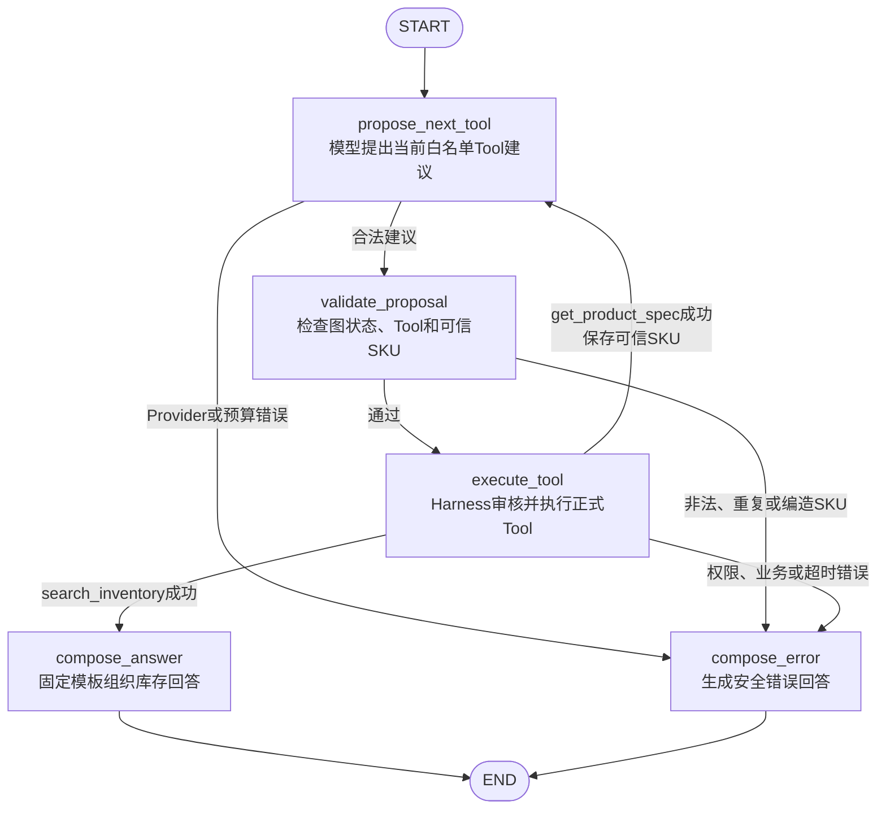

# M1-16 至 M1-17：模型 Provider 与 LangGraph

> 本文件保存从迁移前单文件中拆出的完整历史方案、实施日志与验证证据。
> 当前状态和阅读入口见 [M1入口](../M1_INVENTORY_QUERY.md)。

### 2026-08-28｜M1-16｜建立Mock和Qwen Provider边界

**状态：原始意图合同已被下方“受控Tool调用建议”补充修正取代**

> 验证失效说明：本节记录首次实现时的真实情况，但其中“Provider只返回`InventoryIntent`”“Qwen不发送Tool”和142项测试结论不再代表当前代码。用户评审后已明确改为“模型提出Tool调用、LangGraph与Harness审核、后端受控执行”；当前有效实现与验证以下方补充记录为准。

**本步解决的问题**

M1-15已经有两个可受控调用的正式Tool，但系统还不能把“德国仓蘑菇灯还有多少可售库存？”转换成严格商品词、市场和可选仓库参数。本步建立单一职责`ModelProvider`接口、默认离线`MockProvider`和Qwen结构化输出适配器。Provider只能返回`InventoryIntent`，没有Tool、数据库、权限或SQL执行能力。

**输入、输出和上下游**

- 输入：经过`InventoryIntentRequest`校验的单条自然语言问题，最长4000字符；
- 输出：严格`InventoryIntent`，只包含固定`inventory_query`、`product_query`、`DE|FR`和可选精确仓库代码；
- 上游：未来M1-17 LangGraph分类/提取节点及M1-14模型调用预算；
- 下游：M1-17根据意图固定调用M1-15两个Tool；
- 本步不接收RunContext、tenant、角色、数据库Session、Repository、ToolRegistry或Tool实例，也不调用PostgreSQL。

**用大白话解释运行过程**

Provider像“后端和不同模型之间的翻译插座”，只把一句话整理成固定表格：

```text
“德国仓蘑菇灯还有多少可售库存？”
→ InventoryIntentRequest检查长度和额外字段
→ Mock或Qwen只做意图/参数提取
→ 本地Pydantic再次检查
→ {
     intent: inventory_query,
     product_query: 蘑菇灯,
     market_code: DE,
     warehouse_code: null
   }
→ 停止；本步不调用Tool或数据库
```

用户只说“德国仓”时，Provider只能确定市场DE，不能猜成DE-FRA；只有问题明确包含`DE-FRA`时才填写具体仓库。

**技术决定与边界**

- `ModelProvider`在M1只暴露一个异步方法`parse_inventory_intent`。异步表示等待外部HTTP时可以释放执行权，不代表本步已经实现SSE、后台任务或并行Tool；
- 默认`LLM_PROVIDER=mock`。Mock使用小范围确定性规则，只覆盖M1演示商品、DE/FR和精确仓库代码，不联网、不收费；相同输入返回相同结果；
- Mock拒绝非库存问题、缺少市场、同时包含DE和FR、未知商品以及包含受控SQL攻击标记的问题，统一返回安全`PROVIDER_ERROR`；它不是通用中文NLP模型；
- Qwen通过独立`QwenProvider`调用OpenAI兼容`/chat/completions`，直接使用`httpx`而不让业务代码实例化模型SDK。选择直接HTTP是为了让测试精确检查请求中没有Tool和数据库字段，未来仍可在Provider内部替换SDK而不影响LangGraph；
- Qwen请求使用`response_format.type=json_schema`、`strict=true`和Pydantic生成的`InventoryIntent` JSON Schema；远端返回后仍调用`InventoryIntent.model_validate_json`本地复检，不相信远端“已经严格”的声明；
- 请求显式`enable_search=false`、`stream=false`且不包含`tools/tool_choice`。系统提示明确禁止SQL、Tool、tenant、角色和权限操作；模型只收到系统约束和用户问题；
- 按阿里云结构化输出建议不设置`max_tokens`，避免JSON被截断；M1意图请求温度为0，网络超时默认5秒并限制在1至30秒；本步无自动重试，防止一次用户请求产生不受控模型调用；
- Base URL必须是无用户名、密码、查询参数和片段的HTTPS地址；API Key必须为非空`SecretStr`，只进入Authorization请求头；Settings和QwenProvider构造边界都会拒绝空白Key；
- 超时转换为可重试`PROVIDER_ERROR`，401等调用错误为不可重试，429/5xx为可重试；远端响应正文、请求异常、API Key和原始非法JSON均不进入公开错误；
- `app/llm/`静态禁止导入`app.db/app.models/app.repositories/app.runtime/app.services/app.tools/sqlalchemy`，从模块依赖层证明Provider没有数据库或Tool入口；
- `QwenProvider`目前仍是专门的库存意图提取器，严格输出Schema不能表达`unsupported`。Mock可以对非库存问题抛`unsupported_question`；M1-17必须在调用Qwen前增加非目标问题判定，或者扩展独立路由合同，不能让Qwen把任意问题硬套成库存意图；
- M1-14的`reserve_model_call`尚未接到Provider调用前，接线必须由M1-17统一完成；Provider自身不拿Harness，避免模型层反向控制运行预算或Tool；
- 真实Qwen冒烟默认跳过。只有开发者同时设置`RUN_QWEN_SMOKE=1`和`QWEN_API_KEY`才发起可能计费的外部调用；普通全量测试永不因开发者只有API Key而自动扣费。

**官方接口核对**

- 阿里云官方`qwen3.8-max`页面确认模型调用ID为`qwen3.8-max`，支持Function Calling和结构化输出：<https://help.aliyun.com/zh/model-studio/qwen3-8-max>；
- 阿里云结构化输出文档确认JSON Schema模式使用`response_format={type: json_schema, json_schema: {strict: true, schema: ...}}`，推荐`additionalProperties=false`，并建议结构化输出时不要设置`max_tokens`：<https://help.aliyun.com/zh/model-studio/qwen-structured-output>；
- 阿里云OpenAI兼容Chat文档说明`tools`会赋予模型Function Calling选择能力。本步请求故意不发送该字段，并关闭联网搜索：<https://help.aliyun.com/zh/model-studio/qwen-api-via-openai-chat-completions>。

**修改文件与职责**

- `app/llm/provider.py`：最小`ModelProvider`协议和Mock/Qwen工厂；
- `app/llm/schemas.py`：严格、限长且禁止额外字段的自然语言请求；
- `app/llm/mock.py`：离线确定性M1意图提取及不支持问题拒绝；
- `app/llm/qwen.py`：Qwen严格JSON Schema请求、HTTP超时、安全错误和本地复检；
- `app/llm/__init__.py`：导出M1 Provider公共接口；
- `app/core/errors.py`：增加不支持问题、超时、不可用和非法输出四种内部原因，共用公开`PROVIDER_ERROR`；
- `app/core/config.py`、`.env.example`：校验模型名、安全HTTPS Base URL和1至30秒Qwen超时，默认5秒；
- `requirements.txt`：把实际使用的`httpx`声明为直接运行依赖，不依赖其他包偶然传递安装；
- `tests/unit/test_providers.py`：验证Mock、严格Qwen请求、非法输出、超时、HTTP错误、工厂、配置和静态隔离；
- `tests/smoke/test_qwen_provider_smoke.py`：必须显式开启且有Key才运行的真实Qwen冒烟；
- `tests/unit/test_app_baseline.py`：清理新增Qwen超时环境变量，避免开发Shell污染配置测试；
- `README.md`、`docs/progress/M1/M1_INVENTORY_QUERY.md`、`docs/PROJECT_PROGRESS.md`：记录Provider边界、实际验证和M1-17前停止点。

**调用链位置**

```text
前端（未经过）
→ API（未经过）
→ InventoryIntentRequest Schema
→ ModelProvider（本步）
   ├─ MockProvider（默认、离线）
   └─ QwenProvider（可选外部模型）
→ InventoryIntent Schema
→ LangGraph（未经过，M1-17）
→ Harness/Tool/Service/Repository/Model/PostgreSQL（本步全部未经过）
```

这里的Qwen是外部大模型，不是固定主链中代表数据库表的ORM Model。本步是主业务链旁边的意图解析支路。

**验证方法与实际结果**

1. Mock对标准问题连续两次得到完全相同的`inventory_query/蘑菇灯/DE/null`；“德国仓”没有被猜成DE-FRA；
2. Mock正确解析明确SKU+DE-FRA、法国仓以及FR-CDG英文库存表达；
3. 非库存问题、缺市场、DE/FR冲突、SQL攻击文本和未知商品均得到安全`unsupported_question/PROVIDER_ERROR`；
4. 请求Schema拒绝空问题、超过4000字符和额外`sql`字段；
5. Qwen MockTransport实际截获请求：URL为`.../chat/completions`，模型为`qwen3.8-max`，严格JSON Schema和`additionalProperties=false`存在，属性只有intent/product_query/market_code/warehouse_code；没有tools、tool_choice、sql或tenant字段，联网搜索为false；
6. 合法远端JSON通过本地Pydantic得到DE意图；非JSON、额外sql字段和US市场全部转换为安全`ProviderOutputError`，不保留原内容；
7. 注入包含Authorization、测试Key和SQL文本的ReadTimeout，公开错误只保留安全超时信息；
8. 401映射不可重试，429和503映射可重试；远端含数据库连接、API Key和DROP TABLE的响应正文没有进入公开错误；
9. 工厂默认构建Mock；Qwen模式在Settings和Provider层要求非空API Key，并能构建/关闭自有HTTP客户端；空白Key、非HTTPS、URL凭据/查询参数和0.5秒非法超时被配置校验拒绝；
10. AST静态导入检查确认`app/llm/`没有数据库、ORM、Repository、Runtime、Service、Tool或SQLAlchemy依赖；
11. Provider专项21项通过；真实Qwen冒烟1项因未同时设置显式开关和API Key而按设计跳过，没有发起付费网络请求；
12. 全量`pytest -q`共142项通过、1项跳过；Ruff通过且80个Python文件格式正确；Mypy检查51个`app/scripts`文件无类型问题；编译与`pip check`通过；
13. Mock命令行实跑得到严格DE意图；Windows终端把中文产品词显示为乱码，但测试内存值和JSON断言确认仍为正确“蘑菇灯”，属于终端显示编码而非业务数据损坏；
14. PostgreSQL 17.11容器健康，Alembic仍为`20260828_0003 (head)`且无迁移差异；M1-16没有数据库模型变化；
15. 全量迁移测试结束时数据库按测试隔离恢复为空，随后重新执行确定性Seed成功，关键答案仍为125；最终数据库保留4个Seed用户，threads、agent_runs、tool_calls、evidences均为0，证明Provider验证没有写业务或审计数据；
16. 最终文档检查确认README、总进度和M1阶段记录的代码围栏均成对，内部相对链接目标均存在，`git diff --check`通过；Git状态只保留当前累计工作区变更，未提交或推送Git。Windows仅提示部分文本文件未来可能把LF转换为CRLF，不属于内容错误。

**能够证明**

- 没有Qwen Key时，Mock可以稳定、免费地把M1标准问题转换为严格意图参数；
- Qwen适配器只向外发送问题和意图JSON Schema，没有发送Tool清单或数据库能力；
- 模型返回额外SQL字段、非法市场、非JSON或异常响应时，不会产生可交给Tool的InventoryIntent；
- Provider层通过构造参数和静态导入同时隔离数据库、权限和Tool能力；
- 外部超时和错误不会把API Key、远端正文、SQL或连接信息传播给未来API；
- 默认测试不会联网或产生模型费用。

**不能证明**

- 真实Qwen在当前账号、地域和Base URL下能够调用；本次没有Key且没有显式开启付费冒烟；
- 真实Qwen对所有中文、英文、错别字和模糊仓库表达都能正确理解；严格Schema只能保证结构，不保证语义事实一定正确；
- 非库存问题在Qwen路径一定被正确路由为unsupported；当前Qwen输出合同只表达库存意图，M1-17必须补充前置路由或扩展路由Schema；
- Provider调用已经计入ExecutionBudget和AgentRun模型次数；M1-17才能通过Harness预留并记录；
- Provider已经自动调用两个Tool或访问PostgreSQL；它被设计为不能这样做；
- LangGraph、聊天API或前端自然语言闭环已经完成。

**常见问题与优先排查方向**

- Mock提示无法解析：检查问题是否同时包含库存词、唯一市场和M1演示商品；Mock不是通用模型，不要通过无限增加关键词把它扩成NLP系统；
- “德国仓”得到`warehouse_code=null`：这是正确安全行为，只能确定DE市场；只有明确`DE-FRA`才能填仓库；
- Qwen启动配置失败：检查`LLM_PROVIDER=qwen`时是否配置`QWEN_API_KEY`，Base URL是否为无凭据/查询参数的HTTPS地址；
- Qwen返回401：优先检查Key与地域/Workspace Base URL是否匹配，不要把Key写进日志或错误；
- Qwen返回429/503或超时：检查百炼配额、服务状态、5秒M1预算和网络；本步不自动重试，M1-17也必须受模型调用预算限制；
- Qwen返回非法Schema：检查所选模型是否支持JSON Schema结构化输出、请求是否仍使用strict模式，以及是否错误添加`max_tokens`截断JSON；禁止改成正则提取宽松文本绕过Pydantic；
- Provider意外开始调用Tool或数据库：静态边界测试应立即失败；不要把Session、Repository、Harness或ToolRegistry加入Provider构造函数；
- 全量测试后Seed用户为0：迁移隔离测试会恢复空库，按项目约定重新执行`.venv\Scripts\python.exe -m scripts.seed_m1`；
- 命令行中文显示乱码：先检查PowerShell/终端编码；以Pydantic对象断言和UTF-8文件内容为准，不要据显示乱码修改业务字符串。

**下一步**

该原始实现的下一步已被用户暂停；先完成下方M1-16补充修正，再重新等待M1-17授权。

### 2026-08-28｜M1-16补充修正｜Provider返回受控Tool调用建议

**状态：已完成**

**本步目标与用户确认**

用户确认采用“模型提出Tool调用 → LangGraph和Harness审核 → 后端受控执行Tool”的模式。本步只修正Provider合同，不实现LangGraph，不执行正式Tool，也不访问PostgreSQL。

**输入、输出和上下游**

- 输入：用户自然语言、当前图状态允许的1至2个安全`ModelToolSpec`，以及可选的后端已确认`resolved_sku`；
- 输出：`GetProductSpecToolCall`或`SearchInventoryToolCall`组成的强类型`ToolCallProposal`；
- 上游：未来M1-17 LangGraph根据当前节点从ToolRegistry选择允许展示的Tool；
- 下游：未来M1-17先复核图状态，再交给现有Harness执行；Provider本身到此停止；
- 模型只看见Tool名称、详细描述和输入JSON Schema，看不见Tool实例、允许角色、tenant、市场权限、超时、数据库连接或SQL入口。

**用大白话解释运行过程**

```text
用户：“德国仓蘑菇灯还有多少可售库存？”
→ Registry只拿出当前允许公开给模型的Tool说明书
→ Mock或Qwen建议 get_product_spec(product_query="蘑菇灯")
→ 后端检查Tool名称在白名单内、参数符合Pydantic
→ 停止；M1-16不执行Tool

未来M1-17执行商品Tool并得到可信SKU后：
→ 只提供search_inventory说明书和后端确认SKU
→ Provider建议search_inventory(sku、DE、可选仓库)
→ 再由LangGraph和Harness审核、执行
```

如果用户直接提供合法准确SKU，Provider可以建议直接调用`search_inventory`。真实Qwen没有返回Tool调用时映射为不支持问题；一次返回多个调用、返回未登记/本状态未授权Tool、非法参数或额外SQL字段时，全部映射为安全`ProviderOutputError`。

**修改文件与职责**

- `app/llm/schemas.py`：定义安全Tool说明、决策请求、两类强类型调用建议和白名单复检；
- `app/tools/registry.py`：把已登记Tool投影为仅含名称、描述、参数的不可执行模型说明；
- `app/llm/provider.py`：公共方法改为`propose_tool_call`；
- `app/llm/mock.py`：确定性模拟“先解析商品、再查库存”两轮建议，也支持明确SKU直查；
- `app/llm/qwen.py`：发送OpenAI兼容Function Calling定义，解析`tool_calls`并在本地再次校验；
- `app/llm/__init__.py`：导出新的公共合同；
- `app/core/errors.py`：将非法模型输出文案从“库存意图”修正为“Tool调用建议”；
- `tests/unit/test_providers.py`：覆盖两轮Mock、Registry安全投影、Qwen请求、白名单和非法输出；
- `tests/smoke/test_qwen_provider_smoke.py`：付费冒烟改为验证真实Qwen提出商品Tool；
- `.env.example`：把模型预算注释修正为最多两轮受控Tool建议，不改变既有数值；
- `README.md`、本阶段记录和总进度：同步当前有效架构、验证与停止点。

**调用链位置**

```text
前端（未经过）
→ API（未经过）
→ ToolDecisionRequest / ModelToolSpec Schema（本步）
→ ModelProvider（本步：只提出建议）
→ ToolCallProposal Schema（本步：本地复检）
→ LangGraph（未经过，M1-17）
→ Harness / Tool / Service / Repository / Model(ORM) / PostgreSQL（均未经过）
```

**验证方法与实际结果**

1. Mock对标准问题连续两次都建议`get_product_spec(product_query=蘑菇灯)`；得到后端可信SKU后只建议`search_inventory`，明确SKU问题可直接建议库存Tool；
2. Registry投影恰好只含`name/description/parameters`，商品参数必填`product_query`，库存必填`sku/market_code`，均为`additionalProperties=false`；序列化内容不含tenant、角色和超时策略；
3. Qwen MockTransport截获的请求只含本状态允许的Tool，使用`tool_choice=auto`且关闭联网搜索；不再使用已废弃的意图`response_format`；
4. Qwen返回合法调用后，后端生成对应Pydantic参数对象；未登记`execute_sql`、未授权`search_inventory`、额外`sql`、US市场、非JSON参数和一次多个调用均被拒绝；
5. 无Tool调用映射为安全不支持问题；超时、401、429和503继续保持脱敏及正确重试属性；
6. AST静态检查继续确认`app/llm/`没有数据库、ORM、Repository、Runtime、Service、正式Tool或SQLAlchemy依赖；
7. Provider专项28项通过，真实Qwen付费冒烟1项因未显式开启而跳过；
8. 全量`pytest -q`为149项通过、1项跳过；Ruff、Mypy 51个源文件、Python编译和依赖检查通过；
9. PostgreSQL 17.11保持健康，Alembic仍为`20260828_0003 (head)`且无迁移差异；全量测试后重新运行确定性Seed，最终用户4条、AgentRun/ToolCall/Evidence均为0，关键库存答案仍为125；
10. README、总进度与阶段文档代码围栏成对，内部链接存在，`git diff --check`通过；未提交或推送Git。

**能够证明**

- 模型现在真实看得到当前允许的Tool说明，并能返回可供后续图处理的强类型调用建议；
- Provider不能返回白名单外Tool，也不能通过参数夹带SQL、tenant或非法市场；
- Provider代码没有Tool执行实例、Harness、Service、Repository或数据库入口，因此“提出建议”和“实际执行”仍然隔离；
- Mock可以不联网、不收费地确定性覆盖未来M1-17需要的两轮决策。

**不能证明**

- LangGraph已经审核或执行建议；M1-17尚未开始；
- PermissionGuard、ExecutionBudget和Trace已经包住模型建议与完整图运行；这些接线属于M1-17；
- 自然语言已经查询出库存125；本步没有调用正式Tool、Service或PostgreSQL；
- 真实Qwen在当前账号可用或对所有自然语言表达都能正确选Tool；付费冒烟未运行；
- HTTP聊天接口和前端已经可用。

**风险与优先排查方向**

- 模型选错Tool：先检查LangGraph当前节点提供了哪些Tool、Registry描述是否准确，再检查模型响应；不得靠开放全部Tool解决；
- 模型参数被拒绝：检查对应Tool的Pydantic输入Schema，禁止改为接受任意字典；
- 已解析商品后SKU被模型改写：Provider当前会立即拒绝与`resolved_sku`不一致的建议；M1-17仍应保留图状态复核作为第二道防线；
- Provider出现数据库导入：静态边界测试应失败，数据库依赖必须留在Repository链路；
- 真实Qwen没有产生`tool_calls`：检查模型Function Calling支持、Tool描述和请求格式；不要把普通文本答案当成可执行调用。

**下一步**

用户已明确确认修正后的M1-16并授权进入M1-17；实际实现与验证记录如下。

### 2026-08-28｜M1-17｜实现LangGraph库存最小流程

**状态：已完成**

**本步解决的问题**

M1-16只能返回受控Tool建议，M1-14和M1-15的Harness/Tool也只能被测试代码分别调用。本步使用真实LangGraph把“提出建议、检查图状态、执行Tool、根据结果继续或停止、组织回答”装配成一条最多两轮的库存查询流程。它不是自由规划Agent，不允许模型自己添加节点或无限循环。

**输入、输出和上下游**

- 输入：可信`RunContext`和最长4000字符的`InventoryQueryInput.question`；
- 输出：严格`InventoryAgentResult`，包含终态、确定性回答、`trace_id`、AgentRun ID、Tool名称、Evidence ID、库存结果、安全错误和实际节点历史；
- 上游：M1-18聊天API将负责认证、创建会话并构造请求级依赖；
- 下游：Provider只提建议，Harness检查预算/权限/Trace，两个正式Tool调用Service、Repository、ORM和PostgreSQL；
- 成功业务事务仍由未来API层提交；图发生错误或未知异常时立即回滚当前业务Session，Trace使用独立事务保留终态。

**实际LangGraph节点和分支**



商品名称路径实际节点历史为：

```text
propose_next_tool → validate_proposal → execute_tool(get_product_spec)
→ propose_next_tool → validate_proposal → execute_tool(search_inventory)
→ compose_answer
```

明确SKU路径必须确认SKU原样出现在用户问题中，才能跳过商品Tool；模型自行编造一个格式合法但用户未提供的SKU会在`validate_proposal`被拒绝。商品Tool返回的可信`resolved_sku`还会同时经过Provider和图状态两层一致性检查。

**技术决定与边界**

- LangGraph真实编译5个业务节点，另有框架`START/END`；图结构测试直接读取`compiled_graph.get_graph()`并验证节点及Mermaid输出；
- 初始状态同时允许模型看到两个M1 Tool，便于识别“商品名称先解析”和“明确SKU直接查询”；得到商品SKU后只再开放`search_inventory`；
- `HarnessExecutor.reserve_model_call`固定在每次Provider调用之前，因此模型失败、次数上限和Trace计数不会绕开预算；
- 每次正式Tool调用仍经过M1-14的Tool次数、重复签名、PermissionGuard和ToolCall Trace；LangGraph不复制权限规则；
- 商品名称路径最多2次模型建议和2次Tool执行，明确SKU路径最多1次建议和1次库存Tool；没有Supervisor、Worker、Skill、Checkpoint或开放式规划循环；
- 回答使用后端确定性模板，库存数字直接来自`InventoryResult`和数据库Evidence，不使用第三次模型调用改写数字；
- Provider无适用Tool时进入`compose_error`，提示用户提供商品与DE/FR市场；商品未找到、歧义、库存缺失、权限拒绝、预算和超时沿统一安全错误合同结束；
- 未知Provider或图异常统一转换为`Agent流程执行失败`，不返回原异常、API Key、SQL或堆栈；
- 本步使用异步图以等待Qwen HTTP，但正式Tool和SQLAlchemy仍是同步短查询。M1-18需避免把同步Session跨线程共享；性能优化不能通过绕过Harness完成。

**修改文件与职责**

- `app/agents/__init__.py`：导出M1 Agent公共输入/结果合同；
- `app/agents/state.py`：定义图输入、API可用终态结果、五类节点名称和内部TypedDict状态；
- `app/agents/graphs/__init__.py`：导出库存图入口；
- `app/agents/graphs/inventory_query.py`：编译五节点LangGraph，装配Provider、Harness和两个正式Tool，控制分支、Trace终态、事务回滚和确定性回答；
- `app/core/errors.py`：增加未知图异常的安全`AgentWorkflowError`，并把Provider超时文案同步为Tool建议语义；
- `tests/unit/test_inventory_graph.py`：用FakeRuntime验证真实图结构、两轮路径、明确SKU捷径、错误分支、编造SKU、商品错误和数据库超时；
- `tests/integration/test_inventory_graph.py`：使用真实Seed身份、PostgreSQL、Repository、Service、Harness、Tool和Trace验证完整图；
- `README.md`、本阶段记录和总进度：同步当前可运行范围、真实流程、验证和M1-18前停止点。

**调用链位置**

```text
前端（未经过）
→ API（未经过）
→ InventoryQueryInput Schema
→ LangGraph（本步）
   → ModelProvider（Mock已实跑；Qwen可选但本次未付费实跑）
   → Harness（预算、权限、Trace）
   → Agent Tool
→ Service
→ Repository
→ Model（SQLAlchemy ORM）
→ PostgreSQL合成演示数据
→ Evidence + InventoryAgentResult
```

**验证方法与实际结果**

1. 图结构检查确认只有5个业务节点，实际生成的Mermaid包含商品成功回到建议节点、库存成功、错误终止三类条件边；
2. FakeRuntime标准路径严格经过7次节点记录，商品和库存Tool各执行一次，返回固定答案中的可售125；
3. 明确SKU路径跳过商品Tool；模型在用户未提供SKU时编造`FORGED-SKU-01`会在Tool前拒绝；商品解析后再次建议商品Tool也会拒绝；
4. Provider不支持问题直接进入错误节点，不执行Tool；商品未找到停止在第一个Tool后；数据库超时得到`timed_out`终态；
5. 真实PostgreSQL标准问题使用DE运营身份，经两次模型建议和两个Tool得到DE-FRA可售125、库存数据时间及一个Evidence ID；AgentRun为`completed`、模型2次、Tool 2次，两条ToolCall均成功且Evidence关联第二条ToolCall；
6. 明确SKU真实查询只记录1次模型和1次`search_inventory`；
7. DE运营询问法国库存时，商品Tool成功但库存Tool在Repository结果前被PermissionGuard拒绝；AgentRun为`denied`，无Evidence；
8. 非库存问题记录1次模型、0次Tool并安全失败；模型预算设为1时，第二次Provider调用前停止，已执行商品Tool保留审计；
9. 注入包含测试API Key和`DROP TABLE`的未知Provider异常，公开结果只有`INTERNAL_ERROR/Agent流程执行失败`，AgentRun安全失败且没有ToolCall；
10. 图专项单元及集成14项通过；全量`pytest -q`共163项通过、1项真实Qwen付费冒烟按设计跳过；
11. Ruff、86个Python文件格式、Mypy 55个`app/scripts`源文件、Python编译和依赖检查通过；PostgreSQL 17.11健康，Alembic保持`20260828_0003 (head)`且无迁移差异；
12. 全量测试后重新执行确定性Seed，最终用户4条，AgentRun/ToolCall/Evidence均为0，关键库存答案恢复为125；Markdown围栏、内部链接和`git diff --check`通过，未提交或推送Git。

**能够证明**

- Mock自然语言问题已经能自动经过Provider、LangGraph、Harness、两个正式Tool、Service、Repository和PostgreSQL，返回真实Seed答案125、数据时间和Evidence；
- LangGraph实际控制Tool顺序、可信SKU、成功回路和错误终止，不是文档中的概念图；
- 模型与Tool调用均受到现有预算、白名单、权限和Trace约束；
- 越权、非目标问题、商品错误、数据库超时、预算不足和未知Provider异常不会绕过流程或泄露秘密；
- 明确SKU查询可以安全减少一次模型和商品Tool调用。

**不能证明**

- 真实Qwen账号和网络能完成两轮Function Calling；本次付费冒烟未开启；
- HTTP登录、聊天、Evidence接口已经可用；这些属于M1-18；
- 浏览器聊天页面已经可用；这是M1-19；
- 成功业务事务在HTTP响应前一定提交；当前集成测试由调用方提交，M1-18必须验证请求级提交失败处理；
- 所有自然语言表达都能正确选Tool；后续故障矩阵和评估步骤仍需扩充表达集。

**常见问题与优先排查方向**

- 只执行一次商品Tool后停止：检查第二次模型预算是否至少为2，以及得到SKU后是否只给模型`search_inventory`；
- 明确SKU被拒绝：检查SKU是否以相同大写形式真实出现在当前问题中，不要让模型凭空补SKU；
- 图选择正确但Tool被拒绝：根据ToolCall的`permission_result/error_code`检查角色、tenant和市场范围，不要修改图绕过PermissionGuard；
- 返回125但Evidence没有提交：检查调用方是否在成功图结果后提交同一个业务Session；M1-18必须保持请求级事务；
- AgentRun一直是running：检查图终态后`TraceRecorder.finish_run`是否执行，以及Trace数据库事务是否失败；
- 节点无限循环：检查模型/Tool上限仍为2、相同Tool重复上限为1，禁止增加无边界回边；
- 中文回答数字错误：检查`compose_answer`是否直接使用`InventoryResult`，禁止加入第三次模型自由改写库存数值。

**下一步**

用户已明确确认M1-17并授权进入M1-18；实际实现与验证记录如下。
