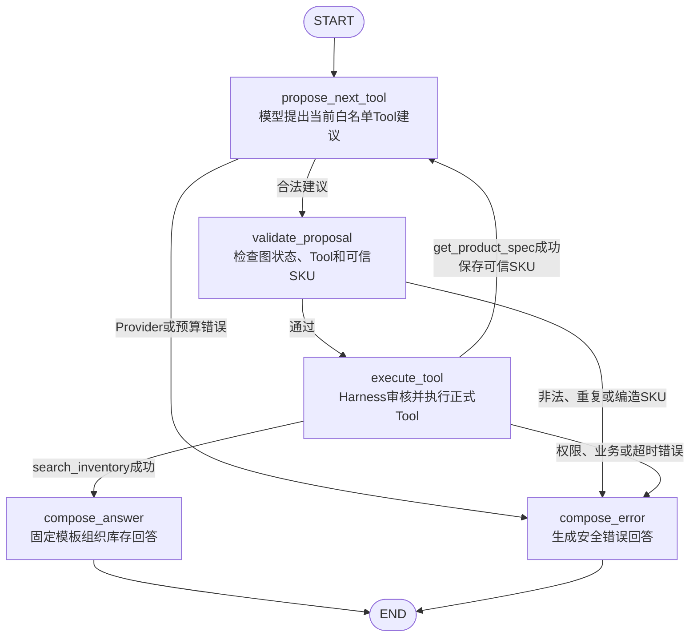

# M1：库存查询垂直切片详细实施方案

> 阶段状态：已完成
> 方案日期：2026-08-28
> 方案确认：2026-08-28，用户明确要求“开始进入M1-01”
> 当前步骤：M1-21已完成并验证，M1-01至M1-21全部收口
> 数据性质：全部业务数据均为合成演示数据，不代表真实Amazon经营数据
> 代码基线：`main` / `2fabc2a4e04b61954405bf53afe8c7d7903eae1d`（M1-20开始时HEAD，本步未提交）

> **当前停止点：M1已完成；用户确认M2方案前禁止开始M2代码开发。**
> 用户对一个步骤的授权不自动授权后续步骤或后续里程碑。

## 1. 本文档目的

本文档把已确认的总体设计收缩成一个可逐步开发、逐步验证的M1实施合同。M1只证明一件事：Amazon运营人员登录后，用自然语言查询德国仓蘑菇灯库存，系统在权限和预算约束下查询PostgreSQL，并返回答案、数据时间、数据库证据和审计轨迹。

本文档保存M1方案、确认记录、逐步实施日志和验证结果；运行代码保存在对应的项目目录中。

## 2. 术语的大白话解释

| 术语 | 大白话 | M1中的例子 |
|---|---|---|
| FastAPI | 接收网页请求、调用后端逻辑、把结果送回去的“服务门口” | 接收登录和聊天请求 |
| Schema | 数据格式合同，规定什么字段能进来、什么字段必须返回 | 库存结果必须包含SKU、可售量和数据时间 |
| ORM | 用Python类代表数据库表和数据行 | SQLAlchemy的`InventorySnapshot`类对应库存快照表 |
| Model | 固定调用链里的数据库模型，不是千问大模型 | `InventorySnapshot`负责把库存对象映射到PostgreSQL表 |
| SQLAlchemy | M1采用的ORM和数据库连接工具 | 管理PostgreSQL连接、事务和受控查询 |
| Alembic | 数据库结构的版本记录器 | 按版本创建用户、产品和库存表 |
| Repository | 专门负责查数据库的数据访问层 | 按租户、SKU和仓库查询最新库存 |
| Service | 执行业务规则的一层 | 计算可售库存并组织Evidence |
| LangGraph | 把Agent步骤写成明确节点和分支的流程图 | 意图解析→商品解析→库存查询→回答 |
| RBAC | 按角色控制权限 | 运营、选品人员、负责人拥有不同角色权限 |
| Harness | 包在Agent外面的程序护栏 | 工具调用前检查身份、市场范围、次数和超时 |
| Mock | 不调用真实外部API的“假实现” | 无千问Key时固定解析“德国仓蘑菇灯” |
| Evidence | 支撑答案的可追溯证据对象 | 指向某条合成库存快照并记录数据时间 |
| trace_id | 一次执行的追踪编号 | 用同一个编号关联路由、工具、耗时和错误 |
| SSE | 服务器持续向网页单向推送事件的连接 | M1不使用，长任务阶段再引入 |

## 3. 当前现状与缺少的能力

### 3.1 旧项目已有能力

- `api/server.py`已有FastAPI入口、任务接口、上传/下载和WebSocket原型；
- `agent/main_agent.py`使用`create_deep_agent`组织主Agent和三个子Agent，并用`InMemorySaver`保存内存状态；
- `api/context.py`展示了使用`ContextVar`隔离会话上下文的正确方向；
- `api/monitor.py`能向WebSocket上报工具和最终结果；
- `tools/`已有MySQL、RAGFlow、Tavily、文件读取、Markdown和PDF原型；
- `requirements.txt`包含FastAPI、LangGraph、SQLAlchemy、Pydantic等部分可复用依赖；
- 当前`frontend/`是空目录，没有`package.json`和可运行页面；
- 当前仓库没有Docker Compose、Alembic配置、PostgreSQL模型或自动测试目录。

### 3.2 旧项目不能直接承担M1的原因

- 旧数据库是MySQL，目标数据库是PostgreSQL；
- 旧数据库Agent可把模型生成的任意SQL直接交给数据库，没有表/字段白名单、租户过滤和可靠只读边界；
- 导入旧主Agent时会初始化模型、RAGFlow和Tavily等外部能力，无法在没有Key时做稳定测试；
- 旧上下文只有会话目录和线程ID，没有用户、租户、角色和数据范围；
- 旧WebSocket事件在内存中，断线后不能补取，也没有数据库审计；
- 没有登录、RBAC、库存模型、Evidence、工具契约、预算或测试；
- 旧README、`.env.example`和依赖仍描述MySQL、RAGFlow及通用多Agent原型，与M1目标不一致。

### 3.3 M1缺少的能力

- 一个与旧原型隔离的新`app/`后端入口；
- 可由Docker Compose启动的PostgreSQL；
- SQLAlchemy连接、ORM模型和Alembic迁移；
- 可重复生成的租户、用户、角色、产品、仓库和库存合成数据；
- 固定Repository查询和明确的输入、输出、错误Schema；
- 登录、JWT身份、市场数据范围和最小RBAC；
- `get_product_spec`、`search_inventory`两个只读Tool；
- RunContext、ToolRegistry、PermissionGuard、ExecutionBudget和基础Trace；
- Mock/Qwen Provider和最小LangGraph库存流程；
- 同步聊天、Evidence API及最小Next.js桌面页面；
- 单元、PostgreSQL集成和浏览器端到端验证。

## 4. 阶段目标与演示效果

### 4.1 阶段目标

Amazon运营人员登录后输入：

> 德国仓蘑菇灯还有多少可售库存？

系统应完成：

1. 从登录身份建立包含用户、租户、角色、市场范围、会话和`trace_id`的RunContext；
2. Mock或千问把自然语言解析为库存意图、商品关键词和德国市场参数；
3. Harness允许且只允许本次所需Tool；
4. `get_product_spec`把“蘑菇灯”解析为受控SKU；
5. `search_inventory`用固定Repository查询PostgreSQL；
6. 返回期末、预留、不可售、可售、在途、安全库存和数据时间；
7. 返回数据库Evidence并醒目标注“合成演示数据”；
8. 保存路由、工具、参数摘要、耗时、状态和错误轨迹；
9. 最小桌面聊天页面显示登录、执行中、成功/失败、回答和证据。

### 4.2 用户最终能看到的效果

- 一个演示登录页和一个桌面聊天页；
- 输入自然语言后先看到“正在查询库存”；
- 成功后看到明确数字、SKU、仓库和数据时间；
- 右侧证据卡显示数据库来源、记录定位、查询条件摘要和“合成演示数据”；
- 权限不足、非法参数或无记录时看到具体原因，不显示“未知错误”；
- 开发调试响应中可用`trace_id`定位本次执行轨迹。

## 5. 明确不做的内容

M1不实现或不启动：

- Skill运行时和5个业务Skill；
- 自建RAG、BGE-M3、Reranker和pgvector知识检索；
- 图片理解和文件上传链路；
- Tavily互联网搜索；
- Supervisor、多Worker和深度研究；
- Celery、Redis、后台长任务、Checkpoint恢复和SSE；
- Markdown/PDF报告；
- MinIO、MCP、Amazon SP-API和真实公司数据；
- 模型生成SQL、通用SQL工具或任何数据写入类Agent Tool；
- 完整企业数据后台、任务中心、知识库和报告中心；
- 移动端适配和生产级商业SaaS能力。

## 6. 前置条件

### 6.1 必须满足

- 用户确认本实施方案；
- Git工作区在每一步开始前可识别已有用户修改，禁止覆盖无关变更；
- Docker Desktop与Docker Compose可用，PostgreSQL端口可配置；
- Python 3.11建议版本可用；
- Node.js 20 LTS及npm可用；
- 当前本机端口使用PostgreSQL `5433`、API `8000`、前端`3000`；PostgreSQL原计划的`5432`被另一工作区占用，因此本项目只绑定`127.0.0.1:5433`；
- 真实密钥只写本地`.env`，不进入Git。

### 6.2 不阻塞开工

- 千问API Key不阻塞M1-01至Mock端到端验证，默认`LLM_PROVIDER=mock`；
- 没有Redis不阻塞M1，因为本阶段没有队列、长任务或跨进程缓存；
- 没有Tavily、RAGFlow、BGE模型不阻塞M1，这些能力不进入本阶段。

## 7. 总体技术方案

### 7.1 新旧代码迁移

| 分类 | 处理 | 原因 |
|---|---|---|
| `api/context.py`的`ContextVar`思想 | 保留思想，在`app/runtime/context.py`重写为强类型RunContext | 旧结构缺少用户、租户、角色和trace |
| `api/monitor.py`的事件记录思想 | 保留思想，改为结构化Trace并持久化 | 旧实现只有内存WebSocket事件 |
| FastAPI异步接口思路 | 保留 | 适合后续扩展，但M1聊天采用同步HTTP响应 |
| `tools/tavily_tool.py`、文件和PDF能力 | 暂时隔离 | 属于M2/M4，不进入M1导入链 |
| `agent/`、`api/`、`tools/`旧目录 | M1不删除、不搬迁、不导入 | 保留学习和迁移依据，避免一次性重写风险 |
| `tools/db_tools.py` | 新链路完全替换 | MySQL、字符串表名和任意SQL不满足安全要求 |
| `create_deep_agent`隐式编排 | 新链路完全替换为显式LangGraph | 只保留M1可观察的固定节点 |
| `InMemorySaver` | M1不使用 | 同步短流程无恢复需求，轨迹改存PostgreSQL |
| `requirements.txt` | 收缩为M1主链依赖；旧依赖另存兼容清单 | 避免安装RAGFlow、MySQL、PDF等未使用依赖 |
| `.env.example`、README | 更新为M1主入口和合成数据说明 | 旧说明会把用户引向错误启动方式 |

新代码统一从`app/main.py`启动。通过启动命令、导入测试和README明确“旧原型不属于M1运行链”，不靠删除旧代码实现隔离。

### 7.2 建议的M1后端目录

```text
app/
├── main.py
├── api/
│   ├── dependencies.py
│   └── routers/
│       ├── auth.py
│       ├── threads.py
│       └── evidence.py
├── core/
│   ├── config.py
│   ├── errors.py
│   ├── logging.py
│   └── security.py
├── db/
│   ├── base.py
│   └── session.py
├── models/
│   ├── identity.py
│   ├── catalog.py
│   ├── inventory.py
│   └── runtime.py
├── schemas/
│   ├── common.py
│   ├── auth.py
│   ├── chat.py
│   ├── product.py
│   ├── inventory.py
│   └── evidence.py
├── repositories/
│   ├── product.py
│   ├── inventory.py
│   └── runtime.py
├── services/
│   ├── auth.py
│   ├── product.py
│   ├── inventory.py
│   └── evidence.py
├── llm/
│   ├── provider.py
│   ├── mock.py
│   ├── qwen.py
│   └── schemas.py
├── tools/
│   ├── contracts.py
│   ├── registry.py
│   ├── get_product_spec.py
│   └── search_inventory.py
├── agents/
│   ├── state.py
│   └── graphs/inventory_query.py
└── runtime/
    ├── context.py
    ├── permissions.py
    ├── budget.py
    ├── trace.py
    └── executor.py

migrations/
scripts/
tests/
frontend/
```

不为只有一个文件的概念预先建立空目录；上面是目标边界，具体文件只在对应步骤创建。

### 7.3 M1是否建立Next.js页面

需要。现有`frontend/`只是空目录，无法演示“登录→提问→证据”。M1将在该目录建立最小Next.js App Router + TypeScript页面，只实现：

- 登录表单；
- 单会话聊天输入和消息区；
- 请求中的执行状态；
- 回答卡和Evidence侧栏；
- 合成演示数据标识；
- 权限、无数据和系统错误状态。

不实现完整导航、任务中心、文件上传、图表或复杂状态管理。前端只展示后端事实，不在浏览器重新计算库存。

### 7.4 PostgreSQL第一批最小表

M1建议14张表，按三个小批次迁移：

| 数据域 | 表 | M1职责 |
|---|---|---|
| 身份 | `tenants` | 演示公司和`is_demo`标记 |
| 身份 | `users` | 邮箱、显示名、密码哈希、状态和租户 |
| 身份 | `roles` | `company_owner`、`product_scout`、`amazon_operator` |
| 身份 | `user_roles` | 用户角色及`market_scopes`数据范围 |
| 商品 | `products` | SPU、中文/英文名、别名、演示标记 |
| 商品 | `product_variants` | 唯一SKU、颜色、状态 |
| 商品 | `product_specs` | 规格值、单位、来源和核验状态 |
| 库存 | `warehouses` | `DE-FRA`、`FR-CDG`等仓库与市场 |
| 库存 | `inventory_snapshots` | 期末、预留、不可售、在途、安全库存和时间 |
| 会话 | `threads` | 用户聊天会话 |
| 会话 | `messages` | 用户问题和系统回答摘要 |
| 运行 | `agent_runs` | trace、路由、预算计数、状态、耗时和错误 |
| 运行 | `tool_calls` | Tool版本、参数摘要、权限结果、耗时和错误 |
| 证据 | `evidences` | 数据库来源、定位、结构化数据、数据时间和访问范围 |

M1不建立`permissions`、`role_permissions`、`tasks`、`task_steps`、`skill_runs`、`checkpoints`、RAG或评估表。Tool允许角色先由版本化ToolRegistry声明，`user_roles.market_scopes`约束市场；进入更复杂权限阶段后再无损迁移到完整权限表。

关键约束：

- `users(tenant_id, email)`唯一；
- `product_variants(tenant_id, sku)`唯一；
- `warehouses(tenant_id, code)`唯一；
- `inventory_snapshots(tenant_id, variant_id, warehouse_id, snapshot_at)`唯一；
- 所有业务和运行记录必须直接带`tenant_id`或通过外键唯一追溯；
- 数量字段非负；`available = on_hand - reserved - unsellable`由Service统一计算并校验；
- 时间使用带时区时间戳。

### 7.5 Redis决定

M1不启动Redis。理由：

- 聊天请求在一次同步HTTP内完成；
- 没有Celery Worker、后台长任务、SSE事件中继、跨进程预算或缓存；
- Trace和Evidence直接写PostgreSQL；
- 单机进程内预算即可完成确定性验证。

Redis预计在M4长任务和Celery出现时引入。若M1提前启动，只能证明容器能运行，不能增加库存闭环的有效能力，反而增加端口、配置和排错面。这一决定是对总体设计中“M1启动Redis”候选顺序的明确收缩。

### 7.6 SQLAlchemy与Alembic分工

- SQLAlchemy负责程序运行时：建立连接池、开启事务、把Python ORM对象映射到表，并让Repository执行参数化查询；
- Alembic负责数据库结构演进：记录“第1版有哪些表、第2版增加什么约束”，支持升级和回退；
- Seed生成器只负责插入演示数据，不能代替Alembic建表；
- 前端、模型和Tool都不直接使用数据库连接。

### 7.7 合成数据与可重复性

- 生成器版本固定为`m1-v1`，随机种子固定；关键演示对象使用确定性UUID；
- 蘑菇灯沿用`LR-TL-MUSH-OR01`，明确标记候选新品和合成演示数据；“尚未产生真实销售”不等于没有演示备货，M1允许它存在海外仓预备库存；
- 德国仓示例数量满足统一公式，例如期末150、预留20、不可售5、可售125，实际数值在Seed清单中唯一声明；
- Seed重复执行使用确定性upsert或先验证后跳过，不制造重复SKU；
- 生成后输出`data/seed/m1_manifest.json`，记录版本、种子、表行数、关键答案和内容哈希；
- 自动校验行数、唯一约束、外键、非负数量、可售公式、权限样本和关键演示答案；
- 页面、API和Evidence均返回`synthetic_data=true`。

### 7.8 M1用户和权限样本

三类产品角色全部进入M1，但只建立库存/规格所需的最小权限样本，不实现完整V1权限矩阵：

- 1个公司负责人：允许查询DE和FR库存/规格；
- 1个选品人员：允许查询DE和FR库存/规格；
- 1个德国运营：只允许DE；
- 1个法国运营：只允许FR，用来验证查询德国仓会被拒绝。

因此是“三类角色、四个演示账号”。密码只保存Argon2哈希；演示初始密码来自本地环境或非敏感Seed默认值，并在README标注仅限本地演示。

RBAC不是只检查角色名。PermissionGuard同时检查：

```text
Tool允许角色 ∩ 当前用户角色 ∩ 当前租户 ∩ 用户市场范围 ∩ 系统只读策略
```

### 7.9 库存查询安全策略

M1采用固定Repository查询和受控参数，禁止模型生成SQL：

```text
自然语言
 → 模型输出InventoryIntent Schema
 → Pydantic校验SKU/商品词/DE或FR
 → PermissionGuard检查租户与市场
 → Repository使用预写SQLAlchemy条件
 → PostgreSQL参数化SELECT + statement_timeout
```

Repository强制带`tenant_id`、SKU、仓库/市场和“最新快照”条件。模型看不到连接串、Session、ORM对象或SQL执行方法。总体设计中面向未来的“受控只读SQL计划 + AST校验”不进入M1，因为两个固定查询不需要通用SQL能力。

### 7.10 两个Tool的Schema

#### `get_product_spec`

输入：

```json
{
  "product_query": "蘑菇灯"
}
```

约束：去除首尾空格，长度1至100；可接收合法SKU、中文名、英文名或受控别名；`tenant_id`不允许由模型传入，只从RunContext取得。

成功数据：

```json
{
  "product_id": "uuid",
  "variant_id": "uuid",
  "sku": "LR-TL-MUSH-OR01",
  "name_zh": "橙色复古蘑菇台灯",
  "name_en": "LUMORIVA Orange Mushroom Table Lamp",
  "status": "candidate",
  "specs": [
    {
      "name": "height",
      "value": "30",
      "unit": "cm",
      "verification_status": "demo_declared"
    }
  ],
  "synthetic_data": true
}
```

#### `search_inventory`

输入：

```json
{
  "sku": "LR-TL-MUSH-OR01",
  "market_code": "DE",
  "warehouse_code": null
}
```

约束：SKU格式白名单；`market_code`只允许`DE|FR`；可选仓库必须属于该市场；`tenant_id`和允许市场只从RunContext取得。

成功数据：

```json
{
  "sku": "LR-TL-MUSH-OR01",
  "product_name": "橙色复古蘑菇台灯",
  "market_code": "DE",
  "warehouse_code": "DE-FRA",
  "warehouse_name": "德国法兰克福海外仓",
  "on_hand": 150,
  "reserved": 20,
  "unsellable": 5,
  "available": 125,
  "inbound": 80,
  "safety_stock": 60,
  "snapshot_at": "2026-08-28T08:00:00+02:00",
  "synthetic_data": true
}
```

#### 统一Tool外壳与错误

```json
{
  "status": "success|error",
  "data": {},
  "evidence_ids": ["uuid"],
  "error": {
    "code": "FORBIDDEN",
    "message": "当前账号无权查询德国市场库存",
    "retryable": false,
    "field": "market_code"
  },
  "meta": {
    "tool": "search_inventory",
    "version": "1.0.0",
    "duration_ms": 83,
    "source_time": "2026-08-28T08:00:00+02:00",
    "trace_id": "uuid",
    "synthetic_data": true
  }
}
```

M1错误码至少包含：`VALIDATION_ERROR`、`UNAUTHENTICATED`、`FORBIDDEN`、`PRODUCT_NOT_FOUND`、`AMBIGUOUS_PRODUCT`、`INVENTORY_NOT_FOUND`、`DATABASE_TIMEOUT`、`BUDGET_EXCEEDED`、`PROVIDER_ERROR`、`INTERNAL_ERROR`。错误不能返回堆栈、密钥、连接串或原始SQL。

### 7.11 Mock与千问Provider

- 定义`ModelProvider`接口，只暴露“根据问题和当前白名单提出一个Tool调用建议”所需方法；
- `ToolRegistry`只投影名称、描述和参数JSON Schema给模型，不提供Tool实例、角色策略、tenant或超时配置；
- `MockProvider`使用固定规则和测试用例，稳定提出演示调用建议，不联网、不收费；
- 默认环境使用Mock，所有确定性单元、集成和端到端测试均不依赖千问；
- `QwenProvider`通过OpenAI兼容Function Calling调用百炼，返回的Tool名称和参数必须经过当前白名单与对应Pydantic输入Schema复检；
- 千问不可用、超时或输出非法时返回`PROVIDER_ERROR`，不得绕过Schema直接查询数据库；
- Qwen冒烟测试单独标记，需要Key时才运行，不作为本地核心回归的前置条件。

证明千问只负责Tool选择建议和参数的方法：

1. `app/llm/`不导入`app/db/`、Repository或SQLAlchemy Session；
2. Provider构造函数不接收数据库连接；
3. 请求测试确认Provider只收到问题、当前允许的Tool说明及后端已确认SKU，不收到Tool实例、身份、权限或数据库配置；
4. Trace顺序必须是`model_proposal → graph_validation → permission_check → tool_call → repository_query`；
5. 数据库访问日志只能由Repository产生；
6. 即使模型建议未登记Tool或输出`DROP TABLE`字段，也会因白名单或Tool输入Schema不接收而被拒绝。

这能证明“本项目没有把数据库能力交给千问”，但不能证明第三方模型服务自身的内部实现。

### 7.12 LangGraph最小图

```text
START
  ↓
propose_next_tool（Provider只看当前白名单）
  ├─ 无适用Tool → unsupported_answer → END
  ↓
validate_proposal（检查图状态、Tool名称和强类型参数）
  ├─ 非法或不符合当前状态 → error_answer → END
  ↓
execute_tool（经Harness检查权限/预算/Trace后执行）
  ├─ 错误 → error_answer → END
  ├─ get_product_spec成功 → 保存可信SKU → 回到propose_next_tool，当前只开放search_inventory
  └─ search_inventory成功
  ↓
compose_answer（确定性模板，不重新查询）
  ↓
END
```

身份认证和RunContext构建发生在进入图之前；PermissionGuard、预算和Trace包在模型建议和每次Tool执行边界，不伪装成Agent节点。图最多允许2次模型建议和2次Tool执行，这个“回到决策节点”只是完成商品解析后的一次受限分支，不是开放式自主循环。M1没有Supervisor、Worker、自由规划、Skill、Checkpoint或人工确认节点。

### 7.13 Evidence生成

M1由确定性的`EvidenceService`把Repository结果变成数据库Evidence，不让模型自行编写证据：

- `source_type=database`；
- `source_name=synthetic_inventory`或`synthetic_product_catalog`；
- `source_locator`保存表名和记录UUID，不暴露连接串；
- `query_summary`保存规范化的SKU、市场、仓库和租户范围，不保存用户密码或完整Token；
- `structured_data`保存回答实际使用的字段；
- `observed_at`为业务数据时间，`created_at`为查询时间；
- `access_scope`保存tenant和市场；
- `synthetic_data=true`；
- Evidence先持久化，再将ID和安全摘要返回给回答。

回答中的库存数字必须直接来自Evidence结构化数据；模型推断不能伪装成数据库证据。

### 7.14 API与前端数据流

M1最小接口：

```text
POST /api/v1/auth/login
GET  /api/v1/me
POST /api/v1/threads
POST /api/v1/threads/{thread_id}/messages
GET  /api/v1/evidence/{evidence_id}
```

登录返回短期JWT Bearer Token。JWT可以理解成“后端签名的临时身份证”；后续请求携带它，后端仍需从数据库读取用户状态、角色和范围。

聊天POST同步返回：`status`、`thread_id`、`message_id`、`answer`、Evidence摘要数组，以及包含`trace_id`、路由、Tool名称、耗时和状态的`execution`对象。前端在等待HTTP时显示`running`，收到后显示`completed`或具体错误；需要详情时按Evidence ID读取。

### 7.15 同步HTTP还是SSE

M1选择同步HTTP：

- 目标是一到两个只读Tool和最多两次模型建议，属于数秒级快速查询；
- 没有后台Worker，HTTP断开后也没有可恢复长任务；
- 同步响应最容易确定性测试错误码、Evidence和审计是否一致；
- 前端仍能显示“正在查询”，不等于必须使用流式协议。

若实际基线P95超过8秒，先定位模型或数据库耗时，不以SSE掩盖性能问题。SSE留给后续需要流式文本或长任务状态的阶段。

## 8. 完整调用链

```text
前端 Next.js
  登录、输入问题、显示running/completed/error、答案和Evidence
  ↓ HTTP
API FastAPI
  校验JWT、创建thread/trace、调用LangGraph、映射HTTP错误
  ↓
Schema Pydantic
  校验登录、聊天、意图、Tool、Evidence和错误结构
  ↓
Service + LangGraph + Harness
  组织步骤，检查权限/预算，调用Tool，计算可售量，生成证据和轨迹
  ├─→ LLM Provider（Mock或千问）
  │     只看当前白名单Tool说明并输出一个受控调用建议，不持有执行或数据库能力
  ↓
Repository
  使用固定参数化条件和tenant/market过滤查询
  ↓
Model（SQLAlchemy ORM）
  把Python业务对象映射到数据库表；这里不是千问大模型
  ↓
PostgreSQL
  保存合成业务数据、用户、会话、Evidence和Trace
```

响应沿相反方向返回。要求中的固定主链是“前端→API→Schema→Service→Model（ORM）→PostgreSQL”；Repository只是把Service和ORM查询职责分开。千问属于Service/LangGraph调用的LLM Provider旁路，不是固定主链里的Model。安全边界不变：千问永远不能跳过Service/Harness直连Repository、ORM或PostgreSQL。

## 9. 实施顺序与依赖评审

候选顺序需要调整的地方：

- Alembic迁移依赖ORM模型，不能在模型定义前完成实际建表，所以先建立SQLAlchemy连接，再按数据域定义模型和迁移；
- Schema是跨层合同，应在Repository和Service正式实现前冻结；
- 身份服务和RunContext要先于PermissionGuard和Tool执行；
- Tool必须在Repository、Service、Schema和Harness都存在后注册；
- Mock Provider先于Qwen真实接入，确保外部Key不阻塞主链；
- Redis、SSE不进入M1；
- 自动测试不是最后才开始，每一步都有局部测试，最后一步只补全故障矩阵和端到端回归。

M1计划按21个小步骤实施。一个步骤只解决一个主要问题；每步完成代码、实际验证和进度记录后暂停汇报，不自动进入下一步。

## 10. 21个单步实施计划

### M1-01｜建立新目录、配置和依赖基线

- 输入：当前旧原型、已确认技术边界；输出：可导入但不含业务实现的`app/`入口、分层配置和M1/旧原型依赖边界。
- 上游：M0设计；下游：所有后端步骤。
- 预计文件：`app/__init__.py`、`app/main.py`、`app/core/config.py`、`requirements.txt`、`requirements-dev.txt`、`requirements-legacy.txt`、`.env.example`、`.gitignore`。
- 调用链位置：API基础和项目配置；尚未经过前端、Schema、Service、Model、PostgreSQL。
- 验证：配置缺失/默认值测试、`app.main`导入测试、依赖清单检查、确认新入口不导入旧`agent/api/tools`。
- 能证明：新旧运行入口已隔离、配置可解析。不能证明：数据库、登录或库存可用。

### M1-02｜只启动PostgreSQL容器

- 输入：数据库环境变量；输出：健康的PostgreSQL服务和持久卷。
- 上游：M1-01；下游：数据库连接与迁移。
- 预计文件：`docker-compose.yml`、`.env.example`、`README.md`。
- 调用链位置：PostgreSQL基础设施；未经过前端、API、Schema、Service、Model。
- 验证：`docker compose config`、容器healthcheck、`pg_isready`、重启后连接验证。
- 能证明：数据库服务可连接、配置有效。不能证明：表和业务数据存在。

### M1-03｜建立SQLAlchemy连接和事务边界

- 输入：`DATABASE_URL`；输出：Engine、Session、Base、请求级事务和数据库健康检查。
- 上游：M1-02；下游：ORM模型、Repository。
- 预计文件：`app/db/base.py`、`app/db/session.py`、`app/api/dependencies.py`、`tests/integration/test_database_connection.py`。
- 调用链位置：API依赖→PostgreSQL连接；未经过业务Schema、Service、Model。
- 验证：连接/回滚/Session关闭、连接失败信息脱敏、`SELECT 1`。
- 能证明：程序能安全建立和释放数据库事务。不能证明：业务表正确。

### M1-04｜建立身份和角色模型及迁移

- 输入：单租户、三角色、市场范围设计；输出：`tenants/users/roles/user_roles`表。
- 上游：M1-03；下游：Seed、登录、RunContext。
- 预计文件：`app/models/identity.py`、`migrations/env.py`、`migrations/versions/*_identity.py`、`alembic.ini`、模型测试。
- 调用链位置：Model→PostgreSQL；未经过前端、API、业务Service或LLM。
- 验证：Alembic升级/降级/再升级、唯一约束、外键和市场范围格式。
- 能证明：身份数据结构可版本化。不能证明：登录和权限拦截有效。

### M1-05｜建立商品和库存模型及迁移

- 输入：商品、SKU、规格、仓库和库存字段；输出：5张业务表及约束。
- 上游：M1-03、M1-04；下游：Seed、Repository。
- 预计文件：`app/models/catalog.py`、`app/models/inventory.py`、`migrations/versions/*_inventory_domain.py`、模型测试。
- 调用链位置：Model→PostgreSQL。
- 验证：非负Check约束、租户内SKU唯一、仓库唯一、快照唯一、外键、迁移回退。
- 能证明：数据库能拒绝重复SKU和非法数量。不能证明：自然语言能查到库存。

### M1-06｜建立会话、运行、Tool审计和Evidence模型

- 输入：trace和Evidence字段合同；输出：`threads/messages/agent_runs/tool_calls/evidences`表。
- 上游：M1-04；下游：Trace、聊天API和Evidence API。
- 预计文件：`app/models/runtime.py`、`migrations/versions/*_runtime_evidence.py`、模型测试。
- 调用链位置：Model(ORM)→PostgreSQL；这里的Model不是大模型。
- 验证：trace唯一、外键、JSON字段、Evidence访问范围和状态枚举。
- 能证明：运行事实有持久化位置。不能证明：真实执行已写入轨迹。

### M1-07｜生成可重复的合成演示数据

- 输入：固定种子、版本和演示业务规则；输出：四个账号、蘑菇灯、仓库、库存和manifest。
- 上游：M1-04至M1-06；下游：所有查询和测试。
- 预计文件：`scripts/seed_m1.py`、`data/seed/m1_seed.json`、`data/seed/m1_manifest.json`、`tests/integration/test_seed_m1.py`。
- 调用链位置：Model→PostgreSQL，属于开发数据入口；不经过前端、API、LLM。
- 验证：空库生成、重复执行、行数/哈希一致、关键答案、可售公式、演示标记、密码非明文。
- 能证明：测试数据可重复且业务关系一致。不能证明：线上真实数据质量。

### M1-08｜冻结Pydantic输入、输出和错误合同

- 输入：第7.10节Tool/API字段；输出：可复用的认证、聊天、商品、库存、Evidence、ToolEnvelope和ErrorDetail Schema。
- 上游：业务目标和数据字段；下游：Service、Tool、Provider、API、前端类型。
- 预计文件：`app/schemas/common.py`、`auth.py`、`chat.py`、`product.py`、`inventory.py`、`evidence.py`、Schema单元测试。
- 调用链位置：Schema层；尚未执行Service、Model或PostgreSQL。
- 验证：合法样例、非法SKU、非法市场、缺字段、多余SQL字段、错误序列化。
- 能证明：边界数据可被严格检查。不能证明：数据库结果正确。

### M1-09｜实现受控商品和库存Repository

- 输入：已验证查询条件与Session；输出：租户范围内的商品解析和最新库存记录。
- 上游：M1-03、M1-05、M1-08；下游：两个业务Service。
- 预计文件：`app/repositories/product.py`、`inventory.py`、Repository集成测试。
- 调用链位置：Service下游→Model(ORM)→PostgreSQL。
- 验证：SKU精确查、别名查、宽泛名称歧义、DE/FR过滤、跨租户无结果、参数化查询、statement timeout。
- 能证明：固定查询和数据范围正确。不能证明：Tool权限和聊天路由正确。

### M1-10｜实现商品规格Service

- 输入：`product_query`和RunContext租户；输出：唯一产品规格或明确的未找到/歧义错误。
- 上游：Schema、ProductRepository；下游：`get_product_spec` Tool和LangGraph。
- 预计文件：`app/services/product.py`、`app/services/evidence.py`相关商品证据部分、单元/集成测试。
- 调用链位置：Schema→Service→Model→PostgreSQL；不经过LLM。
- 验证：SKU、中文别名、英文名、未找到、歧义和跨租户。
- 能证明：商品词能安全解析成SKU。不能证明：库存查询已完成。

### M1-11｜实现库存查询与数据库Evidence Service

- 输入：合法SKU、市场/仓库和RunContext；输出：统一库存结果及持久化Evidence。
- 上游：InventoryRepository、Schema、runtime表；下游：`search_inventory` Tool和回答。
- 预计文件：`app/services/inventory.py`、`app/services/evidence.py`、Service测试。
- 调用链位置：Schema→Service→Model→PostgreSQL。
- 验证：可售公式、最新快照、零库存、无记录、仓库市场不匹配、数据库超时映射、Evidence字段一致。
- 能证明：数据库事实能变成答案数据和证据。不能证明：Agent会选择正确Tool。

### M1-12｜实现登录、JWT和RunContext

- 输入：邮箱密码、thread和trace；输出：签名Token、当前用户信息和强类型RunContext。
- 上游：身份表和Seed；下游：PermissionGuard、API、LangGraph。
- 预计文件：`app/core/security.py`、`app/services/auth.py`、`app/runtime/context.py`、认证测试。
- 调用链位置：API依赖→Service→Model→PostgreSQL；尚未调用大模型。
- 验证：正确/错误密码、禁用用户、过期/伪造Token、四个账号角色和市场范围、Context并发隔离。
- 能证明：执行身份来自后端可信数据。不能证明：Tool权限已执行。

### M1-13｜实现ToolRegistry和PermissionGuard

- 输入：RunContext、Tool元数据和请求市场；输出：允许或结构化拒绝。
- 上游：M1-08、M1-12；下游：Tool执行器。
- 预计文件：`app/tools/registry.py`、`app/runtime/permissions.py`、策略测试。
- 调用链位置：Service/Harness层；不直接访问前端或LLM，必要时读取身份范围。
- 验证：未注册Tool、角色不允许、DE运营查DE成功、FR运营查DE拒绝、tenant不匹配、只读副作用等级。
- 能证明：服务端权限不依赖Prompt。不能证明：预算和审计已生效。

### M1-14｜实现ExecutionBudget和基础Trace

- 输入：模型/Tool次数上限、总时限、调用摘要；输出：预算判定及`agent_runs/tool_calls`轨迹。
- 上游：runtime表、RunContext；下游：统一Tool执行器和LangGraph。
- 预计文件：`app/runtime/budget.py`、`trace.py`、`executor.py`、Harness测试。
- 调用链位置：Service/Harness→Model(ORM)→PostgreSQL。
- 验证：模型次数超限、Tool次数超限、总时限、重复调用、敏感参数摘要脱敏、成功/失败均落轨迹。
- 能证明：M1最小预算和Trace有效。不能证明：后续跨进程预算或重试恢复。

### M1-15｜实现并注册两个Agent Tool

- 输入：严格Tool Schema、RunContext和业务Service；输出：统一ToolEnvelope。
- 上游：M1-10至M1-14；下游：LangGraph。
- 预计文件：`app/tools/contracts.py`、`get_product_spec.py`、`search_inventory.py`、Tool测试。
- 调用链位置：Schema→Service/Harness→Model(ORM)→PostgreSQL。
- 验证：Registry元数据、版本、超时、权限、成功、业务错误、异常脱敏；注册表中严格只有两个Agent Tool。
- 能证明：两个Tool可被受控调用。不能证明：自然语言路由正确。

### M1-16｜建立Mock和Qwen Provider边界

- 输入：自然语言问题、当前允许的Tool安全说明和可选的后端已确认SKU；输出：严格`ToolCallProposal`，只提出调用，不执行Tool或SQL。
- 上游：M1-13 ToolRegistry；下游：LangGraph决策与审核节点。
- 预计文件：`app/llm/provider.py`、`mock.py`、`qwen.py`、`schemas.py`、Provider测试。
- 调用链位置：Service/LangGraph→Model（这里指千问或Mock）；不经过Repository/PostgreSQL。
- 验证：两轮Mock建议、当前Tool白名单、非法/未授权Tool拒绝、参数Schema、Provider超时、SQL注入字段拒绝、静态导入边界；有Key时单独Qwen冒烟。
- 能证明：Provider只能返回当前白名单内的受控Tool建议。不能证明：Tool已经执行或真实千问对所有自然语言都准确。

### M1-17｜实现LangGraph库存最小流程

- 输入：RunContext和问题；输出：确定性回答、Evidence ID、执行状态和trace。
- 上游：Provider受控建议合同、两个Tool、Harness；下游：聊天API。
- 预计文件：`app/agents/state.py`、`app/agents/graphs/inventory_query.py`、图轨迹测试。
- 调用链位置：Schema→Service/LangGraph→Model→Tool/Harness→Service→Model(ORM)→PostgreSQL。
- 验证：标准问题节点顺序、非目标意图、商品未找到、权限拒绝、预算停止、Provider错误、禁止Tool从未出现。
- 能证明：M1流程显式、可观察、可终止。不能证明：HTTP和网页已接通。

### M1-18｜实现FastAPI登录、会话、聊天和Evidence接口

- 输入：HTTP请求、JWT和LangGraph结果；输出：版本化JSON响应和正确HTTP状态。
- 上游：M1-12、M1-17；下游：Next.js。
- 预计文件：`app/main.py`、`app/api/dependencies.py`、`app/api/routers/auth.py`、`threads.py`、`evidence.py`、API集成测试。
- 调用链位置：API→Schema→Service/LangGraph→Model→PostgreSQL，首次接通完整后端链。
- 验证：OpenAPI、登录、me、建会话、聊天、Evidence详情、401/403/404/422/504映射、CORS白名单。
- 能证明：HTTP客户端能完成完整后端查询。不能证明：浏览器界面可用。

### M1-19｜实现最小Next.js登录和证据聊天页

- 输入：M1 API合同；输出：桌面端登录、聊天、状态、回答和Evidence侧栏。
- 上游：M1-18；下游：浏览器端到端测试和演示。
- 预计文件：`frontend/package.json`、`next.config.*`、`tsconfig.json`、`app/layout.tsx`、`app/page.tsx`、`app/globals.css`、`components/*`、`lib/api.ts`。
- 调用链位置：前端→API→Schema→Service→Model→PostgreSQL，完整用户链路。
- 验证：TypeScript检查、lint、production build、键盘发送、loading/error/empty状态、Evidence定位、合成数据标识。
- 能证明：页面构建成功且能正确消费API类型。不能证明：真实浏览器与后端联合运行无误。

### M1-20｜完成故障矩阵、集成和浏览器端到端回归

- 输入：完整M1系统；输出：可重复测试报告和Bad Case记录。
- 上游：M1-01至M1-19；下游：演示验收。
- 预计文件：`tests/unit/*`、`tests/integration/*`、`frontend/e2e/*`、Playwright配置、测试说明。
- 调用链位置：覆盖前端→API→Schema→Service→Model→PostgreSQL整链，也分别绕过上游做组件测试。
- 验证：见第11节完整矩阵；Mock为默认，真实PostgreSQL为集成环境。
- 能证明：已覆盖的正常、越权和故障场景可重复通过。不能证明：未覆盖环境、真实流量和千问长期稳定性。

### M1-21｜完成演示脚本、README和阶段结果记录

- 输入：所有测试和实际启动结果；输出：初学者可照做的启动/演示说明、实际结果和已知限制。
- 上游：M1-20；下游：用户M1验收和M2方案讨论。
- 预计文件：`README.md`、`docs/progress/M1_INVENTORY_QUERY.md`、`docs/PROJECT_PROGRESS.md`、必要的测试结果摘要。
- 调用链位置：项目交付层；演示脚本实际覆盖完整链路，文档本身不进入运行链。
- 验证：从干净数据库按README启动、Seed、登录、查询、越权演示、停止并重启；检查命令和链接。
- 能证明：M1可按说明复现和讲解。不能证明：M2及后续能力已实现。

## 11. 测试与异常验证矩阵

### 11.1 单元测试

- Schema：合法/非法SKU、市场、空问题、额外SQL字段、错误外壳；
- Service：可售公式、商品歧义、零库存、Evidence映射；
- Harness：角色、tenant、市场权限交集，次数/时限/重复调用，Trace脱敏；
- Provider：Mock确定性、非法结构、超时和SQL注入文本；
- LangGraph：节点顺序、终止分支和禁止Tool；
- 安全：密码哈希/JWT、错误不泄露连接串或堆栈。

### 11.2 PostgreSQL集成测试

- 所有Alembic迁移升级、降级和重建；
- Seed首次运行和重复运行结果/哈希一致；
- 唯一约束、外键、非负Check和重复SKU；
- tenant、role和market范围过滤；
- 商品别名、最新库存快照、零库存和无记录；
- `statement_timeout`在测试查询中实际触发；
- Tool、Evidence、agent_run和tool_call在同一trace下可追溯；
- API使用真实PostgreSQL和Mock Provider完成登录到回答。

### 11.3 浏览器端到端测试

- 德国运营登录并查询德国仓蘑菇灯，页面显示可售量、时间、Evidence和演示标记；
- 法国运营查询德国仓，页面显示权限不足且不出现库存数字；
- 非法/过期Token回到登录状态；
- 无库存和数据库错误显示具体可行动错误；
- 键盘发送、重复点击保护、loading状态和Evidence侧栏可用。

### 11.4 指定异常如何验证

| 异常 | 注入/准备方式 | 期望结果 | 主要证明 |
|---|---|---|---|
| 越权 | FR运营查询DE-FRA | `FORBIDDEN`，无Evidence、无数据泄露，Trace记录拒绝 | PermissionGuard在Tool前执行 |
| 非法SKU | 直接API/Tool传`SKU@@@` | 422或`VALIDATION_ERROR`，Repository零调用 | Schema先于数据库 |
| 零库存 | Seed一条合法且`available=0`快照 | 成功返回0，不误报“未找到” | 零是有效业务事实 |
| 无库存记录 | 合法SKU在指定仓无快照 | `INVENTORY_NOT_FOUND` | 区分零库存和无记录 |
| 重复SKU | 集成测试插入同租户同SKU两次 | PostgreSQL唯一约束拒绝；Seed重跑不重复 | 数据库最终约束生效 |
| 数据库超时 | 测试事务设置极短`statement_timeout`并运行`pg_sleep`；Repository模拟相同异常 | API映射504/`DATABASE_TIMEOUT`且可重试，Trace记错 | DB超时设置与错误映射有效 |
| 模型超时 | Mock Provider抛超时 | `PROVIDER_ERROR`，无Tool/DB调用 | 模型失败不会绕过流程 |
| Tool次数超限 | 测试预算设为0或构造重复请求 | `BUDGET_EXCEEDED`，后续Tool不执行 | 程序预算有效 |
| 商品歧义 | 宽泛名称匹配多个灯具 | `AMBIGUOUS_PRODUCT`并要求更精确SKU | 系统不随便选商品 |
| 跨租户 | 另一tenant记录使用相同SKU | 当前tenant查不到对方记录 | tenant过滤有效 |

数据库超时的两部分验证分别证明PostgreSQL超时参数会生效、应用会正确映射超时；它不能完全模拟所有真实网络抖动。网络级故障在后续可靠性阶段扩展。

## 12. 范围控制护栏

- ToolRegistry测试断言注册表严格只有`get_product_spec`和`search_inventory`；
- `app/`导入测试禁止引用RAGFlow、Tavily、BGE、pgvector、Celery、Redis、MinIO和旧MySQL工具；
- M1没有`skills/`运行时代码、Supervisor或Worker目录；
- 不接受SQL字符串作为任何公开Schema字段；
- Docker Compose只定义PostgreSQL；
- 前端没有上传、任务中心、知识库、报告、图表和管理后台；
- 发现后续需求只记录到“遗留问题”，不顺手实现；
- 每步只有经验证并更新本文件后才可汇报完成。

## 13. 阶段完成标准

必须同时满足以下条件，M1才能从“进行中”改为“已完成”：

1. 用户确认后的21个步骤均完成并有实际验证记录；
2. PostgreSQL可由Docker Compose启动，迁移和Seed可从空库重复执行；
3. 四个演示账号和三类角色存在，DE/FR范围验证通过；
4. 标准库存问题通过Mock Provider走指定LangGraph节点和两个受控Tool；
5. 前端显示正确库存、数据时间、Evidence、执行状态和合成数据标记；
6. ToolRegistry中只有两个M1 Tool，模型不能提交或执行SQL；
7. 越权、非法SKU、零库存、无记录、重复SKU、超时、歧义和跨租户测试通过；
8. 路由、参数摘要、权限、Tool、耗时、错误和Evidence可由同一`trace_id`关联；
9. 单元、PostgreSQL集成、API和浏览器端到端测试通过；
10. README能从干净环境复现演示；
11. `docs/PROJECT_PROGRESS.md`和本文件记录实际结果、能证明和不能证明的范围；
12. 未提前实现第5节列出的后续能力。

## 14. 主要风险与优先排查方向

| 风险/现象 | 优先排查方向 |
|---|---|
| 新入口启动时仍要求RAGFlow/Tavily/MySQL Key | 检查`app/`是否误导入旧`agent/api/tools` |
| Docker无法启动 | 先看Docker Desktop、端口、Compose配置和PostgreSQL healthcheck |
| Alembic显示最新但缺表 | 检查`migrations/env.py`的metadata导入和实际`DATABASE_URL` |
| Seed结果每次不同 | 检查固定种子、确定性UUID、时钟字段和upsert键 |
| 用户登录成功但角色为空 | 检查`user_roles` Seed、JWT解析后的数据库刷新和禁用状态 |
| 越权查询返回数据 | 第一优先检查PermissionGuard和Repository的tenant/market条件，不只改Prompt |
| 可售数不一致 | 检查统一公式、快照字段和是否误取旧快照，前端不得重算 |
| 商品词匹配错SKU | 检查别名优先级、SKU精确匹配和歧义分支 |
| Trace有工具但无Evidence | 检查Tool事务顺序和Evidence落库失败时是否错误提交 |
| Qwen输出不符合Schema | 检查结构化输出、模型名、Prompt和一次有限修复；禁止宽松解析SQL文本 |
| 同步聊天超过8秒 | 分开测Provider、PermissionGuard、Repository和序列化耗时，再决定优化 |
| 前端CORS或401 | 检查API地址、允许源、Token保存/过期和浏览器网络面板 |
| 测试通过但演示失败 | 对比测试数据库与演示数据库URL、Seed版本和前端环境变量 |

## 15. 需要用户确认的技术决定

以下均给出推荐结论，用户确认整个M1方案即表示接受；如不同意可逐项调整：

1. **新旧隔离**：推荐新后端统一放`app/`，旧`agent/api/tools`保留但M1不导入、不删除。
2. **Redis**：推荐M1不启动，只用PostgreSQL；Redis延后到需要Celery长任务的M4。
3. **前端**：推荐在现有空`frontend/`内建立最小Next.js + TypeScript页面。
4. **用户样本**：推荐三类角色全部建模，使用四个账号（负责人、选品人员、DE运营、FR运营）验证最小权限。
5. **数据库查询**：推荐只用固定Repository和受控条件，M1完全禁止模型生成SQL。
6. **模型策略**：推荐Mock为默认可重复测试路径，Qwen为可选冒烟路径；无Key不阻塞M1。
7. **流程**：推荐最小LangGraph固定图，不启用Supervisor、Worker、Skill或循环Tool Agent。
8. **通信**：推荐同步HTTP；SSE延后到确有流式或长任务需求时。
9. **演示数据解释**：推荐允许候选新品`LR-TL-MUSH-OR01`存在合成的海外仓预备库存，同时继续明确“无真实销售”。
10. **步骤数**：推荐按21个小步骤逐个说明、实现、验证和更新进度，不批量授权后续步骤。

除了Docker/Node/Python可用性和本地端口需要开工后实际检查，当前没有必须先提供的外部凭据。千问Key可以到M1-16再决定是否配置。

## 16. 本次方案编写记录

### 2026-08-28｜M1-PLAN-01｜编写并评审M1详细实施方案

**状态：已完成**

**目标**

基于总体设计和真实旧代码，明确M1边界、迁移策略、数据表、Tool/Harness/Provider/LangGraph/API/前端设计、21个单步顺序、验证方法和完成标准。

**本次修改文件**

- `docs/progress/M1_INVENTORY_QUERY.md`：创建M1详细实施方案和本记录；
- `docs/PROJECT_PROGRESS.md`：同步当前步骤、M1链接和方案摘要。

**调用链位置**

本次属于设计与项目治理层，没有修改“前端→API→Schema→Service→Model→PostgreSQL”任何运行代码。文档规划覆盖了整条未来链路，但不代表链路已经实现。

**验证方法与实际结果**

- 文件存在性检查通过：本文件已创建，总进度看板已更新；
- 12项必需内容关键词检查全部为`True`，包括阶段状态、现状、目标、不做内容、前置条件、调用链、实施步骤、完成标准、风险、确认问题和禁止开发声明；
- 使用正则`^### M1-[0-9]{2}｜`实际识别到21个步骤，编号从M1-01连续到M1-21；
- 两份本次修改文档共识别到22个代码围栏标记，为偶数，未发现未闭合围栏；
- 逐文件检查Markdown标题层级，未发现跨级标题；未发现非Markdown硬换行用途的行尾空白；
- 逐个解析两份文档中的本地Markdown链接，5次引用的目标均存在；
- 未发现`<<<<<<<`、`=======`、`>>>>>>>`合并冲突标记；
- `git diff --check`未报告空白错误，只提示Windows工作区未来可能把`PROJECT_PROGRESS.md`从LF转换为CRLF；
- `git status --short`只显示`docs/PROJECT_PROGRESS.md`被修改、`docs/progress/M1_INVENTORY_QUERY.md`为新文件，没有M1运行代码变更；
- `git diff --stat`只统计已跟踪的总看板，不会包含尚未跟踪的新M1文件，因此不把该统计当作文档总变更量证明。

**能够证明**

- 方案文件具备要求的结构、21个小步骤、验证矩阵、风险和确认停止点；
- 总看板与阶段文件的状态均为“待确认”，链接有效；
- 本次工作范围只包含两份Markdown文档，没有开始M1运行代码；
- 被检查的本地链接、代码围栏、冲突标记和Git空白规则没有发现结构性问题。

**不能证明**

- 任何M1运行代码已经实现；
- PostgreSQL、千问、FastAPI、Next.js或端到端链路能够运行；
- 方案中的暂定性能和安全目标已经达到。

**风险或问题**

- 总体设计的候选顺序曾包含M1启动Redis，本方案基于实际范围建议延后，需要用户随整体方案确认；
- 21个步骤仍需用户确认后才能开始第1步。

**下一步**

用户已于2026-08-28明确要求“开始进入M1-01”；方案确认停止点已经解除，后续按单步规则推进。

### 2026-08-28｜M1-01｜建立新目录、配置和依赖基线

**状态：已完成**

**本步解决的问题**

旧项目只有会在导入时初始化MySQL、RAGFlow、Tavily和旧Agent的运行入口，依赖清单也混合了M1当前不需要的大量文档、RAG和旧数据库包。本步建立一个不依赖外部服务即可导入的M1新入口，并把运行配置、M1依赖、开发依赖和旧原型依赖分开。

**输入、输出和上下游**

- 输入：已确认的M1方案、旧`requirements.txt`、`.env.example`和旧`agent/api/tools`目录；
- 输出：`app`新入口、集中配置、M1依赖清单、旧依赖快照和基础自动化测试；
- 上游：M0设计基线和M1详细方案；
- 下游：M1-02 PostgreSQL容器，以及后续数据库连接、API、Service、Tool和LangGraph步骤。

**用大白话解释运行过程**

程序从`app.main:app`进入，先由`Settings`统一读取环境变量并检查端口、API前缀、模型模式和敏感配置规则，再创建一个最小FastAPI应用。当前只有`/health`健康接口，它明确返回`database=not_checked`，因为数据库属于M1-02，不能提前假装已经可用。默认模型模式是Mock，因此没有千问Key也能安全导入应用。

**修改文件与职责**

- `app/__init__.py`：建立M1应用包并声明当前应用版本；
- `app/core/__init__.py`：建立配置基础包；
- `app/core/config.py`：集中读取和校验应用、PostgreSQL、Mock/Qwen和未来JWT配置；
- `app/main.py`：提供`create_app`应用工厂、新FastAPI入口、CORS基础设置和不访问数据库的`/health`；
- `requirements.txt`：只声明M1运行时直接依赖和兼容主版本范围；
- `requirements-dev.txt`：声明pytest、Ruff、mypy等开发验证依赖；
- `requirements-legacy.txt`：完整保留旧`requirements.txt`依赖快照，供旧教学原型按需使用；
- `.env.example`：替换为M1环境变量模板，默认使用Mock，真实密钥仍禁止提交；
- `.gitignore`：补充Python构建和包元数据产物；
- `tests/__init__.py`、`tests/unit/__init__.py`：建立测试包；
- `tests/unit/test_app_baseline.py`：验证安全默认配置、配置拒绝规则、健康接口和新旧导入边界；
- `docs/progress/M1_INVENTORY_QUERY.md`、`docs/PROJECT_PROGRESS.md`：记录本步状态和验证事实。

本地`.venv`还安装了`requirements-dev.txt`声明的依赖，但虚拟环境被`.gitignore`忽略，不属于仓库源文件。

**调用链位置**

```text
前端（未经过）
→ API（建立FastAPI外壳和/health）
→ Schema（仅Settings配置校验，尚无业务Schema）
→ Service（未经过）
→ Model（未经过）
→ PostgreSQL（未启动、未连接）
```

本步属于API基础和项目配置层。它只为后续完整链路提供统一入口，不包含登录、库存、Agent Tool或数据库业务逻辑。

**验证方法与实际结果**

1. 首次执行`.venv\\Scripts\\python.exe -m pip install -r requirements-dev.txt`时，Windows旧版pip按GBK读取UTF-8中文注释，安装在下载前失败；将三个依赖文件的注释改为ASCII英文后重新执行成功；
2. `pytest -q tests/unit/test_app_baseline.py`：7个测试全部通过，其中包含`.env.example`实际解析和开发者Shell环境变量隔离；
3. `ruff check app tests`：通过，没有代码规范错误；
4. `mypy app`：通过，4个源文件没有类型错误；
5. `compileall -q app tests`：退出码0，Python语法编译通过；
6. `pip check`：返回`No broken requirements found`；
7. 直接导入`app.main:app`成功，应用标题为`Deep Search Pro M1`，路由只有框架文档路由和`/health`；
8. 扫描`app/`未发现对旧`agent/api/tools/rawflow`或MySQL、RAGFlow、Tavily运行模块的导入；
9. `requirements-legacy.txt`去掉新增说明后与Git基线中的旧`requirements.txt`逐行一致；
10. 三个依赖文件的非ASCII字符数量均为0，避免旧Windows pip再次出现编码错误；
11. `git diff --check`没有空白错误，只报告Windows未来可能进行LF/CRLF转换的提示；
12. Git状态确认没有修改旧`agent/`、`api/`、`tools/`运行文件，也没有M1-02及后续代码。
13. 再次安装`requirements-dev.txt`全部返回`Requirement already satisfied`，证明本步依赖安装可重复执行；
14. 最终检查两份进度文档代码围栏均闭合、本地链接损坏数为0、意外行尾空白数为0，变更文件中未发现常见真实密钥或私钥特征。

**能够证明**

- M1有一个不需要数据库和外部API即可导入、创建和测试的新入口；
- 配置从统一位置读取，Mock是安全默认值，Qwen模式缺少Key会立即拒绝；
- 生产模式不能继续使用本地JWT占位密钥；
- 新入口当前没有导入旧MySQL、RAGFlow、Tavily或旧Agent运行链；
- M1直接依赖、开发依赖和旧原型依赖已经分开，声明的依赖在当前`.venv`中没有破损；
- 基础健康接口不会误报数据库已经就绪。

**不能证明**

- PostgreSQL已经启动、可连接或能够持久化数据；
- SQLAlchemy事务、Alembic迁移、登录、权限、库存Tool或LangGraph已经实现；
- 千问API可以真实调用；
- 当前兼容版本范围能像锁文件一样保证未来每次安装得到完全相同的小版本；
- 前端或端到端链路已经存在。

**常见问题与优先排查方向**

- `ModuleNotFoundError`：先确认命令使用仓库`.venv\\Scripts\\python.exe`，再执行`pip install -r requirements-dev.txt`；
- pip出现GBK/UTF-8错误：先检查依赖文件是否重新出现非ASCII注释，以及使用的pip版本；
- 应用导入时要求旧API Key：检查`app/`是否误导入旧`agent/api/tools`；
- `LLM_PROVIDER=qwen`启动失败：检查`QWEN_API_KEY`，默认本地开发应先保持`mock`；
- CORS配置失败：`CORS_ORIGINS`必须是JSON数组格式；
- `/health`显示`database=not_checked`：这是本步预期结果，数据库健康检查从M1-02/M1-03开始；
- 换电脑后得到不同依赖小版本：当前是带主版本上限的直接依赖基线，完整锁定需要在后续部署基线中补充。

**下一步**

停止开发并等待用户理解和确认本步结果；用户明确同意后才进入M1-02“只启动PostgreSQL容器”。

### 2026-08-28｜M1-02｜只启动PostgreSQL容器

**状态：已完成**

**本步解决的问题**

M1-01只有数据库连接配置，没有实际PostgreSQL服务。本步建立一份只包含PostgreSQL的Docker Compose配置，使数据库版本、端口、健康检查和数据卷能够被其他开发者按相同步骤复现，同时不提前引入Redis或业务表。

**输入、输出和上下游**

- 输入：M1-01的`.env.example`、Docker Desktop和已确认的“本阶段不启动Redis”边界；
- 输出：健康运行的PostgreSQL 17.11容器、仅本机可访问的5433端口、命名数据卷和启动/停止说明；
- 上游：M1-01应用配置和依赖基线；
- 下游：M1-03 SQLAlchemy连接、请求级事务和数据库健康检查。

**用大白话解释运行过程**

Docker Compose按照`docker-compose.yml`创建一台本项目专用的PostgreSQL。Windows程序通过`127.0.0.1:5433`访问它，容器内部仍使用标准5432。数据库文件放进`deep-search-postgres-data`命名卷，因此删除并重建容器时，数据不会随着容器外壳一起消失。Docker每5秒运行`pg_isready`，只有数据库真正接受连接时才标记为`healthy`。

**镜像和端口决定**

- 使用官方固定镜像`postgres:17.11-alpine3.24`，不使用会漂移的`latest`；PostgreSQL 17.11于2026-08-13发布，Docker官方存在对应标签：[PostgreSQL 17.11发布说明](https://www.postgresql.org/docs/17/release-17-11.html)、[Docker官方Postgres标签](https://hub.docker.com/_/postgres/tags?name=17.&page=1)；
- 最初按方案尝试宿主机5432，Docker发现该端口被另一工作区的健康PostgreSQL占用。本步没有停止或修改其他项目，而是将本项目改为`127.0.0.1:5433 → 容器5432`；
- 只绑定`127.0.0.1`，避免把使用本地演示密码的开发数据库暴露到局域网；
- `DATABASE_URL`使用明确的`127.0.0.1`而不是`localhost`，避免当前Windows优先解析IPv6 `::1`造成连接等待；
- M1不使用pgvector镜像，M2进入向量检索时再评估兼容的PostgreSQL 17 pgvector镜像。

**修改文件与职责**

- `docker-compose.yml`：定义唯一的`postgres`服务、固定镜像、环境变量、IPv4本地端口、健康检查、停止宽限期和命名卷；
- `.env.example`：把本项目宿主机PostgreSQL端口和`DATABASE_URL`统一调整为`127.0.0.1:5433`；
- `app/core/config.py`：同步默认`DATABASE_URL`，防止模板与应用默认值不一致；
- `tests/unit/test_app_baseline.py`：精确断言`.env.example`能够解析出本步骤确认的数据库地址；
- `README.md`：在旧原型说明前增加M1当前范围、数据库启动、健康检查、停止和数据保留说明；
- `docs/progress/M1_INVENTORY_QUERY.md`、`docs/PROJECT_PROGRESS.md`：同步本步事实、验证结论和停止点。

Docker还创建了本地容器`deep-search-postgres`、网络`deep-search-pro_default`和命名卷`deep-search-postgres-data`。它们是本地运行状态，不是Git文件；当前容器按本步完成状态保持运行。

**调用链位置**

```text
前端（未经过）
→ API（未经过；/health仍不检查数据库）
→ Schema（未经过）
→ Service（未经过）
→ Model（未经过）
→ PostgreSQL（本步建立并验证基础服务）
```

本步只证明PostgreSQL基础设施可用，不代表Python应用已经建立数据库连接。

**验证方法与实际结果**

1. `docker version`确认客户端和服务端均为29.6.2，`docker compose version`为5.3.1；Docker Desktop最初未运行，按本步需要启动后引擎正常；
2. `docker compose config --quiet`通过，`config --services`严格只返回`postgres`，`config --images`只返回`postgres:17.11-alpine3.24`；
3. 首次启动发现宿主机5432被另一工作区容器占用；确认5433空闲后调整端口，没有停止、删除或修改对方容器；
4. `docker compose ps`显示`deep-search-postgres`为`healthy`，最终端口映射为`127.0.0.1:5433->5432/tcp`；
5. 容器内`pg_isready`返回`accepting connections`，SQL确认数据库为`deep_search_pro`、用户为`deep_search_app`、服务端版本为17.11；
6. 使用`.venv`中的psycopg从Windows宿主机连接`127.0.0.1:5433`成功，证明端口映射、密码认证和数据库身份有效；
7. 创建仅用于验证的`m1_02_persistence_probe`表，容器普通重启后成功读到`m1-02-volume-ok`标记；
8. 再次写入探针后执行不带`-v`的`docker compose down`，确认命名卷仍存在；重建新容器后成功读到`m1-02-recreate-ok`，证明数据不依赖旧容器外壳；
9. 两次持久化验证后均删除探针表，查询`public` Schema表数量为0，没有把测试表留给后续Alembic；
10. 调整数据库地址后重跑M1-01回归：pytest 7个测试通过，Ruff通过，mypy通过。
11. 最终边界检查确认Compose服务数量为1、名称为`postgres`、不包含Redis，容器持续为`healthy`；
12. README和两份进度文档代码围栏均闭合、本地链接损坏数为0、合并冲突标记为0；清理旧README的Token形状占位符后，常见真实密钥和私钥特征扫描为0；`git diff --check`仅保留Windows LF/CRLF转换提示。

**能够证明**

- Compose配置只有PostgreSQL，没有提前启动Redis或其他服务；
- PostgreSQL 17.11已经运行并达到应用可判断的健康状态；
- Windows宿主机能通过受限的`127.0.0.1:5433`和密码访问正确数据库；
- 命名卷在容器重启以及删除/重建后仍能保留数据；
- 探针数据已经清理，数据库没有M1业务表；
- 本步骤没有干扰占用5432的其他工作区。

**不能证明**

- `app`已经通过SQLAlchemy连接数据库或正确管理事务；
- Alembic迁移、身份表、库存表或合成数据已经存在；
- 数据库备份恢复、并发性能、生产高可用和云部署能力；
- pgvector已经安装或启用；
- 本地演示密码适合生产环境。

**常见问题与优先排查方向**

- Docker命令存在但无法连接引擎：先确认Docker Desktop已经启动并等待Linux Engine就绪；
- 容器启动时报`port is already allocated`：使用`docker ps --filter publish=端口`定位占用者，不要直接停止不属于本项目的容器；
- `localhost`连接等待但`127.0.0.1`成功：检查IPv4/IPv6解析和Compose实际绑定地址；
- 容器为`running`但不是`healthy`：查看`docker compose logs postgres`，再检查用户名、数据库名和健康检查；
- 修改`.env`密码后旧数据卷仍使用原密码：PostgreSQL初始化变量只在空数据目录第一次生效，需要通过SQL改密码，不能误以为改环境变量会自动修改已有账号；
- 重建后数据消失：检查是否误用了`docker compose down -v`或手工删除了`deep-search-postgres-data`；
- 应用仍连接5432：对照`.env.example`检查`DATABASE_URL`是否为`127.0.0.1:5433`。

**下一步**

停止开发并等待用户理解和确认本步结果；用户明确同意后才进入M1-03“建立SQLAlchemy连接和事务边界”。

### 2026-08-28｜M1-03｜建立SQLAlchemy连接和事务边界

**状态：已完成**

**本步解决的问题**

M1-02只有一台健康运行的PostgreSQL，还没有后端统一访问数据库的方式。本步使用SQLAlchemy建立Engine、Session工厂、模型Base和请求级事务依赖，使后端能够执行最小健康查询，并保证请求成功时提交、失败时回滚、结束时释放连接。

**输入、输出和上下游**

- 输入：`.env`或`.env.example`中的`DATABASE_URL`、连接超时和SQL日志开关；
- 输出：`DatabaseRuntime`中的Engine和Session工厂、ORM模型共同Base、FastAPI数据库依赖、真实数据库健康检查；
- 上游：M1-02 PostgreSQL容器；
- 下游：M1-04至M1-06 ORM模型和Alembic迁移，以及后续Repository。

**用大白话解释运行过程**

应用启动时先按照数据库地址准备一个“连接管理器”，但不会因为导入代码就立刻占用数据库连接。请求需要数据库时，FastAPI依赖会打开一个Session，也就是本次请求专用的数据库办事窗口。请求正常结束就提交；中途抛错就撤销本次尚未提交的操作；无论成功失败都会关闭Session，把连接归还连接池。`/health`会通过同一套连接执行`SELECT 1`：成功返回HTTP 200和`database=connected`，失败返回HTTP 503和`database=unavailable`，不会把驱动报错或密码交给调用方。

**技术决定与边界**

- M1继续使用同步SQLAlchemy和同步HTTP数据库调用，FastAPI会在线程池中执行同步健康检查；当前短查询链路不需要为了“技术数量”引入异步数据库驱动；
- API路由统一使用`DatabaseSession`依赖，它采用函数级作用域，保证提交或回滚完成后才向前端发送响应，避免“前端收到成功但随后提交失败”；
- Engine和Session工厂归属于每个FastAPI应用实例，保存在`application.state`，便于测试替换，也避免各模块各自创建连接池；
- `pool_pre_ping=True`在借出已有连接前检查其可用性；连接超时默认5秒，防止数据库不可达时无限等待；
- `Base`只为后续ORM模型提供共同父类，本步没有定义任何业务表；
- 健康接口只返回受控状态，不返回底层异常；SQL参数日志启用`hide_parameters`，降低敏感值进入日志的风险；
- M1-03没有引入Alembic。Alembic负责数据库表结构版本，必须等M1-04业务模型定义后再创建首个迁移。

**修改文件与职责**

- `app/db/__init__.py`：声明新数据库基础设施包；
- `app/db/base.py`：提供后续所有ORM模型共同继承的`Base`；
- `app/db/session.py`：创建Engine和Session工厂，并执行安全的`SELECT 1`健康检查；
- `app/api/__init__.py`：声明M1 API包；
- `app/api/dependencies.py`：提供请求级Session，统一提交、回滚和关闭；
- `app/core/config.py`、`.env.example`：新增1至30秒范围内的数据库连接超时，默认5秒；
- `app/main.py`：把数据库Runtime挂到应用实例，并让`/health`返回真实数据库状态；
- `tests/unit/test_app_baseline.py`：把原来的“数据库未检查”基线更新为M1-03行为，并用内存SQLite隔离单元测试；
- `tests/integration/test_database_connection.py`：使用真实PostgreSQL验证连接、身份、健康检查、提交、回滚、连接释放和错误脱敏；
- `tests/integration/__init__.py`：声明集成测试包；
- `README.md`：把当前可运行范围更新到M1-03，并补充后端启动和健康检查方法；
- `docs/progress/M1_INVENTORY_QUERY.md`、`docs/PROJECT_PROGRESS.md`：记录本步事实、验证结论和新停止点。

**调用链位置**

```text
前端（未经过）
→ API（本步：/health和请求级数据库依赖）
→ Schema（未经过：健康响应暂未建立业务Schema）
→ Service（未经过）
→ Model（只建立共同Base，没有业务模型）
→ PostgreSQL（本步：连接、SELECT 1和事务验证）
```

**验证方法与实际结果**

1. PostgreSQL容器持续为`healthy`，映射仍为`127.0.0.1:5433->5432`；
2. SQLAlchemy通过真实连接执行`SELECT 1`，并确认数据库是`deep_search_pro`、用户是`deep_search_app`；
3. 真实`/health`返回HTTP 200和`database=connected`；
4. 测试API写入探针表后正常返回，依赖自动提交，另一连接能够读取数据；
5. 测试API在建表后主动抛错，依赖自动回滚，另一连接确认表不存在；
6. 成功和失败请求结束后连接池`checkedout()`均为0，证明连接已经归还；
7. 构造一个只有提交时才触发的延迟唯一约束错误，API返回HTTP 500而不是提前返回成功，事务回滚且探针表不存在；
8. 连接本机不可用端口时，在1秒超时边界内转换为`DatabaseConnectionError`；对外错误、HTTP 503正文均不包含测试密码或底层驱动细节；
9. 首轮测试发现FastAPI不能从“字典或JSONResponse”联合返回类型建立响应字段；将健康接口统一返回`JSONResponse`后重新全量验证通过；
10. `pytest -q`共15个测试通过；`ruff check app tests`、`mypy app`和`compileall app tests`全部通过；
11. 验证结束后查询PostgreSQL `public` Schema，表数量为0，提交探针、回滚探针和延迟约束探针均已清理；
12. `git diff --check`没有空白错误，仅报告Windows工作区已有的LF/CRLF转换提醒。

**能够证明**

- 后端能通过SQLAlchemy连接正确的PostgreSQL数据库和用户；
- 一个API请求可以获得独立Session，并按成功/失败完成提交或回滚；
- Session结束后连接能够归还连接池，不会因正常请求持续占用；
- 健康检查能区分数据库可用与不可用，并返回200或503；
- 对外数据库错误不包含密码和驱动细节；
- 本步没有留下测试表，也没有提前创建业务表。

**不能证明**

- 用户、角色、商品、仓库和库存表已经存在；
- Alembic可以升级或回退数据库结构；
- Repository库存查询、租户隔离和角色权限已经实现；
- 自然语言、千问、LangGraph、Agent Tool或前端聊天链路能够运行；
- 当前本地连接池参数适合生产并发、故障切换或云数据库部署。

**常见问题与优先排查方向**

- `/health`返回503：先运行`docker compose ps`确认容器为`healthy`，再核对`DATABASE_URL`中的主机、5433端口、数据库名和用户；
- 连接等待时间过长：检查`DATABASE_CONNECT_TIMEOUT_SECONDS`是否在1至30秒内，并确认使用`127.0.0.1`而不是可能解析到IPv6的`localhost`；
- 密码修改后认证失败：检查是否只改了`.env`而没有修改已存在数据卷内的PostgreSQL账号密码；
- 请求失败后数据仍存在：先确认路由使用的是`Depends(get_db_session)`提供的Session，且业务代码没有自行提前`commit()`；
- 连接数持续增加：检查Session是否绕开依赖手工创建，以及异常路径是否执行了`close()`；
- 测试提示表已经存在：说明上次测试被强制中断，按测试输出中的随机`m1_03_*`表名核对并只清理对应探针表。

**下一步**

停止开发并等待用户理解和确认本步结果；用户明确同意后才进入M1-04“建立身份和角色模型及迁移”。

### 2026-08-28｜M1-04｜建立身份和角色模型及迁移

**状态：已完成**

**本步解决的问题**

M1-03只能连接一座空数据库，不知道公司、用户、角色和数据范围如何保存。本步建立四张身份表及首个Alembic版本，使数据库能够保存“谁属于哪家公司、拥有什么角色、能看哪些市场”，并由PostgreSQL拒绝重复或非法身份数据。

**输入、输出和上下游**

- 输入：单演示租户、`company_owner`/`product_scout`/`amazon_operator`三角色和两位大写市场代码范围设计；
- 输出：`tenants`、`users`、`roles`、`user_roles`四张表，Alembic版本`20260828_0001`及对应约束；
- 上游：M1-03 SQLAlchemy连接、Base和事务边界；
- 下游：M1-05/M1-06其他业务模型、M1-07确定性Seed、后续登录和RunContext。

**用大白话解释运行过程**

SQLAlchemy模型是Python里的“表格设计图”，Alembic迁移是可执行、可编号的“施工单”。执行`alembic upgrade head`后，Alembic按照第一个施工版本创建四张表，并在`alembic_version`记录当前版本；执行`alembic downgrade base`会按依赖反序删除这四张表；再次升级能够原样重建。业务代码以后不会靠启动应用偷偷建表，而是显式执行迁移，因此其他开发者和部署环境可以得到相同结构。

四张表分别负责：

- `tenants`：公司边界、演示数据标记和创建时间；
- `users`：租户内登录身份、规范化小写邮箱、显示名、密码哈希和`active/disabled`状态；
- `roles`：只允许M1确定的三个角色名；
- `user_roles`：用复合主键关联用户与角色，并保存`DE`、`FR`这类市场范围数组。

**技术决定与边界**

- 主键统一使用UUID，便于未来合成数据使用确定性ID，也避免不同环境自增编号碰撞；本步不生成任何具体UUID记录；
- 时间统一使用带时区时间戳并由PostgreSQL写入当前时间；
- `users(tenant_id, email)`唯一，同时要求邮箱以小写保存，避免同一租户出现大小写不同的重复登录身份；
- 用户状态只允许`active`或`disabled`，角色名只允许M1三角色；
- `market_scopes`使用PostgreSQL字符串数组，必须包含1至20项，每项必须是两个大写字母且不能为NULL；本步验证`DE/FR`，不把数据库约束永久写死为只有德国和法国；
- 用户、角色或租户被删除时，关联关系通过外键级联清理，避免孤立记录；
- 约束采用稳定命名规则，使Alembic未来能够明确增删某个约束，不依赖数据库随机名称；
- `alembic.ini`不保存连接密码；`migrations/env.py`读取和应用相同的`Settings.database_url`；
- 本步不建立`permissions`、`role_permissions`，Tool允许角色仍按已确认计划由后续ToolRegistry声明；
- 三个角色记录和四个演示账号仍由M1-07 Seed统一生成，本步保持四张业务表为空；
- 本步没有登录API、JWT、PermissionGuard或任何库存查询逻辑。

**修改文件与职责**

- `app/db/base.py`：增加稳定的表、主键、外键、唯一约束、检查约束和索引命名规则；
- `app/models/__init__.py`：集中暴露M1新链路的ORM模型；
- `app/models/identity.py`：定义Tenant、User、Role和UserRole模型、关系及数据库约束；
- `alembic.ini`：Alembic入口和日志配置，不写数据库密码；
- `migrations/env.py`：连接应用配置与SQLAlchemy metadata，支持在线/离线迁移；
- `migrations/script.py.mako`：后续新迁移文件的统一模板；
- `migrations/README`：说明迁移目录和密钥边界；
- `migrations/versions/20260828_0001_identity_and_roles.py`：首个可升级、可回退的身份结构版本；
- `tests/unit/test_identity_models.py`：验证身份表注册、表名和UserRole复合主键；
- `tests/integration/test_identity_migration.py`：在真实PostgreSQL验证迁移往返、唯一约束、角色范围、市场格式和外键；
- `README.md`：更新当前范围并增加Alembic升级、查看版本和回退警告；
- `docs/progress/M1_INVENTORY_QUERY.md`、`docs/PROJECT_PROGRESS.md`：记录本步事实、验证结论和新停止点。

**调用链位置**

```text
前端（未经过）
→ API（未经过；/health继续沿用M1-03）
→ Schema（未经过）
→ Service（未经过）
→ Model（本步：四个身份ORM模型）
→ PostgreSQL（本步：Alembic建表、约束、升级与回退）
```

**验证方法与实际结果**

1. 执行Alembic升级、回退到`base`、再次升级到`20260828_0001`，四张表按顺序消失并原样恢复；测试结束的`current`为`20260828_0001 (head)`；
2. `alembic check`返回`No new upgrade operations detected`，证明当前模型metadata与迁移后的数据库结构没有待生成差异；
3. 重复插入同租户同邮箱、含大写字母的邮箱或非法用户状态，PostgreSQL抛出`IntegrityError`；
4. 写入未批准角色名、空市场数组、小写`de`市场或不存在的用户外键，PostgreSQL均拒绝；
5. 写入合法的`amazon_operator`与`["DE", "FR"]`市场范围成功，随后整体事务回滚，未留下测试数据；
6. 首轮非法数据测试在预期异常后错误释放失败的保存点，确认失败位于测试事务控制；调整为保存点先回滚、测试断言后捕获后，专项测试通过；
7. 全量`pytest -q`共21项通过；Ruff检查通过且20个Python文件均符合格式；Mypy检查11个应用文件无类型问题；编译和`pip check`通过；
8. 最终PostgreSQL公共表为`alembic_version/roles/tenants/user_roles/users`，四张身份表行数均为0；
9. 容器保持`healthy`，没有启动Redis，没有创建商品、库存、运行、Evidence或后续阶段表。

**能够证明**

- 身份结构由可追踪的Alembic版本管理，能够升级、回退和重建；
- Python ORM模型和迁移后的PostgreSQL结构一致；
- 同租户邮箱唯一、合法角色名、市场范围格式和外键完整性由数据库强制执行；
- 四张表已真实存在，且没有提前插入任何演示或真实公司数据；
- 迁移配置复用应用数据库地址，没有把密码复制到Alembic配置。

**不能证明**

- 三种角色或四个演示账号已经存在；
- 密码哈希已经由Argon2生成或用户能够登录；
- 用户获得角色后PermissionGuard会正确允许或拒绝Tool；
- 商品、仓库、库存、会话、Trace或Evidence表已经存在；
- 租户隔离的Repository查询和自然语言库存闭环已经实现；
- 级联删除是对外开放的业务功能；M1只建立数据库完整性行为，不提供删除API。

**常见问题与优先排查方向**

- `alembic current`没有版本：先确认`DATABASE_URL`指向本项目5433端口，再执行`alembic upgrade head`；
- Alembic显示最新但缺表：检查实际连接的数据库名、`migrations/env.py`是否导入模型以及`alembic_version`内容；
- `alembic check`报告新增操作：对比ORM模型和最近迁移，不能直接忽略或盲目生成重复迁移；
- 插入邮箱被小写约束拒绝：进入后续Schema/Service时统一先做`strip().lower()`，不要删除数据库防线；
- 市场范围写入失败：检查是否为空、包含NULL或使用了`de`这类非两位大写代码；
- 测试中一次约束失败导致后续SQL全部失败：需要回滚当前事务或使用保存点隔离预期异常；
- 回退后表消失：这是`downgrade base`的预期行为；正常开发使用`upgrade head`，不要把回退命令当作日常启动命令。

**下一步**

停止开发并等待用户理解和确认本步结果；用户明确同意后才进入M1-05“建立商品和库存模型及迁移”。

### 2026-08-28｜M1-05｜建立商品和库存模型及迁移

**状态：已完成**

**本步解决的问题**

M1-04只有身份边界，数据库还不知道商品、SKU、规格、仓库和某时刻库存如何保存。本步新增五张业务表和第二个Alembic版本，使PostgreSQL能够保存库存查询所需的原始事实，并在数据库层拒绝重复SKU、跨租户关联、负库存和不可能的库存分配。

**输入、输出和上下游**

- 输入：SPU/SKU、中文英文商品名、别名、规格来源、仓库市场、库存数量和快照时间设计；
- 输出：`products`、`product_variants`、`product_specs`、`warehouses`、`inventory_snapshots`五张表和迁移版本`20260828_0002`；
- 上游：M1-03数据库运行时、M1-04租户表和首个迁移；
- 下游：M1-07确定性Seed、M1-09固定Repository、商品规格和库存Service。

**用大白话解释运行过程**

商品域回答“这是什么”：`products`保存SPU级商品，`product_variants`保存实际可查询的SKU，`product_specs`保存高度、材质等可追溯规格。库存域回答“货在哪里、某时有多少”：`warehouses`保存仓库和市场，`inventory_snapshots`保存某SKU在某仓库、某时间点的原始数量。

库存快照不保存`available`字段。后续Service统一计算：

```text
available = on_hand - reserved - unsellable
```

这样不会出现“原始数量已经修改，但数据库里旧的available忘记同步”的双重事实。数据库仍强制`reserved + unsellable <= on_hand`，保证计算结果不会为负。

**技术决定与边界**

- 五张业务表全部直接带`tenant_id`；SKU到商品、规格到SKU、库存到SKU和仓库使用包含`tenant_id`的复合外键，数据库会拒绝把A公司的SKU挂到B公司的商品或仓库；
- `products(tenant_id, spu)`、`product_variants(tenant_id, sku)`和`warehouses(tenant_id, code)`分别唯一；
- 库存唯一键为`tenant_id + variant_id + warehouse_id + snapshot_at`，同一SKU、仓库和时间只能有一个快照；
- SKU和SPU只允许大写字母、数字和连字符；仓库代码采用`DE-FRA`格式，市场代码采用两位大写字母；
- 商品和SKU状态允许`candidate/active/inactive/discontinued`，兼容M1候选新品蘑菇灯；
- 商品别名使用最多20项的PostgreSQL数组，便于后续受控解析“蘑菇灯”和英文别名；
- 规格记录包含`value/unit/source_type/source_id/verification_status`；M1合成Seed将使用`synthetic_seed + demo_declared`，同时为后续供应商文档和图片观察保留明确来源类型；
- 所有库存数量必须非负，并且预留加不可售不能超过在库；`available`不落库；
- 仓库建立`tenant_id + market_code`索引，为后续按租户和DE/FR市场查询减少扫描范围；
- 商品、仓库和库存用`is_demo`明确标记合成演示事实；SKU和规格可通过所属商品唯一追溯演示属性；
- 本步只建立结构，五张新表行数保持0，没有插入蘑菇灯、德国仓或任何库存；
- 本步没有Repository、Service、Tool、Evidence、登录、权限或前端代码。

**修改文件与职责**

- `app/models/catalog.py`：定义Product、ProductVariant和ProductSpec及租户、唯一性、格式和来源约束；
- `app/models/inventory.py`：定义Warehouse和InventorySnapshot，包含市场索引、库存唯一键和数量检查；
- `app/models/__init__.py`：集中注册并暴露M1-04/M1-05全部ORM模型；
- `migrations/env.py`：把新增五个模型注册进Alembic metadata；
- `migrations/versions/20260828_0002_catalog_and_inventory.py`：创建和回退商品库存结构；
- `tests/unit/test_catalog_inventory_models.py`：验证五张表注册并确认`available`不是存储字段；
- `tests/integration/test_catalog_inventory_migration.py`：使用真实PostgreSQL验证迁移往返、唯一键、复合外键和库存检查；
- `README.md`：更新到M1-05范围、Alembic版本、回退边界和可售库存公式；
- `docs/progress/M1_INVENTORY_QUERY.md`、`docs/PROJECT_PROGRESS.md`：记录本步事实、验证结论和新停止点。

**调用链位置**

```text
前端（未经过）
→ API（未经过；/health继续沿用M1-03）
→ Schema（未经过）
→ Service（未经过；available尚未实际计算）
→ Model（本步：五个商品库存ORM模型）
→ PostgreSQL（本步：第二个迁移、表、索引和约束）
```

**验证方法与实际结果**

1. 从`20260828_0001`升级到`20260828_0002`，五张表出现；回退到`0001`时只删除五张商品库存表，四张身份表保留；再次升级能原样恢复；
2. `alembic current`最终为`20260828_0002 (head)`；`alembic check`返回`No new upgrade operations detected`，模型和迁移结构一致；
3. 在真实事务中写入合法租户、蘑菇灯商品、`LR-TL-MUSH-OR01` SKU、30cm规格、`DE-FRA`仓库和150/20/5/80/60库存快照成功；事务最终回滚，不留下Seed数据；
4. 重复SKU、重复仓库代码和同SKU/仓库/时间的重复快照均被唯一约束拒绝；
5. 把另一个租户的SKU挂到当前商品，或用另一个租户把当前SKU和仓库组成库存快照，均被复合外键拒绝；
6. 写入负数`inbound`，或让`reserved + unsellable > on_hand`，均被库存检查约束拒绝；
7. 开发中在已执行的未交付`0002`迁移里补充仓库市场索引后，本地数据库出现“版本号相同但缺索引”；先补齐同名索引恢复开发状态，再由正式回退/升级测试删除并重建完整结构；最终`alembic check`无差异，运行不依赖手工索引；
8. 全量`pytest -q`共27项通过；Ruff检查通过且25个Python文件格式正确；Mypy检查13个应用文件无类型问题；编译和`pip check`通过；
9. 最终PostgreSQL公共表为9张业务表加`alembic_version`；五张新业务表行数均为0，容器保持`healthy`；
10. 未创建M1-06运行/Evidence表，未启动Redis，也未修改旧`agent/api/tools`运行代码。

**能够证明**

- 商品、SKU、规格、仓库和库存快照结构可以独立升级、回退和重建；
- Python ORM模型与真实PostgreSQL第二版结构一致；
- 数据库能阻止重复SKU、重复仓库、重复库存快照、跨租户引用和非法库存数量；
- 原始库存字段能够支持后续按统一公式计算可售库存；
- 按租户和市场查询所需的数据列、约束和索引已经存在；
- 当前表中没有真实公司数据或合成演示记录。

**不能证明**

- 蘑菇灯、德国仓和150/20/5等演示数据已经生成；
- `available=125`已经由Service实际计算；
- Repository能够按SKU、市场和最新时间返回正确快照；
- 重复名称、歧义商品和无库存错误已经被业务层处理；
- 用户权限能够限制DE或FR市场；
- Evidence、Trace、Agent Tool、LangGraph、聊天API或前端页面已经实现。

**常见问题与优先排查方向**

- `alembic current`仍是`0001`：执行`alembic upgrade head`，再确认连接的是本项目5433数据库；
- 版本显示`0002`但`alembic check`报告缺表或索引：数据库可能执行过旧的开发期迁移文件；先对比实际结构与迁移，不要只修改`alembic_version`；
- SKU或仓库写入失败：检查是否使用大写字母/数字/连字符，以及仓库是否符合`DE-FRA`这类格式；
- 合法ID仍报外键失败：同时核对`tenant_id`，复合外键会主动拒绝跨租户拼接；
- 库存写入失败：先检查五个数量是否非负，再检查`reserved + unsellable`是否超过`on_hand`；
- “可售库存字段在哪里”：它故意不在表里，后续Service从三个原始字段计算，前端也不得自行计算；
- 最新库存查询慢：后续Repository应严格带租户、SKU、仓库/市场和时间排序条件，不能把性能问题交给模型生成SQL解决。

**下一步**

停止开发并等待用户理解和确认本步结果；用户明确同意后才进入M1-06“建立会话、运行、Tool审计和Evidence模型”。

### 2026-08-28｜M1-06｜建立会话、运行、Tool审计和Evidence模型

**状态：已完成**

**本步解决的问题**

M1-05已经能保存身份、商品和库存事实，但系统还没有位置记录“哪次聊天触发了哪次Agent运行、运行调用了什么Tool、权限结果是什么、答案依据哪条证据”。本步新增五张运行域表和第三个Alembic版本，把会话、trace、Tool审计和Evidence变成可关联、可约束的数据库事实。

**输入、输出和上下游**

- 输入：会话、消息摘要、唯一`trace_id`、路由、预算计数、Tool版本/权限/耗时、Evidence来源/定位/结构化数据/访问范围字段合同；
- 输出：`threads`、`messages`、`agent_runs`、`tool_calls`、`evidences`五张表和迁移版本`20260828_0003`；
- 上游：M1-04用户/租户模型、M1-05业务表和M1-03事务边界；
- 下游：M1-07 Seed、后续基础Trace、Tool执行、聊天API和Evidence详情API。

**用大白话解释运行过程**

这五张表是一套“运行账本”：

```text
Thread：哪段聊天
→ Message：用户问题或助手回答摘要
→ AgentRun：这次处理的trace、路由、状态和预算计数
→ ToolCall：调用了什么Tool、版本、权限结果、参数摘要和耗时
→ Evidence：答案使用了哪条数据库事实、数据时间和访问范围
```

`trace_id`像一次执行的快递单号。以后看到某个回答有问题，可以从一个编号追到运行、Tool和Evidence。Evidence不只是日志文本，而是保存来源类型、表记录定位、安全查询摘要、回答使用的结构化字段、业务数据时间以及租户/市场访问范围。

**技术决定与边界**

- `threads`通过`tenant_id + user_id`复合外键绑定用户；`agent_runs`再通过`tenant_id + thread_id + user_id`确保运行用户就是会话所有者，不能在同一租户内串到另一个人的会话；
- `trace_id`全局唯一；运行状态只允许`running/completed/failed/denied/timed_out`，模型和Tool调用计数、耗时不能为负，结束时间不能早于开始时间；
- `messages`只允许`user/assistant`，保存1至4000字符的`content_summary`，不建立原始模型输入输出字段；
- `tool_calls`记录递增序号、Tool名称、版本、JSON参数摘要、`allowed/denied`权限结果、状态、耗时和安全错误摘要；同一运行中的序号不能重复；
- `arguments_summary`必须是JSON对象，不能写入数组或任意原始载荷；未来Harness仍负责真正脱敏，数据库负责结构防线；
- Evidence必须通过`tenant_id + tool_call_id + agent_run_id`复合外键指向同一次运行的ToolCall，避免把另一次运行的证据误挂到当前答案；
- M1 Evidence只允许`source_type=database`和`synthetic_inventory/synthetic_product_catalog`两个来源名；RAG、网页、文件、图片Evidence等后续阶段再通过新迁移扩展；
- `query_summary`、`structured_data`和`access_scope`必须是JSON对象；置信度在0至1之间；M1强制`synthetic_data=true`；
- `source_locator`只预留`表名/记录UUID`这类安全定位，表结构没有连接串或原始SQL字段；
- 本步为`users(tenant_id, id)`增加唯一约束，供会话复合外键可靠引用；不修改M1-04已执行迁移，而是在`0003`中版本化增加和回退；
- 五张新表保持为空，本步没有真正执行Agent、Tool、EvidenceService或聊天请求；
- 不建立`tasks`、`task_steps`、`skill_runs`、`checkpoints`、claims、reports、RAG或评估表。

**修改文件与职责**

- `app/models/runtime.py`：定义Thread、Message、AgentRun、ToolCall和Evidence模型、关系、JSON字段和约束；
- `app/models/identity.py`：补充用户租户复合唯一键，支持会话的租户一致性外键；
- `app/models/inventory.py`：明确库存快照的SKU/仓库复合关系共享`tenant_id`，消除ORM写入关系歧义；
- `app/models/__init__.py`：集中注册并暴露14个M1业务模型；
- `migrations/env.py`：把五个运行域模型加入Alembic metadata；
- `migrations/versions/20260828_0003_runtime_and_evidence.py`：创建、索引和回退运行/Evidence结构；
- `tests/unit/test_runtime_models.py`：验证五张表、trace唯一、JSONB类型和不保存原始模型载荷；
- `tests/integration/test_runtime_migration.py`：使用真实PostgreSQL验证迁移往返、租户链、trace、状态、JSON、来源和Evidence链路；
- `README.md`：更新到M1-06、第三版迁移、14张业务表和Evidence边界；
- `docs/progress/M1_INVENTORY_QUERY.md`、`docs/PROJECT_PROGRESS.md`：记录本步事实、验证结论和新停止点。

**调用链位置**

```text
前端（未经过）
→ API（未经过；尚未创建聊天和Evidence路由）
→ Schema（未经过）
→ Service（未经过；尚未生成Trace或Evidence）
→ Model（本步：五个运行/Evidence ORM模型）
→ PostgreSQL（本步：第三个迁移、表、索引、JSON和关系约束）
```

**验证方法与实际结果**

1. 从`20260828_0002`升级到`20260828_0003`，五张运行表出现；回退到`0002`只删除本步五张表和用户复合唯一约束，身份、商品和库存表保留；再次升级能够原样恢复；
2. `alembic current`最终为`20260828_0003 (head)`；`alembic check`返回`No new upgrade operations detected`，模型和数据库结构一致；
3. 真实事务中写入合法租户、用户、Thread、用户Message、完成的AgentRun、`search_inventory` ToolCall和数据库Evidence成功，最终整体回滚；
4. 用当前租户绑定另一个租户的用户创建Thread，被复合外键拒绝；
5. 写入非法`tool`消息角色、重复`trace_id`或JSON数组形式的Tool参数摘要，均被数据库拒绝；
6. 建立第二次运行和`get_product_spec` ToolCall后，尝试把它的ToolCall挂到第一次运行的Evidence，被三列复合外键拒绝；
7. 将网页来源伪装成M1 Evidence，或将`access_scope`写成JSON数组，均被数据库检查约束拒绝；
8. 在把SQLAlchemy映射警告升级为错误后，发现库存快照的SKU和仓库关系共享`tenant_id`但未显式声明；使用`overlaps`明确这是有意的复合外键共享，并新增全模型映射检查，最终所有ORM关系无警告完成配置；
9. 全量`pytest -q`共35项通过；Ruff检查通过且29个Python文件格式正确；Mypy检查14个应用文件无类型问题；编译和`pip check`通过；
10. 最终PostgreSQL公共表为14张业务表加`alembic_version`，本步五张表行数均为0，容器保持`healthy`；
11. 未启动Redis，未创建后续阶段表，未修改旧`agent/api/tools`运行代码。

**能够证明**

- 会话、运行、Tool和Evidence事实有明确的PostgreSQL持久化位置；
- 一个唯一trace能够关联到正确租户、用户和Thread；
- Tool名称、版本、权限结果、调用顺序、参数摘要、耗时和错误有受控字段；
- Evidence不能跨运行串接，M1来源、JSON对象、访问范围、合成标记和置信度能够被数据库约束；
- 第三版迁移可以独立回退，M1方案中的14张业务表已全部建立且为空。

**不能证明**

- 真实聊天请求会创建Thread、Message和AgentRun；
- Harness会正确记录每次路由、权限检查、预算和Tool调用；
- Tool参数摘要已经完成字段级脱敏；表结构只能限制类型，不能判断字符串内容是否敏感；
- EvidenceService会从Repository结果生成正确的125库存证据；
- Evidence先落库、回答后生成的事务顺序已经实现；
- 聊天API、Evidence API、LangGraph、前端或真实Agent执行已经存在。

**常见问题与优先排查方向**

- `trace_id`重复：确认每次运行在进入图前生成新UUID，不要复用Thread ID或Message ID；
- Thread创建报外键错误：同时核对用户ID和租户ID，不能只确认用户ID存在；
- AgentRun无法关联Thread：确认运行中的`tenant_id/thread_id/user_id`三项与Thread完全一致；
- Tool JSON写入失败：`arguments_summary`必须是JSON对象；数组、字符串和原始序列化日志都不符合M1合同；
- Evidence外键失败：检查`tool_call_id`是否确实属于同一个`agent_run_id`，不能只改一个ID；
- Evidence来源被拒绝：M1只允许数据库合成证据，网页/RAG/文件/图片要等后续阶段迁移扩展；
- `synthetic_data=false`被拒绝：这是M1强制边界，当前项目禁止把演示链路标成真实公司数据；
- 表已经存在但没有Trace：M1-06只建存储位置，真正写入行为要等后续Trace、Tool和聊天Service步骤。

**下一步**

停止开发并等待用户理解和确认本步结果；用户明确同意后才进入M1-07“生成可重复的合成演示数据”。

### 2026-08-28｜M1-07｜生成可重复的合成演示数据

**状态：已完成**

**本步解决的问题**

M1-06结束时14张业务表已经存在，但全部为空。没有固定账号、商品和库存，后续Repository、权限和Agent Tool既无法开发，也无法得到每次一致的测试结果。本步建立`m1-v1`合成数据合同、可重复Seed脚本和manifest，并把演示数据实际写入本地PostgreSQL。

**输入、输出和上下游**

- 输入：固定版本`m1-v1`、固定随机种子`20260828`、版本化JSON业务事实和本地`M1_DEMO_PASSWORD`；
- 输出：1个演示租户、3个角色、4个账号与角色范围、1个蘑菇灯商品和SKU、4条规格、2个仓库、2条库存快照及稳定manifest；
- 上游：M1-04身份表、M1-05商品库存表、M1-06运行表和M1-03数据库Session；
- 下游：M1-08 Schema、M1-09 Repository、登录与权限测试、两个Agent Tool和最终演示。

**用大白话解释运行过程**

Seed可以理解为“给空数据库装一套标准样板”。`m1_seed.json`是装箱清单，写明要装哪些人、商品、仓库和库存；`seed_m1.py`是装箱工人；`m1_manifest.json`是装完后的验收单。

脚本先把`版本 + 数据类型 + 业务唯一键`转换成固定UUID，再逐条检查数据库：没有就新增，有且一致就保留，有但内容被改过就报错并整体回滚。这样重复执行不会增加第二个蘑菇灯或第二条相同库存。密码不在Seed JSON中，数据库只保存根据本地演示密码生成的Argon2不可逆哈希。manifest只对固定业务JSON计算内容哈希，不把带随机盐的密码哈希算进去，因此业务输入不变时结果文件保持一致。

```text
固定JSON业务事实
→ Seed脚本校验版本和“合成演示数据”标记
→ SQLAlchemy Session开启事务
→ Model按依赖顺序写入或核对
→ PostgreSQL约束最终把关
→ 成功提交后生成稳定manifest
```

**固定演示样本**

- 三类角色、四个账号：负责人和选品人员可看DE/FR；德国运营只看DE；法国运营只看FR；
- 蘑菇灯SKU：`LR-TL-MUSH-OR01`，商品状态为`candidate`，所有商品/仓库/库存均标记为演示数据；
- 德国仓`DE-FRA`：期末150、预留20、不可售5、在途80、安全库存60，可售`150 - 20 - 5 = 125`；
- 法国仓`FR-CDG`：期末70、预留10、不可售0、在途30、安全库存40，可售60；
- 快照时间统一为`2026-08-28T06:00:00Z`，对应德国和法国夏令时`08:00`；
- 运行域五张表不伪造Agent记录，继续保持0行，等待后续真实执行链写入。

**技术决定与边界**

- 采用“确定性UUID + 已有数据核对”，不使用会悄悄覆盖手工变化的通用upsert；
- Seed只负责开发演示数据，不创建或修改表结构，建表仍由Alembic负责；
- `available`只写入manifest作为验收答案，不写入库存表；数据库仍只保存原始数量，后续Service负责正式计算；
- JSON中不保存密码；四个账号的本地初始密码来自集中配置`Settings.m1_demo_password`；
- Argon2每次从空库生成的哈希可能因随机盐不同，但同一次数据库重复Seed会验证密码而不改写哈希；稳定性由业务JSON的SHA-256内容哈希证明；
- 本步没有实现Repository、Pydantic业务Schema、登录、PermissionGuard、Trace写入、Agent Tool、LangGraph、API或前端；
- 未启动Redis，未修改或导入旧`agent/api/tools`运行代码。

**修改文件与职责**

- `data/seed/m1_seed.json`：唯一声明M1固定合成业务事实，不包含密码；
- `scripts/seed_m1.py`：生成确定性UUID，写入或核对现有记录，计算关键答案并输出manifest；
- `scripts/__init__.py`：允许通过`python -m scripts.seed_m1`从项目根目录安全运行脚本；
- `data/seed/m1_manifest.json`：记录版本、固定种子、业务内容哈希、各表Seed行数和德国仓关键答案；
- `app/core/config.py`：集中提供受`SecretStr`保护的本地演示密码配置；
- `.env.example`：说明`M1_DEMO_PASSWORD`仅限本地演示；
- `tests/integration/test_seed_m1.py`：使用真实PostgreSQL验证首次生成、重复执行、行数、关键答案、权限样本、演示标记和密码哈希；
- `README.md`：补充Seed命令、四个账号、密码边界和固定演示答案；
- `docs/progress/M1_INVENTORY_QUERY.md`、`docs/PROJECT_PROGRESS.md`：记录本步事实、验证结论和新停止点。

**调用链位置**

```text
前端（未经过）
→ API（未经过）
→ Schema（未经过；M1-08才建立业务数据合同）
→ Service（未经过；本步是独立开发数据入口）
→ Model（本步：通过现有ORM对象写入并核对）
→ PostgreSQL（本步：实际保存固定合成演示数据）
```

**验证方法与实际结果**

1. 集成测试先清理仅属于`m1-v1`的固定租户和角色，从空业务表运行Seed成功；随后再次运行，manifest对象和文件字节完全一致，各表没有重复行；
2. manifest内容哈希固定为`sha256:6c18f37c52fc8c5c98df0e6b3f58307b0c8752f04aecdf2190a92477cd4a70f5`；实际连续执行两次默认Seed命令，manifest文件SHA-256保持相同；
3. 真实PostgreSQL最终行数为：租户1、角色3、用户4、用户角色4、商品1、SKU 1、规格4、仓库2、库存快照2；五张运行域表均为0；
4. 数据库查询确认`LR-TL-MUSH-OR01`在`DE-FRA`为150/20/5，按公式得到125，在`FR-CDG`为70/10/0，按公式得到60，两条快照均为`is_demo=true`；
5. 四个用户分别绑定预期角色和`{DE,FR}`、`{DE}`或`{FR}`市场范围；四条密码值均以`$argon2id$`开头，不等于明文，并能用本地演示密码验证；
6. 第一次测试运行暴露了测试使用底层Connection读取ORM时只得到UUID的问题；只把该段读取改为ORM Session后重新验证通过，Seed生产逻辑无需修改；
7. 全量`pytest -q`共36项通过；Ruff检查通过且32个Python文件格式正确；Mypy检查16个`app/scripts`文件无类型问题；编译和`pip check`通过；
8. PostgreSQL 17.11容器保持`healthy`，最终迁移版本仍为`20260828_0003 (head)`；全量迁移测试结束后已重新执行Seed恢复演示数据；
9. 未执行登录、Repository查询、Agent、Tool、Trace、Evidence生成、聊天API或前端测试；未提交或推送Git。

**能够证明**

- 从空业务表可以得到固定且内部关系一致的M1合成演示数据；
- 同一版本Seed可以安全重复执行，不制造重复账号、SKU、仓库或库存；
- 德国仓关键答案和原始库存公式固定为125，后续层可以据此做确定性测试；
- 三类角色、四个用户和DE/FR权限范围样本已经真实存在于PostgreSQL；
- 数据和manifest明确标记为合成演示数据，密码没有以明文写入JSON或数据库；
- Seed输入内容是否变化可以由稳定SHA-256哈希发现。

**不能证明**

- 后续Repository能正确选择最新库存，或能阻止跨租户、跨市场查询；
- Service已经正式计算`available=125`并生成数据库Evidence；
- 用户现在能够登录，密码哈希存在不等于认证Service已经实现；
- 模型能够识别“德国仓蘑菇灯”，或Agent能够选择正确Tool；
- Trace、ToolCall和Evidence会在真实请求中写入；
- 前端、API或完整库存查询闭环已经可用；
- 这些合成数据能代表真实Amazon或公司数据质量。

**常见问题与优先排查方向**

- Seed提示表不存在：先执行`alembic upgrade head`并确认当前版本为`0003`；
- Seed连接失败：确认Docker容器为`healthy`、`.env`的`DATABASE_URL`使用`127.0.0.1:5433`；
- 重跑提示现有数据不一致：先核对报错对象是否被手工修改，不要直接绕过核验或删除整库；
- 密码不匹配：确认`.env`中的`M1_DEMO_PASSWORD`是否在首次Seed后被修改；当前策略不会静默重置已有密码；
- manifest哈希变化：优先比较`m1_seed.json`业务字段、数组顺序和版本，不要把密码哈希或当前时间加入manifest；
- 行数重复：检查是否绕开Seed脚本直接插入相同自然键，或改动了确定性ID规则；
- 时间看起来是`06:00`而不是`08:00`：数据库保存UTC，同一时刻在德国/法国夏令时显示为`08:00`；
- 表里没有`available`列：这是设计边界，后续Service统一计算，不能为了演示数字提前增加冗余字段。

**下一步**

停止开发并等待用户理解和确认本步结果；用户明确回复“确认M1-07，可以进入M1-08”后，才进入M1-08“冻结Pydantic输入、输出和错误合同”。

### 2026-08-28｜M1-08｜冻结Pydantic输入、输出和错误合同

**状态：已完成**

**本步解决的问题**

M1-07已经提供固定账号、商品和库存，但前端、模型、Tool、Service和API还没有共享的数据格式。如果各层自行决定字段，后续很容易出现“模型传入tenant_id”“库存结果少数据时间”“错误响应夹带SQL”或“前端按另一套字段解析”等问题。本步建立严格Pydantic合同，先固定什么数据可以进、什么数据必须出、什么情况必须拒绝。

**输入、输出和上下游**

- 输入：M1方案第7.10至7.14节确定的Tool、错误、认证、聊天和Evidence字段，以及M1-07的SKU、市场、仓库、库存和合成标记；
- 输出：认证、聊天、商品、库存、Evidence、`ToolEnvelope`、`ToolMeta`、`ErrorDetail`和`ApiErrorResponse`等可复用Schema；
- 上游：产品目标、数据库字段合同和M1-07固定样例；
- 下游：M1-09 Repository、M1-10/M1-11 Service、登录、Harness、Provider、Agent Tool、FastAPI和Next.js；
- 本步没有使用数据库Session，不读取或修改PostgreSQL业务数据。

**用大白话解释运行过程**

Schema像整条链路统一使用的“快递箱规格和安检表”。例如模型想表达库存意图时，只能装入商品词、DE/FR市场和可选仓库；没有名为`sql`、`tenant_id`或数据库连接的格子。后续代码收到数据时先过Pydantic校验，合格后才允许交给Service或Repository。

```text
未来的前端/模型/Tool输入
→ Pydantic检查字段、类型、格式和字段之间的关系
├─ 不合格：生成结构化校验错误，不进入后续层
└─ 合格：形成有类型的Python对象，供后续Service使用
```

Schema还检查结果本身是否自相矛盾。例如Tool状态为`success`时必须有`data`且不能同时有`error`；状态为`error`时必须有标准错误，不能夹带业务数据和Evidence ID。库存结果必须满足`available = on_hand - reserved - unsellable`，但正式计算仍由M1-11 Service承担。

**技术决定与边界**

- 所有M1公开Schema继承`M1Schema`，统一使用`extra=forbid`；未知字段不是被悄悄忽略，而是立即报错；
- SKU只允许3至64位大写字母、数字和连字符；仓库使用`DE-FRA`格式；市场只允许`DE|FR`；
- `warehouse_code`存在时必须以当前市场开头，例如DE请求不能携带`FR-CDG`；
- `InventoryIntent`只表示`inventory_query`及其受控参数，不存在SQL、tenant、Session或数据库连接字段；
- `tenant_id`只出现在后端可信的当前用户和Evidence访问范围响应中，不进入模型控制的Tool输入；
- 时间字段使用Pydantic的`AwareDatetime`，必须带UTC或明确时区，避免`06:00`究竟属于哪个地区的歧义；
- `synthetic_data`使用`Literal[True]`，M1结果不能被调用方伪装成真实公司数据；
- Error只允许10类既定错误码，公开字段只有`code/message/retryable/field`；额外的`sql/stack/connection_string/api_key`会被拒绝；
- Schema只能限制错误对象有哪些字段，不能判断未来Service写入`message`的每段自然语言是否泄密；真正的异常脱敏仍由后续错误映射实现；
- 登录输入用`SecretStr`避免调试序列化直接暴露密码，登录响应不包含密码或密码哈希；访问Token必须作为真实字符串返回给客户端，因此不能使用会掩码输出的`SecretStr`；
- Evidence详情使用严格的商品/库存查询摘要和结构化结果联合类型，不接受任意JSON SQL字段；来源只允许M1数据库合成目录；
- 本步没有创建API路由、Repository、Service、RunContext、权限、Tool实现、Provider、LangGraph或前端，也没有修改数据库迁移。

**修改文件与职责**

- `app/schemas/common.py`：统一严格基类、SKU/市场/角色/Tool等公共类型、10类错误码、Tool元数据和成功/失败外壳；
- `app/schemas/auth.py`：登录输入、当前用户和登录响应合同，规范化邮箱并隔离密码哈希；
- `app/schemas/chat.py`：建会话、聊天问题、执行摘要和同步聊天成功响应；
- `app/schemas/product.py`：`get_product_spec`输入、规格条目和商品结果；
- `app/schemas/inventory.py`：模型库存意图、`search_inventory`输入和库存结果及公式校验；
- `app/schemas/evidence.py`：Evidence摘要、详情、安全查询摘要、结构化数据和访问范围；
- `app/schemas/__init__.py`：集中导出M1 Schema，给后续层提供稳定导入入口；
- `tests/unit/test_schemas.py`：17项Schema边界测试；
- `README.md`：说明Schema作用、安全边界以及“合同存在不等于链路已运行”；
- `docs/progress/M1_INVENTORY_QUERY.md`、`docs/PROJECT_PROGRESS.md`：记录实际实现、验证和M1-09前停止点。

**调用链位置**

```text
前端（未经过；未来消费这些字段）
→ API（未经过；尚未建立业务路由）
→ Schema（本步：严格校验输入、输出和错误）
→ Service（未经过）
→ Model（未经过；本步没有使用ORM）
→ PostgreSQL（未经过；本步没有查询或写入）
```

**验证方法与实际结果**

1. `product_query`能够去除首尾空格并接收“蘑菇灯”，额外`tenant_id`被拒绝；
2. 合法SKU `LR-TL-MUSH-OR01`通过，`sku@@@`、小写、过短和带空格SKU均被拒绝；
3. 市场只接受DE/FR，DE与`FR-CDG`的错误组合被跨字段校验拒绝；
4. `InventoryIntent`可以表达“蘑菇灯+DE”，额外`sql`和`tenant_id`字段均被拒绝；
5. 150/20/5/125库存结果通过；available改为126、负库存或无时区时间均被拒绝；
6. 商品结果缺少规格或把`synthetic_data`设为false时被拒绝；
7. 登录邮箱被规范化为小写；密码不会以明文出现在Schema JSON中；输入夹带`password_hash`被拒绝，登录响应不存在密码字段；
8. Tool成功外壳缺少data、成功同时带error、错误夹带Evidence ID等矛盾结构均被拒绝；
9. 未知错误码以及额外`sql/stack/connection_string/api_key`字段被拒绝；合法API错误只序列化`status/error/trace_id`；
10. Evidence只接受database和两个M1合成来源；查询摘要夹带SQL或`synthetic_data=false`被拒绝；
11. 空聊天问题和聊天请求额外SQL字段被拒绝；合法聊天响应包含thread、message、answer、Evidence摘要和execution trace；
12. 逐一检查公开Schema生成的JSON Schema，`additionalProperties=false`全部成立；通用泛型`ToolEnvelope[InventoryResult]`也能成功生成JSON Schema；
13. Schema专项测试17项通过，全量`pytest -q`共53项通过；Ruff检查通过且40个Python文件格式正确；Mypy检查23个`app/scripts`文件无类型问题；编译和`pip check`通过；
14. PostgreSQL容器保持`healthy`；全量迁移测试结束后已重新运行M1-07 Seed恢复演示数据；
15. 未执行Repository、Service、Tool、Agent、API或前端测试；未提交或推送Git。

**能够证明**

- 后续各层已经有统一、可序列化且默认拒绝未知字段的M1数据合同；
- 模型控制的意图和Tool输入没有SQL、tenant、Session或数据库连接入口；
- 非法SKU、非法市场、市场与仓库不一致、缺字段和额外字段能在进入业务层前被拒绝；
- 成功/失败Tool外壳、库存公式、时区和合成数据标记具有程序化约束；
- 认证和Evidence对外结构没有密码哈希、连接串、原始SQL或堆栈字段；
- 后续可以从同一Pydantic定义生成OpenAPI和前端类型，而不需要重新猜字段。

**不能证明**

- Repository已经按tenant、SKU、市场和最新时间安全查询PostgreSQL；
- Schema通过的数据一定在数据库中存在；
- 125已经由业务Service从数据库事实正式计算；
- PermissionGuard会阻止FR运营查询德国仓；
- 后续Service构造的错误消息一定完成语义脱敏；
- 千问一定输出合法意图，或Provider不会尝试绕过Schema；
- FastAPI状态码、JWT、Agent Tool、LangGraph、Evidence持久化和前端已经实现。

**常见问题与优先排查方向**

- 请求多传字段却报错：先对照对应Schema；M1故意不静默忽略未知字段；
- SKU看起来正常但被拒绝：检查是否包含小写、下划线、空格或非ASCII符号；
- 仓库被拒绝：同时核对两位市场和仓库前缀，例如`DE + DE-FRA`；
- 时间被拒绝：确保字符串包含`Z`或`+02:00`等时区；
- ToolEnvelope报自相矛盾：根据status检查data、error和evidence_ids组合；
- Evidence联合类型报错很多：先检查`query_summary`和`structured_data`是否属于同一种商品或库存形状；
- 前端字段未来发生变化：先修改并评审Pydantic合同和测试，再同步API与前端类型，不能由某一层私自改名；
- 错误结构没有敏感字段但message仍可能泄密：问题应在后续异常映射和脱敏层修复，不能误以为`extra=forbid`能理解所有文本语义。

**下一步**

停止开发并等待用户理解和确认本步结果；用户明确回复“确认M1-08，可以进入M1-09”后，才进入M1-09“实现受控商品和库存Repository”。

### 2026-08-28｜M1-09｜实现受控商品和库存Repository

**状态：已完成**

**本步解决的问题**

M1-08只能判断查询参数格式是否合法，还没有代码真正读取PostgreSQL。旧项目把模型生成的SQL直接交给数据库，不具备租户、市场、固定字段和超时边界。本步建立新的商品和库存Repository，只执行开发者预先写好的SQLAlchemy SELECT，并在每次查询中强制带租户等受控条件。

**输入、输出和上下游**

- 输入：M1-08已验证的商品词、SKU、DE/FR市场、可选仓库，后端RunContext未来提供的`tenant_id`，以及请求级SQLAlchemy Session；
- 输出：冻结的`ProductCandidate`、`ProductSpecRecord`和`InventoryRecord`只读记录列表；
- 上游：M1-03 Session、M1-05 ORM模型、M1-08 Schema；
- 下游：M1-10商品规格Service和M1-11库存/Evidence Service；
- Repository不接收自然语言Prompt、模型对象、SQL字符串、用户密码或Token。

**用大白话解释运行过程**

Repository是数据库的“固定取货窗口”。前面的Schema把申请单格式检查好，Repository再把后端可信租户和申请条件放入提前写好的查询模板。数据库驱动负责把参数与SQL结构分开传输，所以商品词和SKU不会变成SQL代码。

```text
已校验的商品词/SKU/市场 + 后端tenant_id
→ 设置本事务的数据库查询超时
→ 执行固定SQLAlchemy SELECT
→ PostgreSQL按tenant/SKU/market/warehouse/time过滤
→ 转成冻结只读记录
→ 交给后续Service判断未找到、歧义和业务结果
```

商品解析先尝试租户内精确SKU；精确命中后立即返回，避免某个SKU文本同时被当成别名。没有精确SKU时，再匹配中文全名、大小写不敏感的英文全名和受控别名。命中多个候选时完整返回，下一步Service负责生成`AMBIGUOUS_PRODUCT`，Repository不擅自选择。

库存查询按租户、SKU、市场和可选仓库过滤。数据库子查询先找出每个SKU/仓库的最大`snapshot_at`，主查询只取与最大时间相同的快照，因此不会误把旧库存当成当前库存。

**技术决定与边界**

- 禁止通用SQL入口；Repository公开方法不存在`sql`参数，只能调用预写SELECT；
- 所有业务查询同时过滤`InventorySnapshot`、SKU、商品和仓库的`tenant_id`，不是只依赖一个外键条件；
- 商品查询在精确SKU和名称/别名两个分支中都带租户条件；规格查询同时带租户和variant；
- 库存查询只读取`active`仓库，每个匹配仓库返回最新一条快照；市场内多个仓库会返回多条最新记录，后续Service必须明确处理，不能随便相加或挑选；
- SQLAlchemy使用绑定参数；集成测试监听实际发送给驱动的SQL，确认SKU和tenant UUID不出现在SQL文本中而存在于参数对象；
- 使用PostgreSQL`set_config('statement_timeout', ..., true)`设置事务级超时，参数同样绑定；事务提交或回滚后自动恢复，不污染连接池中的下一次请求；
- 应用默认超时为2000毫秒，集中配置允许50至30000毫秒；Repository底层测试允许1至30000毫秒以便快速注入超时；
- Repository返回dataclass只读快照，不返回ORM实体，避免上层无意触发懒加载或修改数据库对象；
- `InventoryRecord`只包含`on_hand/reserved/unsellable/inbound/safety_stock`原始事实，没有`available`；M1-11 Service负责正式计算；
- 本步不映射`OperationalError`为`DATABASE_TIMEOUT`，只验证PostgreSQL会真实取消超时SQL；公开错误映射留给Service/API；
- 当前M1演示数据规模很小，现有租户/SKU/仓库/快照唯一索引和仓库市场索引足够；本步没有为名称/别名额外建立GIN或全文索引，也没有新增Alembic迁移；
- 本步没有实现业务Service、Evidence、登录、PermissionGuard、Tool、Trace、LangGraph、API或前端。

**修改文件与职责**

- `app/repositories/common.py`：通过参数化`set_config`设置事务级statement timeout并限制配置范围；
- `app/repositories/product.py`：固定的租户内SKU/名称/别名候选查询和规格查询，返回冻结只读记录；
- `app/repositories/inventory.py`：固定的租户/SKU/市场/仓库过滤和每仓最新库存查询；
- `app/repositories/__init__.py`：集中暴露Repository及记录类型；
- `app/core/config.py`：新增`database_statement_timeout_ms`集中配置，默认2000毫秒；
- `.env.example`：增加`DATABASE_STATEMENT_TIMEOUT_MS=2000`示例；
- `tests/unit/test_app_baseline.py`：隔离并验证新增环境变量默认值；
- `tests/integration/test_repositories.py`：在真实PostgreSQL事务中验证商品、库存、隔离、参数绑定和超时，测试结束全部回滚；
- `README.md`：说明Repository职责、固定查询、双重权限边界和暂未计算available；
- `docs/progress/M1_INVENTORY_QUERY.md`、`docs/PROJECT_PROGRESS.md`：记录本步实际结果和M1-10前停止点。

**调用链位置**

```text
前端（未经过）
→ API（未经过）
→ Schema（沿用M1-08合同；本步测试直接提供合法参数）
→ Service（未经过；M1-10/M1-11才实现）
→ Repository（本步：固定参数化只读查询）
→ Model（本步：使用Product/Variant/Spec/Warehouse/InventorySnapshot ORM字段）
→ PostgreSQL（本步：真实SELECT、最新时间聚合和statement timeout）
```

**验证方法与实际结果**

1. 同一租户内精确`LR-TL-MUSH-OR01`只返回对应SKU，不进入宽泛别名结果；
2. 中文全名和不同大小写的英文全名都返回正确SKU；受控别名“蘑菇灯”命中两个测试商品时按SKU稳定返回两个候选，证明Repository不隐藏歧义；
3. 两个租户拥有相同SKU时，各自查询只返回自己租户的商品；不存在SKU返回空列表；
4. 当前租户可读取自己variant的30cm规格，用另一个租户查询该variant返回空列表；
5. DE市场有DE-BER与DE-FRA两个仓库，DE-FRA存在旧/新两条快照；无仓库过滤时只返回DE-BER 40和DE-FRA最新150，不返回DE-FRA旧100；
6. 指定DE-FRA只返回150；FR只返回FR-CDG 70；把DE-FRA与FR市场组合或查询不存在SKU均返回空列表；
7. 另一个租户同样拥有`LR-TL-MUSH-OR01 + DE-FRA`且库存999，当前租户仍得到150，另一个租户得到999，证明同键跨租户隔离；
8. 监听实际数据库驱动调用，两个业务SELECT的SQL文本均不包含`LR-TL-MUSH-OR01`或tenant UUID，参数对象非空，证明不是字符串插值SQL；
9. 在独立真实事务中设置10毫秒statement timeout，`current_setting`返回`10ms`；执行50毫秒`pg_sleep`被PostgreSQL以`OperationalError`取消，回滚后不残留事务状态；
10. 0和30001毫秒配置被Repository公共护栏拒绝；
11. Repository专项集成测试8项通过；全量`pytest -q`共61项通过；Ruff检查通过且45个Python文件格式正确；Mypy检查27个`app/scripts`文件无类型问题；编译和`pip check`通过；
12. 全量测试后重新运行M1-07 Seed，使用真实Seed执行新Repository：“蘑菇灯”得到1个`LR-TL-MUSH-OR01`候选，`DE + DE-FRA`得到1条150/20/5快照；`InventoryRecord`确认没有`available`字段；
13. PostgreSQL 17.11容器保持`healthy`，数据库迁移仍为`20260828_0003 (head)`，本步没有结构变更；
14. 测试数据均在事务中回滚；最终数据库保持4个演示用户、1个SKU、2条Seed库存快照和0条Agent运行；
15. 未执行Service、PermissionGuard、Tool、Evidence、Agent、API或前端测试；未提交或推送Git。

**能够证明**

- 商品和库存数据库访问使用固定、参数化且带超时的SQLAlchemy SELECT，不接受模型SQL；
- 精确SKU、中文/英文名、受控别名、歧义候选和规格查询具有确定行为；
- 商品、规格和库存查询在相同SKU/仓库键跨租户时仍保持数据隔离；
- 市场和仓库过滤有效，每个仓库只返回时间最新的库存快照；
- PostgreSQL statement timeout在真实数据库中有效且属于当前事务；
- Repository只返回原始数据库事实，没有提前计算available或生成Evidence。

**不能证明**

- 商品未找到或歧义会被映射为正确的`PRODUCT_NOT_FOUND/AMBIGUOUS_PRODUCT`，这是M1-10职责；
- 150/20/5会被Service正式计算成125并通过Schema返回；
- 数据库超时会被映射为安全的`DATABASE_TIMEOUT`和HTTP 504；
- FR运营查询DE会被拒绝；Repository只接受tenant/market条件，不知道当前用户角色；
- 多个德国仓库的结果应该合并、报歧义还是要求指定仓库，业务规则仍由Service明确；
- Evidence、Trace、Tool审计会被创建；
- 模型会提供正确商品词和市场，或Agent会选择正确Tool；
- API和前端已经连接Repository。

**常见问题与优先排查方向**

- 商品查不到：先确认tenant是否正确，再按“精确SKU→全名→受控别名”顺序检查；
- “蘑菇灯”返回多个候选：这是预期的歧义保护，下一步Service应要求更精确SKU，不要在Repository里取第一条；
- 库存拿到旧数据：检查最大`snapshot_at`子查询是否同时按tenant、variant、warehouse分组；
- 查到其他租户：逐项检查主查询和子查询的tenant条件，不能只依靠SKU唯一；
- DE查不到DE-FRA：同时核对warehouse状态是否为active、market_code是否为DE、tenant是否一致；
- 查询突然超时：区分连接超时和statement timeout，先记录具体Repository方法、参数摘要和数据库慢查询计划；
- 超时后Session继续报错：PostgreSQL取消语句后当前事务必须回滚，再归还连接；
- 参数化测试失败：检查是否新增了f-string、字符串拼接或`text()`业务查询；固定`set_config`和测试用`pg_sleep`不属于业务数据查询；
- 数据量增大后别名查询变慢：先通过查询计划确认瓶颈，再在未来迁移中评估规范化别名表或GIN索引，不在M1小数据阶段预建复杂索引；
- 上层找不到available：这是有意边界，M1-11 Service才计算，不能把业务公式塞进Repository。

**下一步**

停止开发并等待用户理解和确认本步结果；用户明确回复“确认M1-09，可以进入M1-10”后，才进入M1-10“实现商品规格Service”。

### 2026-08-28｜M1-10｜实现商品规格Service

**状态：已完成**

**本步解决的问题**

M1-09的ProductRepository能返回0个、1个或多个商品候选，但不会判断这些情况在业务上代表什么，也不会把规格组装成M1-08的公开Schema。本步建立`ProductSpecService`，把Repository事实转换成唯一商品规格结果或明确、安全的业务错误。

**输入、输出和上下游**

- 输入：后端未来从RunContext取得的可信`tenant_id`，以及已通过M1-08校验的`GetProductSpecInput.product_query`；
- 输出：唯一的`ProductSpecResult`，或者`PRODUCT_NOT_FOUND`、`AMBIGUOUS_PRODUCT`、`INTERNAL_ERROR`等`ApplicationError`；
- 上游：M1-08商品Schema和M1-09 ProductRepository；
- 下游：M1-15 `get_product_spec` Agent Tool和M1-17 LangGraph商品解析节点；
- 本步不接收模型对象、Prompt、SQL、数据库Session、用户角色或市场权限。

**用大白话解释运行过程**

Repository像数据库取货员，Service像业务主管。取货员只说“找到了几件候选商品”，主管再按规则处理：

```text
GetProductSpecInput + tenant_id
→ ProductRepository查候选
├─ 0个：PRODUCT_NOT_FOUND
├─ 多个：AMBIGUOUS_PRODUCT，要求更精确的名称或SKU
└─ 1个：继续读取该tenant下的variant规格
   ├─ 无规格：PRODUCT_NOT_FOUND，明确说明规格不可用
   ├─ 非M1演示数据或内部字段非法：INTERNAL_ERROR
   └─ 合法：组装并再次通过ProductSpecResult校验
```

Service不取“第一条”掩盖歧义，也不在缺少规格时编造内容。所有成功结果最终再次经过Pydantic输出Schema；Repository或数据库出现不符合合同的状态/核验值时，Pydantic异常会被转换为安全的`INTERNAL_ERROR`，不会把内部堆栈直接交给未来API。

**技术决定与边界**

- `ProductReader` Protocol只允许Service调用`find_candidates`和`list_specs`两个只读方法，便于单元测试使用Fake，也限制Service依赖面；
- Service接收`GetProductSpecInput`对象而不是任意字典，正式链路必须先完成Pydantic检查；
- tenant仍是单独的后端参数，模型和前端控制的商品输入没有tenant字段；
- 0候选使用`PRODUCT_NOT_FOUND`；多候选使用`AMBIGUOUS_PRODUCT`；候选SKU只保存在异常内部供Trace/调试，公共`ErrorDetail`不扩展任意详情字段；
- 商品存在但规格为空时沿用M1既定错误码`PRODUCT_NOT_FOUND`，但使用“已找到商品，但没有可用的商品规格”区分原因；M1不为单个场景扩展`SPEC_NOT_FOUND`错误码；
- 输出状态采用SKU variant状态，因为本次解析结果面向具体可售SKU；M1 Seed中product和variant均为`candidate`；
- M1强制合成演示边界，Repository候选若不是demo数据则返回安全`INTERNAL_ERROR`，不把它伪装成M1结果；
- Repository返回非法状态、核验值、超出Schema规格数量等情况时，Service捕获输出校验错误并转换为`InternalDataContractError`；
- `ApplicationError.to_detail()`统一转换为M1-08的严格`ErrorDetail`，为未来Tool/API适配保留单一错误出口；
- 本步没有捕获或映射数据库超时；M1-11统一处理库存和Evidence相关数据库错误，未来可抽取共用映射；
- 原计划预计在M1-10建立`app/services/evidence.py`商品部分，实际复核后延后：Evidence表必须绑定真实`agent_run_id + tool_call_id`，这些ID要等Harness/Tool执行步骤产生；现在持久化会制造假的审计关系；
- 本步不创建Evidence、不修改Repository、ORM或迁移，也不实现库存计算、登录、PermissionGuard、Tool、Trace、LangGraph、API或前端。

**修改文件与职责**

- `app/core/errors.py`：定义可安全公开的`ApplicationError`及商品未找到、歧义、内部数据合同错误，并转换为`ErrorDetail`；
- `app/services/product.py`：定义最小`ProductReader`接口和商品唯一解析、规格组装、错误映射规则；
- `app/services/__init__.py`：集中导出商品Service接口；
- `tests/unit/test_product_service.py`：使用Fake Repository验证0/1/多候选、无规格、非演示数据和非法内部字段；
- `tests/integration/test_product_service.py`：使用真实PostgreSQL和ProductRepository验证SKU、中文别名、英文名、未找到、歧义及跨租户；
- `README.md`：解释Service业务职责、实际Seed结果和Evidence延后原因；
- `docs/progress/M1_INVENTORY_QUERY.md`、`docs/PROJECT_PROGRESS.md`：记录本步实际结果、计划调整和M1-11前停止点。

**调用链位置**

```text
前端（未经过）
→ API（未经过）
→ Schema（本步输入GetProductSpecInput、输出ProductSpecResult/ErrorDetail）
→ Service（本步：唯一解析、规格组装和业务错误）
→ Repository（沿用M1-09固定查询）
→ Model（沿用现有ORM）
→ PostgreSQL（真实只读商品/规格SELECT）
```

本步不经过LLM。未来模型只能先产生受Schema约束的商品词，再经Tool调用本Service。

**验证方法与实际结果**

1. 单元测试Fake Repository返回一个候选和一条30cm规格，Service生成严格SKU、candidate状态、规格和`synthetic_data=true`结果，并按相同tenant依次调用候选/规格查询；
2. 0候选转换为`PRODUCT_NOT_FOUND`，公共错误包含固定安全消息、`retryable=false`和`field=product_query`；
3. 两个候选转换为`AMBIGUOUS_PRODUCT`，内部候选SKU按稳定顺序保存，且确认发生歧义后不再调用规格查询；
4. 唯一商品没有规格时返回`PRODUCT_NOT_FOUND`和“规格不可用”消息，不返回空成功结果；
5. 非合成候选被M1边界拒绝为`INTERNAL_ERROR`；Repository返回非法核验状态时，Pydantic内部错误被转换为安全`INTERNAL_ERROR`；
6. 真实PostgreSQL集成测试中，精确SKU、中文别名“橙色蘑菇灯”和不同大小写英文全名均解析到`LR-TL-MUSH-OR01`及30cm规格；
7. 真实数据库中不存在商品返回未找到；宽泛别名“台灯”同时命中两个SKU时返回歧义且候选稳定；
8. 另一个租户专属SKU从当前tenant查询返回未找到，从所属tenant查询成功，证明Service没有绕过Repository租户隔离；
9. 本步专项测试7项通过；全量`pytest -q`共68项通过；Ruff检查通过且50个Python文件格式正确；Mypy检查30个`app/scripts`文件无类型问题；编译和`pip check`通过；
10. 全量迁移测试后重新执行M1-07 Seed，使用真实Seed运行`Schema→Service→Repository→ORM→PostgreSQL`：输入“蘑菇灯”得到`LR-TL-MUSH-OR01`、candidate和color/diameter/height/voltage四条规格，合成标记为true；
11. PostgreSQL 17.11容器保持`healthy`，数据库迁移仍为`20260828_0003 (head)`；最终保留4个演示用户、1个SKU、2条库存快照和0条Agent运行；
12. 未创建Evidence/ToolCall/AgentRun，未执行库存、权限、Agent、API或前端测试；未提交或推送Git。

**能够证明**

- 合法商品词可以在可信tenant范围内安全解析为唯一SKU和严格规格结果；
- SKU精确匹配、中文别名、英文全名、未找到、歧义和跨租户具有明确且可重复的业务行为；
- Service不会在多候选时擅自选第一条，也不会在规格缺失时伪造成功；
- Repository内部数据必须再次通过公开输出Schema，非法数据不会直接进入Tool/API；
- 商品业务错误可以统一转换为M1公开`ErrorDetail`；
- 当前真实Seed的“蘑菇灯”商品规格后端链已经接通到PostgreSQL。

**不能证明**

- “德国仓蘑菇灯还有多少库存”已经完成；本步只解析商品规格，不查询库存；
- 150/20/5已经由库存Service计算成125；
- Evidence已经生成并与真实ToolCall/AgentRun关联；
- 数据库超时已经映射为`DATABASE_TIMEOUT`；
- 当前用户角色和市场权限已经检查；
- AI能够稳定输出“蘑菇灯”，或Agent Tool会调用本Service；
- FastAPI和前端已经能访问商品Service。

**常见问题与优先排查方向**

- 商品一直未找到：依次检查GetProductSpecInput是否通过、tenant是否正确、Repository精确SKU/全名/别名是否有记录；
- 明明有商品却提示歧义：查看内部候选SKU，确认别名是否过宽；不要通过取第一条绕过；
- 商品存在但规格不可用：检查`product_specs`是否使用相同tenant和variant_id，以及是否确实有至少一条规格；
- 返回INTERNAL_ERROR：优先检查product/variant状态、`is_demo`、规格核验状态、字段长度和规格条数是否符合M1 Schema；
- 跨租户商品被找到：检查Service是否传入RunContext中的tenant，以及是否绕开ProductRepository；
- 单元测试通过但数据库失败：Fake只证明业务分支，继续检查真实Repository、迁移版本和PostgreSQL；
- 想立刻创建Evidence：必须先具备真实AgentRun和ToolCall上下文，不能伪造外键让审计链看似完整；
- 想让AI调用Service：要等ToolRegistry、PermissionGuard、Tool和LangGraph步骤，当前直接暴露会绕过运行时护栏。

**下一步**

停止开发并等待用户理解和确认本步结果；用户明确回复“确认M1-10，可以进入M1-11”后，才进入M1-11“实现库存查询与数据库Evidence Service”。

### 2026-08-28｜M1-11｜实现库存查询与数据库Evidence Service

**状态：已完成**

**本步解决的问题**

M1-09的`InventoryRepository`只能返回最新库存原始事实，还不会把150件期末库存、20件预留和5件不可售正式计算成125件可售，也不会生成支撑回答的数据库Evidence。本步建立`InventoryService`和`EvidenceService`，让一条合法库存查询得到严格业务结果，并确保Evidence写入数据库事务后才允许返回成功。

**输入、输出和上下游**

- 输入：后端可信的`tenant_id`、`agent_run_id`、`tool_call_id`，以及已经通过M1-08校验的`SearchInventoryInput`；
- 输出：包含`InventoryResult`与`EvidenceDetail`的`InventoryServiceResult`，或者安全的`ApplicationError`；
- 上游：M1-08库存/Evidence Schema、M1-09 `InventoryRepository`、M1-06运行与Evidence外键结构；
- 下游：M1-15 `search_inventory` Agent Tool、M1-17 LangGraph和最终聊天回答；
- 本步不接收自然语言Prompt、模型对象、SQL、Token、用户角色或可自行修改的tenant。

**用大白话解释运行过程**

Repository像“按固定取货单去仓库拿数据的人”，库存Service像“负责算账和判断异常的业务主管”，Evidence Service像“把本次答案依据装订进档案的人”：

```text
可信运行标识 + 已校验库存条件
→ InventoryRepository读取该tenant、SKU、市场和仓库的最新快照
├─ 0条：INVENTORY_NOT_FOUND，不写Evidence
├─ 多条：要求补充warehouse_code，不猜仓库、不相加
└─ 1条：计算available = on_hand - reserved - unsellable
   → InventoryResult再次检查非负数、公式、时间和合成数据标记
   → EvidenceService关联AgentRun与ToolCall并flush Evidence
   ├─ Evidence失败：整次结果失败，交给请求事务回滚
   └─ Evidence成功：才把库存结果和Evidence返回上层
```

这里的`flush`是“把本次写入先送到PostgreSQL执行并检查外键”，不是单独永久保存。未来API请求最外层事务负责最终`commit`（提交，即永久保存）；任何后续步骤失败则`rollback`（回滚，即撤销整次请求产生的数据），避免出现“回答成功但证据没保存”或“证据存在但回答失败”的半成品。

**技术决定与边界**

- `InventoryReader`与`InventoryEvidenceWriter` Protocol只暴露本Service需要的两个操作，便于Fake单元测试，也防止业务层拿到任意数据库能力；
- `available`不写回库存表，只在Service中由最新快照的三个原始字段统一计算；结果还必须再次通过`InventoryResult`校验；
- 查询无记录返回`INVENTORY_NOT_FOUND`；库存数量为0是合法事实，仍返回成功和Evidence，不能误报“没找到”；
- 不指定仓库且同一市场命中多个仓时返回`VALIDATION_ERROR`并要求`warehouse_code`，M1不擅自求和或选第一条；
- Repository返回非合成数据、负库存、可售计算为负、非法市场/仓库或无时区时间时，统一转换为安全`INTERNAL_ERROR`，不把不可信内部数据交给上层；
- PostgreSQL语句取消的SQLSTATE `57014`映射为可重试的`DATABASE_TIMEOUT`；其他SQLAlchemy/驱动错误映射为安全`INTERNAL_ERROR`，公开错误中不包含SQL、密码、驱动消息或堆栈；
- Evidence确定性地来自已校验库存结果，不让模型编写。记录包含库存快照ID、查询摘要、库存结构、数据时间、可信度、实际访问的tenant和市场，以及`synthetic_data=true`；
- Evidence必须通过数据库复合外键关联同tenant的AgentRun和ToolCall。标识不匹配时返回安全的证据保存错误；外层调用者必须回滚已失败事务；
- 本步只实现库存Evidence。商品规格Evidence继续等待真实`get_product_spec` Tool上下文，不伪造商品审计记录；
- 本步没有实现登录/JWT、正式RunContext、PermissionGuard、ExecutionBudget、Trace写入器、ToolRegistry、Agent Tool、千问/Mock Provider、LangGraph、聊天API或前端；因此当前Service只能由可信后端测试代码调用，不能直接开放给用户。

**修改文件与职责**

- `app/core/errors.py`：新增库存未找到、多仓需明确、数据库超时/失败、库存合同错误和Evidence保存错误的安全异常；
- `app/services/inventory.py`：读取最新库存、处理0/1/多记录、计算可售、校验结果、映射数据库异常，并编排Evidence先写后返回；
- `app/services/evidence.py`：构造库存数据库Evidence、绑定运行/Tool外键并执行`flush`；
- `app/services/__init__.py`：集中导出库存与Evidence Service接口；
- `tests/unit/test_inventory_service.py`：使用Fake验证公式、零库存、无记录、多仓、非法数据、超时与错误脱敏；
- `tests/integration/test_inventory_evidence_service.py`：使用真实PostgreSQL事务验证最新快照、Evidence字段和外键、缺失库存不写证据及错误外键安全失败；
- `README.md`：同步M1-11可运行范围、库存Service流程、事务和未实现边界；
- `docs/progress/M1_INVENTORY_QUERY.md`、`docs/PROJECT_PROGRESS.md`：记录实际实现、验证结果和M1-12前停止点。

**调用链位置**

```text
前端（未经过）
→ API（未经过）
→ Schema（沿用M1-08 SearchInventoryInput / InventoryResult / EvidenceDetail）
→ Service（本步：业务判断、可售计算、错误映射、Evidence编排）
→ Repository（沿用M1-09固定参数化查询）
→ Model（沿用库存、AgentRun、ToolCall、Evidence ORM）
→ PostgreSQL（真实读取最新快照并在事务内写入Evidence）
```

本步不经过LLM。未来千问只能提供受Schema约束的意图和参数，再由Agent Tool调用本Service；千问不会得到Repository、Session、ORM、SQL或数据库连接。

**验证方法与实际结果**

1. Fake Repository返回150/20/5，Service正式得到`available=125`；只有Evidence Writer成功返回后才产生`InventoryServiceResult`；
2. 0/0/0返回合法`available=0`并生成Evidence，证明“零库存”没有被误判为“无记录”；
3. 0条记录返回`INVENTORY_NOT_FOUND`且Evidence零调用；同一市场两仓返回要求指定`warehouse_code`的安全校验错误且不写Evidence；
4. `on_hand=10/reserved=9/unsellable=2`造成负可售，以及`synthetic_data=false`，均转换为安全库存合同错误且不写Evidence；
5. 模拟SQLSTATE `57014`得到`DATABASE_TIMEOUT/retryable=true`；其他数据库异常返回安全错误，断言公开JSON不包含SQL文本、密码或驱动详情；
6. 真实PostgreSQL集成测试创建事务内AgentRun和ToolCall，旧/新两条快照中只采用最新150/20/5，得到125，并实际读取到已经`flush`的Evidence；
7. Evidence实际绑定正确`agent_run_id`和`tool_call_id`，定位到最新`inventory_snapshots/{id}`，查询摘要为SKU/DE/DE-FRA，结构化库存为125，访问范围只记录该tenant与实际DE市场；
8. 真实PostgreSQL查询FR缺失库存不新增Evidence；故意错配AgentRun外键时数据库拒绝并被转换为安全`EvidencePersistenceError`；集成测试使用外层事务或savepoint回滚，没有留下测试数据；
9. 本步专项10项测试通过；全量`pytest -q`共78项通过；Ruff检查通过且54个Python文件格式正确；Mypy检查32个`app/scripts`文件无类型问题；编译、`pip check`均通过；
10. PostgreSQL 17.11容器为`healthy`；Alembic处于`20260828_0003 (head)`，`alembic check`确认ORM与迁移没有待生成差异；
11. 全量测试后重新执行确定性Seed，manifest仍给出`LR-TL-MUSH-OR01 + DE-FRA = 125`；使用真实Seed、临时AgentRun/ToolCall运行完整后端链，得到`available=125`、`evidence_flushed=true`和`source=synthetic_inventory`；随后事务整体回滚；
12. 最终数据库保留4个用户、1个商品、2条库存快照，且threads、agent_runs、tool_calls、evidences均为0，证明临时验证没有伪造永久运行审计；
13. 辅助验证中曾使用错误的`psql`用户名和错误的说明性租户名，均在进入业务断言前失败且没有写入；改为读取项目配置和真实Seed标识后验证通过。该过程不改变上述通过结论；
14. 未执行登录、角色权限、Agent Tool、LangGraph、聊天API或前端测试；未提交或推送Git。

**能够证明**

- 当前后端能从真实PostgreSQL最新库存快照稳定计算出德国仓可售125，并返回严格库存结果；
- 无记录、零库存、多仓、非法内部数据、数据库语句超时和普通数据库错误具有明确且安全的业务行为；
- 库存成功结果必带一条已经通过PostgreSQL外键检查的数据库Evidence，Evidence能够定位到具体库存快照并带数据时间、访问范围和合成数据标记；
- Evidence失败时Service不会返回库存成功结果，测试事务能够完整回滚；
- 模型无需也不能生成SQL，本步所有数据库读取仍经过固定Repository。

**不能证明**

- 用户已经可以登录，或`tenant_id/agent_run_id/tool_call_id`已经由正式RunContext自动产生；本步验证使用事务内可信测试上下文；
- FR运营查询DE会被PermissionGuard拒绝；当前Repository只执行传入的tenant/market过滤，不知道用户角色；
- Agent能够选择并调用`search_inventory` Tool，ExecutionBudget和Trace已经生效；
- 千问能够把“德国仓蘑菇灯还有多少可售库存”稳定解析为SKU、市场和仓库；
- FastAPI和Next.js已经能取得库存回答、Evidence和执行状态；
- M1库存查询用户闭环已经完成，或运行时代码已经达到生产可用水平。

**常见问题与优先排查方向**

- 返回`INVENTORY_NOT_FOUND`：依次检查输入SKU、tenant、market、warehouse、仓库`active`状态及是否存在快照；不要把0库存当作无记录；
- 提示需要仓库代码：说明当前市场命中多个活动仓，补充明确`warehouse_code`，不要在Service里临时选第一条；
- 返回库存合同错误：检查原始数量是否非负、三项计算是否得到非负可售、时间是否带时区、市场/仓库格式和三张源表的demo标记；
- 返回`DATABASE_TIMEOUT`：检查`DATABASE_STATEMENT_TIMEOUT_MS`、慢查询计划、索引和连接状态；超时后先回滚当前事务再继续使用Session；
- 返回Evidence保存失败：首先核对tenant、AgentRun、ToolCall三者复合外键是否属于同一次运行，再检查事务是否已因更早的数据库错误失效；
- Evidence存在但回答失败：未来API必须让运行、Tool、Evidence和回答共享同一外层事务，禁止中间单独commit；
- Evidence访问范围错误：应记录Repository实际读取的市场，而不是模型最初猜测或用户无关的全部权限范围；
- 单元测试通过但真实数据库失败：Fake只证明业务分支，继续检查容器健康、迁移head、Seed、外键和真实集成测试。

**下一步**

停止开发并等待用户理解和确认本步结果；用户明确回复“确认M1-11，可以进入M1-12”后，才进入M1-12“实现登录、JWT和RunContext”。

### 2026-08-28｜M1-12｜实现登录、JWT和RunContext

**状态：已完成**

**本步解决的问题**

M1-07已经在PostgreSQL保存四个演示账号、Argon2密码哈希、角色和市场范围，但此前没有代码能够验证登录，也没有可信方法把用户身份传给后续PermissionGuard和Agent执行。本步建立固定身份查询、认证Service、短期签名JWT和强类型RunContext，让后端能够回答“当前是谁、属于哪个租户、拥有哪些当前角色和市场范围、这次会话和执行编号是什么”。

**输入、输出和上下游**

- 输入：M1-08 `LoginRequest`中的规范化邮箱和密码；后续解析输入为JWT；建立运行上下文时再输入可信`thread_id`和可选`trace_id`；
- 输出：`LoginResponse`、数据库刷新后的`CurrentUser`，以及不可变`RunContext`；
- 上游：M1-04身份表、M1-07 Seed账号、M1-08认证Schema和M1-03请求级数据库事务；
- 下游：M1-13 PermissionGuard、M1-14 Trace/预算、M1-17 LangGraph和M1-18认证/聊天API；
- 本步不接收模型输出、Prompt、SQL、Tool名称或待查询业务市场，不执行具体Tool权限判断。

**用大白话解释运行过程**

认证Service像“后端门卫”，JWT像“有后端防伪签名且会过期的临时身份证”，RunContext像“本次任务随身携带的工作证袋”：

```text
邮箱和密码
→ Schema清理邮箱大小写和空格，并保护密码不被普通序列化
→ IdentityRepository按固定SELECT读取唯一账号、租户、角色和市场范围
→ SecurityService用Argon2核对密码哈希
→ AuthService组装CurrentUser并签发60分钟JWT

后续请求携带JWT
→ 核对HS256签名、签发方、接收方、用途、签发时间和过期时间
→ 使用JWT中的user_id + tenant_id重新查询PostgreSQL
→ 检查账号仍为active，并取得最新角色和市场范围
→ 加入thread_id与trace_id，建立不可变RunContext
```

JWT故意不保存角色和市场范围。这样管理员在数据库中禁用用户或改变范围后，不需要等旧Token过期：下一次解析Token时重新查库，就会立即采用新状态。`thread_id`代表本项目的聊天会话；`trace_id`代表这一轮具体执行，未来用于关联AgentRun、ToolCall和Evidence。

**技术决定与边界**

- 密码继续使用Seed已采用的Argon2哈希验证，数据库和响应都不返回明文密码或哈希；数据库哈希格式损坏时转换为安全内部数据错误；
- 找不到邮箱、密码错误或同一邮箱意外匹配多个租户身份，都使用安全登录失败，不猜租户；不存在唯一用户时仍执行一次虚拟密码校验，减少通过响应时间判断邮箱是否存在的差异；虚拟Argon2哈希只在进程加载时生成一次，避免每个请求重复执行无意义的哈希生成；
- 禁用用户在密码登录和Token刷新两条路径都会得到`UNAUTHENTICATED`，不能仅依赖Token过期；
- JWT只包含`sub(user_id)`、`tenant_id`、唯一`jti`、`token_type=access`、签发方、接收方、签发时间和过期时间；不包含密码、角色、市场权限、数据库连接或业务数据；
- 解码时固定算法白名单为配置中的`HS256`，并强制校验全部必需声明、签名、过期时间、签发方和接收方；伪造、过期、用途错误、字段缺失或用户已删除均安全拒绝；
- `IdentityRepository`使用固定SQLAlchemy SELECT和statement timeout读取身份，不接受SQL字符串；Token中的tenant必须与数据库用户所属tenant同时匹配；
- `RunContext`使用冻结dataclass，角色和范围转换为tuple，建立后不能被业务代码原地修改；
- `ContextVar`只在当前请求/异步任务中绑定RunContext，并在上下文结束时恢复旧值，避免并发用户共享全局身份；
- `app/api/dependencies.py`只增加请求级`AuthService`组装能力。公开`POST /api/v1/auth/login`、`GET /api/v1/me`、Bearer HTTP解析和错误状态码映射仍属于M1-18，本步没有提前创建路由；
- 本步没有验证Thread属于当前用户；RunContext只接受未来会话Service/API已经核验过的可信`thread_id`。Thread创建和所有权校验留在M1-18；
- 本步没有实现ToolRegistry、PermissionGuard、ExecutionBudget、Trace写入器、Agent Tool、Provider、LangGraph、聊天API或前端。

**修改文件与职责**

- `app/core/security.py`：Argon2密码验证、虚拟密码校验、JWT签发和严格解析；
- `app/core/errors.py`：新增登录失败、无效Token、禁用账号、身份数据合同和身份数据库安全错误；
- `app/repositories/identity.py`：固定查询邮箱或Token subject，并聚合数据库当前角色与市场范围；
- `app/repositories/__init__.py`：导出身份Repository及只读记录；
- `app/services/auth.py`：编排登录、Token身份刷新、账号状态和严格`CurrentUser`转换；
- `app/services/__init__.py`：导出认证Service接口；
- `app/runtime/context.py`、`app/runtime/__init__.py`：建立不可变RunContext及任务隔离的绑定/读取接口；
- `app/api/dependencies.py`：在现有请求级Session上组装可供未来路由注入的AuthService；
- `tests/unit/test_auth_service.py`：验证登录分支、JWT安全、数据库刷新、错误脱敏、RunContext不可变及并发隔离；
- `tests/integration/test_auth_service.py`：使用真实Seed和PostgreSQL验证四账号、错误密码、禁用用户及Token后的范围刷新；
- `README.md`：说明认证内核、JWT最小载荷、数据库刷新、RunContext和未开放HTTP路由的边界；
- `docs/progress/M1_INVENTORY_QUERY.md`、`docs/PROJECT_PROGRESS.md`：记录实际实现、验证结论和M1-13前停止点。

**调用链位置**

```text
前端（未经过；尚无登录页面）
→ API（只准备AuthService依赖，尚无公开登录/me路由）
→ Schema（LoginRequest / LoginResponse / CurrentUser）
→ Service（本步：密码验证、JWT签发/解析、数据库身份刷新）
→ Repository（本步：固定身份SELECT）
→ Model（Tenant / User / UserRole / Role ORM）
→ PostgreSQL（真实读取密码哈希、状态、角色和市场范围）

数据库刷新后的CurrentUser
→ RunContext（本步：user/tenant/roles/scopes/thread/trace）
→ PermissionGuard（未经过；M1-13）
```

本步不经过千问或任何LLM。模型不会看到密码、Token、密码哈希，也不能提供tenant、角色或市场范围来覆盖数据库身份。

**验证方法与实际结果**

1. 正确邮箱密码生成`LoginResponse`，有效期为3600秒，返回用户不包含密码；解码后的JWT user/tenant正确，且声明中没有roles或market_scopes；
2. 错误密码、不存在邮箱和相同邮箱多身份均返回`InvalidCredentialsError`，不选择第一条用户；
3. 禁用账号即使密码正确也被拒绝；损坏的密码哈希转换为安全身份数据合同错误；
4. 过期Token、用另一密钥签名的伪造Token和数据库中已不存在的subject均返回`InvalidAccessTokenError`；
5. Token签发后修改Fake数据库角色/市场范围，解析原Token得到新范围；随后禁用用户，同一Token立即被拒绝；
6. 模拟身份数据库`OperationalError`，公开错误JSON不含测试SQL或驱动详情；
7. RunContext字段与数据库刷新用户一致，显式修改冻结字段被拒绝；离开绑定区间后上下文被清除；
8. 两个异步任务同时绑定不同用户，主动让出执行权后仍各自读取原用户，证明ContextVar并发隔离；
9. 真实PostgreSQL中owner、scout、DE运营和FR运营四个Seed账号全部使用Argon2密码登录成功，分别返回`company_owner/DE+FR`、`product_scout/DE+FR`、`amazon_operator/DE`和`amazon_operator/FR`；
10. 真实数据库事务内把DE运营范围改为FR后，旧Token解析出FR；再禁用用户后旧Token被拒绝；事务回滚后不污染Seed；
11. 专项单元与集成测试共11项通过；全量`pytest -q`共89项通过；Ruff检查通过且61个Python文件格式正确；Mypy检查37个`app/scripts`文件无类型问题；编译和`pip check`通过；
12. PostgreSQL 17.11容器为`healthy`；Alembic仍是`20260828_0003 (head)`，`alembic check`确认没有模型/迁移差异；本步无需新迁移；
13. 全量测试后重新执行确定性Seed，真实执行`Schema→AuthService→IdentityRepository→PostgreSQL→JWT解析→RunContext`：大写且带空格的德国运营邮箱规范化成功，得到`amazon_operator + DE`，Token有效期3600秒，Context用户和租户均与数据库一致；
14. 最终数据库仍为4个用户、4条角色分配，agent_runs、tool_calls、evidences均为0；登录和Context演示没有写入假运行记录；
15. 第一轮专项测试曾因测试辅助函数重复使用`password_hash`参数名而在进入业务代码前失败，修正测试夹具命名后同组11项全部通过；该失败不是认证行为失败；
16. Markdown结构、围栏、内部链接和Git差异将在本步最终文档检查中验证；未提交或推送Git。

**能够证明**

- 后端能够使用真实Seed密码哈希验证四个演示账号，并签发、解析有签名和过期时间的短期JWT；
- JWT只充当数据库身份指针，不把可变角色和范围固化在Token中；账号禁用、角色或市场范围变化会在后续请求立即生效；
- 伪造、过期、字段非法或数据库subject不存在的Token不能建立可信身份；
- RunContext由数据库刷新后的CurrentUser建立，字段不可变，并且不同并发任务不会互相覆盖身份；
- 身份查询和认证错误不会把密码、哈希、SQL或驱动详情暴露给未来API。

**不能证明**

- 用户现在能通过浏览器或HTTP接口登录；公开login/me路由留在M1-18；
- RunContext中的thread已经经过所有权校验；Thread API和归属检查尚未实现；
- DE运营查询DE一定允许、FR运营查询DE一定拒绝；角色和范围已装入Context，但M1-13 PermissionGuard尚未执行规则；
- Agent Tool、预算、Trace、LangGraph、千问/Mock、聊天API或前端已经接入身份；
- JWT撤销列表、Refresh Token、单点登录、跨租户同邮箱选择器或生产密钥轮换已经实现；这些均不属于M1最小范围；
- M1库存查询用户闭环已经完成。

**常见问题与优先排查方向**

- 正确密码仍提示失败：先检查邮箱规范化、Seed是否执行、`.env`中的`M1_DEMO_PASSWORD`是否与已有哈希一致，再检查账号是否唯一；
- Token刚签发就无效：检查`JWT_SECRET_KEY`、算法、系统时间、issuer/audience和运行进程是否使用同一配置；
- Token有效但用户被拒绝：查询users.status是否为active，并检查JWT中的user/tenant是否仍对应数据库同一行；
- 角色或市场为空：检查`user_roles`与`roles`外键、Seed分配以及CurrentUser严格Schema；不要把角色临时塞进JWT绕过数据库问题；
- 两个请求身份串线：检查是否使用模块级可变变量保存用户；正式执行必须通过`bind_run_context`并在`finally`语义下恢复ContextVar；
- Context缺少thread：M1-18应先创建或核验Thread所有权，再建立Context，不能直接信任URL中的thread_id；
- 身份数据库超时：检查statement timeout和连接状态，失败事务必须回滚后再使用Session；
- 想立即用HTTP测试登录：当前路由尚未实现，不要把`/health`当作认证接口；等M1-18统一实现OpenAPI、Bearer解析和401响应。

**下一步**

停止开发并等待用户理解和确认本步结果；用户明确回复“确认M1-12，可以进入M1-13”后，才进入M1-13“实现ToolRegistry和PermissionGuard”。

### 2026-08-28｜M1-13｜实现ToolRegistry和PermissionGuard

**状态：已完成**

**本步解决的问题**

M1-12已经把数据库当前用户、租户、角色和市场范围放入可信RunContext，但此前没有程序判断某个Tool是否正式登记、是否只读、当前用户角色能否使用、目标tenant是否一致以及请求市场是否越界。本步建立不可运行任意名称的ToolRegistry和确定性PermissionGuard，让权限判断由服务端代码执行，而不是依赖Prompt或模型自觉。

**输入、输出和上下游**

- 输入：M1-12可信`RunContext`、请求的Tool名称、后端绑定的`target_tenant_id`和可选`market_code`；
- 输出：不可变`PermissionGrant`，或者安全的`FORBIDDEN` `ApplicationError`；
- 上游：M1-08两个Tool Schema、M1-12数据库刷新身份和RunContext；
- 下游：M1-14统一执行预算/Trace和M1-15两个Agent Tool；
- 模型和前端不能提交allowed_roles、side_effect、version、timeout或tenant来修改Registry策略。

**用大白话解释运行过程**

ToolRegistry像“公司批准的工具白名单和说明书”，PermissionGuard像“工具间门口的门禁”：

```text
RunContext + Tool名称 + 后端目标tenant + 请求市场
→ Registry查Tool说明书
├─ 未登记：FORBIDDEN
→ 检查系统只读策略
├─ write：FORBIDDEN
→ 检查目标tenant是否等于登录tenant
├─ 不一致：FORBIDDEN
→ 检查用户角色是否与Tool允许角色有交集
├─ 无交集：FORBIDDEN
→ market范围Tool必须提供市场，并检查是否在RunContext.market_scopes
├─ 不在范围：FORBIDDEN
└─ 全部通过：返回PermissionGrant，未来执行器才可继续业务Service
```

德国运营的RunContext范围为DE，所以查询DE得到允许；法国运营范围为FR，所以查询FR允许、查询DE在进入库存Service前拒绝。权限判断不生成SQL，也不访问库存表。

**技术决定与边界**

- M1默认Registry严格只有`get_product_spec`和`search_inventory`，旧根目录`agent/`、`api/`、`tools/`不被导入；`execute_sql`等任意名称不存在回退入口；
- 每个Tool登记名称、描述、输入/输出Pydantic Schema、`1.0.0`版本、3000毫秒总超时、允许角色、数据范围和副作用等级；Registry构建后只读，重复名称、非法版本、非法超时、空角色集合或非Pydantic Schema被拒绝；
- 两个Tool均允许`company_owner`、`product_scout`和`amazon_operator`，最终可访问市场仍取RunContext中的数据库当前范围；
- `get_product_spec`读取租户公共商品目录，输入没有市场字段，因此使用`tenant`范围：检查登记、只读、tenant和角色；
- `search_inventory`使用`market`范围：除上述检查外，必须提供`market_code`且在用户范围内；
- `target_tenant_id`不是模型或Tool Schema字段，必须由未来服务端执行器绑定。即使它被错误传成另一个租户，Guard也会拒绝；真正Repository仍继续保留tenant查询条件，形成权限门禁和数据查询双重防线；
- M1系统级策略只允许`read`。测试构造的`write`元数据即使进入自定义Registry，PermissionGuard仍拒绝；默认Registry不存在写入Tool；
- 权限拒绝统一使用`FORBIDDEN/retryable=false`，分别标记`tool`、`tenant_id`或`market_code`字段，不返回允许角色清单、其他tenant信息、数据库数据或堆栈；
- 权限检查顺序先于业务Service是未来统一执行器必须遵守的合同。本步通过Fake下游调用验证拒绝后调用计数为0，但生产Tool执行器尚未在M1-15实现；
- 本步不建立`permissions`或`role_permissions`数据库表；M1最小策略随版本化Registry放在代码中，市场数据范围继续来自`user_roles.market_scopes`；
- 本步没有实现ExecutionBudget、Trace写入器、Tool执行器、两个Agent Tool函数、Provider、LangGraph、API或前端。

**M1默认Registry**

| Tool | 输入Schema | 输出Schema | 版本 | 超时 | 允许角色 | 范围 | 副作用 |
|---|---|---|---|---:|---|---|---|
| `get_product_spec` | `GetProductSpecInput` | `ProductSpecResult` | 1.0.0 | 3000ms | 三类角色 | tenant | read |
| `search_inventory` | `SearchInventoryInput` | `InventoryResult` | 1.0.0 | 3000ms | 三类角色 | market | read |

**修改文件与职责**

- `app/tools/registry.py`、`app/tools/__init__.py`：定义版本化Tool元数据、只读Registry和严格两个Tool的默认工厂；
- `app/runtime/permissions.py`：按Tool、只读、tenant、角色和市场顺序返回PermissionGrant或拒绝；
- `app/runtime/__init__.py`：导出PermissionGuard与PermissionGrant；
- `app/core/errors.py`：新增未注册Tool、角色、tenant、市场和系统只读策略的安全拒绝错误；
- `tests/unit/test_permissions.py`：验证Registry合同、非法元数据、各种拒绝、允许结果及拒绝先于Fake下游调用；
- `tests/integration/test_permissions.py`：从真实PostgreSQL登录四个Seed账号并验证当前角色/市场策略；
- `README.md`：说明双Tool白名单、权限交集、角色样本及尚未接入正式Tool执行器的边界；
- `docs/progress/M1_INVENTORY_QUERY.md`、`docs/PROJECT_PROGRESS.md`：记录实际实现、验证结果和M1-14前停止点。

**调用链位置**

```text
前端（未经过）
→ API（未经过）
→ Schema（沿用两个Tool输入/输出合同）
→ RunContext（沿用M1-12可信身份）
→ ToolRegistry（本步：固定白名单和元数据）
→ PermissionGuard（本步：只读、tenant、角色和市场检查）
→ Service（未经过；只有允许后未来执行器才会调用）
→ Model/PostgreSQL业务数据（未经过）
```

真实身份集成测试会为JWT刷新读取PostgreSQL身份表，但PermissionGuard自身是纯内存确定性逻辑，不查询业务数据库、不调用模型，也不生成SQL。

**验证方法与实际结果**

1. 默认Registry名称稳定且严格等于`get_product_spec/search_inventory`，两项输入/输出Schema、版本、3000毫秒超时、三类角色、范围和`read`副作用与M1合同一致；
2. 重复Tool名称、`latest`非法版本、30001毫秒超时和空允许角色集合在Registry构建阶段被拒绝；
3. DE运营调用`search_inventory + DE + 同tenant`得到明确PermissionGrant，包含Tool、版本、tenant和市场；
4. 未注册`execute_sql`返回`FORBIDDEN`，测试中放在Guard之后的Fake数据库调用计数保持0；
5. 自定义owner-only Tool拒绝amazon_operator，跨tenant拒绝，DE运营请求FR拒绝，market范围Tool缺少市场也拒绝；
6. FR范围用户调用tenant范围`get_product_spec`无需伪造市场即可通过；自定义`write`副作用元数据被系统只读策略拒绝；
7. 真实PostgreSQL与Seed身份中，负责人和选品人员查询DE/FR均允许，DE运营查DE允许但查FR拒绝，FR运营查FR允许但查DE拒绝；四个账号均可调用同tenant商品规格Tool；
8. 真实DE运营传入另一个tenant ID被拒绝，证明Guard不只检查角色名；
9. 本步专项单元与集成测试共9项通过；全量`pytest -q`共98项通过；Ruff检查通过且66个Python文件格式正确；Mypy检查40个`app/scripts`文件无类型问题；编译与`pip check`通过；
10. PostgreSQL 17.11容器为`healthy`；Alembic仍是`20260828_0003 (head)`，`alembic check`无模型/迁移差异；本步只增加内存策略，无需数据库迁移；
11. 全量测试后重新执行确定性Seed，真实运行`PostgreSQL身份→登录/JWT→RunContext→PermissionGuard`：Registry只含两个Tool，DE运营查DE为true，FR运营查FR为true，FR运营查DE为`FORBIDDEN`；
12. 最终数据库仍为4个用户，agent_runs、tool_calls、evidences均为0，权限演示没有执行库存查询或制造假审计记录；
13. 专项首次规范检查只发现一个测试文件未使用导入，自动清理后Ruff与同组9项测试全部通过；权限行为没有失败；
14. Markdown结构、围栏、内部链接和Git差异将在最终文档检查中验证；未提交或推送Git。

**能够证明**

- 服务端默认可见的Agent Tool白名单严格只有两个，不存在任意SQL或写入Tool入口；
- 权限判断不依赖Prompt，能够使用数据库刷新后的角色、tenant和市场范围确定性允许或拒绝；
- 当前三类角色和四账号最小样本符合设计，尤其FR运营查询DE会得到安全`FORBIDDEN`；
- 跨tenant、市场越界、角色无交集、未注册Tool、缺失市场和非只读操作均有明确拒绝行为；
- 拒绝规则可以放在业务Service前执行，测试下游在拒绝后保持零调用。

**不能证明**

- 真实Agent Tool执行已经强制经过PermissionGuard；两个Tool函数和统一执行器要到M1-15实现；
- 拒绝已经写入`agent_runs/tool_calls`审计表；M1-14才实现基础Trace；
- ExecutionBudget、总时限、Tool次数或重复调用限制已经生效；
- 用户已经可以通过HTTP登录和发送聊天问题；
- 模型会选择正确Tool，或LangGraph会把市场参数传给Guard；
- 数据库Repository双重tenant/market过滤与Guard已经在一次完整Agent请求中联合验证；
- M1完整权限闭环或库存聊天闭环已经完成。

**常见问题与优先排查方向**

- 正常Tool提示未注册：检查调用名称是否与Registry完全一致，以及是否错误导入旧根目录`tools/`；不要增加任意名称回退；
- DE运营查询DE被拒绝：依次检查JWT数据库刷新、RunContext.market_scopes、请求`market_code`和`target_tenant_id`；
- FR运营可以查询DE：优先确认统一执行器是否在Service前调用Guard，其次检查market是否漏传、Registry的data_scope是否错误改为tenant；
- 角色正确仍被拒绝：检查Registry.allowed_roles与RunContext.roles是否有交集，以及角色是否来自数据库当前值；
- tenant不一致：检查目标tenant是否由服务端Context绑定，禁止从模型参数或前端JSON读取；
- 写入型Tool意外注册：默认Registry必须只从`create_m1_tool_registry`创建；即使自定义Registry存在write元数据，Guard仍应拒绝；
- Guard通过但Repository越权：继续检查Repository是否始终使用`context.tenant_id`和已授权market；Guard与查询过滤是双重防线，不能互相替代；
- 权限拒绝没有Trace：这是当前预期限制，M1-14才把允许/拒绝结果写入统一审计轨迹。

**下一步**

停止开发并等待用户理解和确认本步结果；用户明确回复“确认M1-13，可以进入M1-14”后，才进入M1-14“实现ExecutionBudget和基础Trace”。

### 2026-08-28｜M1-14｜实现ExecutionBudget和基础Trace

**状态：已完成**

**本步解决的问题**

M1-13只能判定某次Tool请求是否有权限，还不能阻止模型或Tool反复调用、限制整次运行时间，也不能把成功、拒绝、超时和错误稳定写入`agent_runs/tool_calls`。本步实现每次运行独立的ExecutionBudget、基础TraceRecorder和同步HarnessExecutor，让后续Provider/Tool必须先经过预算与权限，再执行受控回调，并保留脱敏审计。

**输入、输出和上下游**

- 输入：M1-12 RunContext、M1-13 Registry/PermissionGuard、预算配置、严格Tool输入或受控参数映射，以及确定性测试回调；
- 输出：允许执行时的`ToolExecutionResult + ToolExecutionContext`，或者安全`ApplicationError`；同时持久化AgentRun和ToolCall；
- 上游：RunContext、Tool元数据、权限策略、M1-06运行表；
- 下游：M1-15两个正式Agent Tool、M1-16 Provider调用计数和M1-17 LangGraph；
- 本步回调只用于验证Harness，不是正式`get_product_spec/search_inventory` Agent Tool实现。

**用大白话解释运行过程**

ExecutionBudget像“本次任务的次数和时间额度”，TraceRecorder像“独立保存的任务审计单”，HarnessExecutor像“把预算、门禁、记录和业务调用按固定顺序串起来的执行通道”：

```text
创建并提交running AgentRun
→ 模型调用前预留次数并更新model_call_count
→ Tool请求从自身严格参数提取market_code
→ 检查总时间、Tool次数和重复签名
→ PermissionGuard检查Tool/只读/tenant/角色/市场
├─ 预算或权限拒绝：提交denied/timeout ToolCall，不执行回调
└─ 允许：提交allowed + running ToolCall
   → 把已提交agent_run_id/tool_call_id交给业务回调
   → 成功、业务错误、数据库超时、Tool超时或未知异常分别安全收尾
→ AgentRun最终变为completed/failed/denied/timed_out
```

Trace使用独立短事务。即使业务Session后来回滚，已经记录的失败审计仍存在；成功库存Tool未来可以使用执行上下文中的真实ToolCall ID写Evidence。

**M1默认预算**

| 配置 | 默认值 | 作用 |
|---|---:|---|
| `EXECUTION_MAX_MODEL_CALLS` | 2 | 最多预留2次Provider调用 |
| `EXECUTION_MAX_TOOL_CALLS` | 2 | 库存链最多两个Tool尝试 |
| `EXECUTION_MAX_REPEAT_TOOL_CALLS` | 1 | 相同Tool+相同脱敏参数只能执行一次 |
| `EXECUTION_TOTAL_TIMEOUT_MS` | 8000 | 整次同步运行总时间预算 |
| Registry `timeout_ms` | 每Tool 3000 | 单个Tool回调上限 |

根据用户评审后的M1-16合同，商品名称路径预计使用2次受控模型建议、1次商品规格Tool和1次库存Tool；明确SKU路径可只用1次模型建议和1次库存Tool。两次上限只覆盖这条固定分支，不允许开放式循环规划。

**技术决定与边界**

- `ExecutionBudget`是每个AgentRun新建的内存对象，不使用全局计数；使用`time.monotonic`单调时钟，系统时间调整不会产生负耗时；测试可注入手动时钟而不真实等待8秒；
- 模型调用和Tool调用必须在真正下游动作前`reserve`；达到次数上限、总时间到期或相同签名重复时抛`BUDGET_EXCEEDED`；被拦截的重复/超限尝试不会执行回调，但仍记录一条拒绝ToolCall；
- 重复签名使用Tool名称和排序后的脱敏参数摘要生成SHA-256，只在内存中比较；Trace不存签名或原始敏感值；
- Executor只从Tool自身参数摘要提取`market_code`，不接受第二份独立市场参数，避免“Guard检查DE、业务参数查询FR”的双输入越权；`target_tenant_id`仍必须由服务端RunContext绑定；
- AgentRun和ToolCall通过专用`sessionmaker`的独立短事务提交，不与可能失败的业务Session共享失败状态；Thread必须在开始Run前已经提交；M1同步串行执行，不支持同一Run并行创建ToolCall，序号由已提交`tool_call_count + 1`产生；
- Trace参数最多20个顶层字段，嵌套最多2层、列表最多10项、字符串最多200字符；敏感字段名包含password/token/secret/api_key/authorization/connection/database_url/sql时统一写`[REDACTED]`；
- 未知回调异常由Harness边界转换成安全`INTERNAL_ERROR/Tool执行失败`，Trace不保存原始异常、堆栈、密码或SQL；已知ApplicationError只保存固定错误码和安全消息；
- `ToolExecutionContext`只暴露tenant、AgentRun ID、ToolCall ID和trace ID，未来库存Tool可据此建立Evidence外键；
- 同步Python无法在不破坏共享Session的情况下安全强杀正在运行的普通回调。本步在调用前和返回后检查总时间/单Tool时间，超时结果不返回并要求业务事务回滚；数据库查询仍由真实PostgreSQL `statement_timeout`中断，Provider未来使用HTTP客户端超时；
- `run_scope`保证只要AgentRun成功开始，就会在正常结果、已知业务错误或未知异常后写入终态；若Trace本身保存失败则返回安全`TracePersistenceError`，不继续假装审计成功；
- 本步没有实现两个正式Agent Tool、Provider、LangGraph、API、前端、跨进程预算、分布式锁、Checkpoint、重试恢复或并行Tool调度。

**修改文件与职责**

- `app/runtime/budget.py`：预算配置快照、模型/Tool次数、重复签名、总时间和单Tool时限判断；
- `app/runtime/trace.py`：参数脱敏、AgentRun/ToolCall独立事务持久化、终态和安全错误映射；
- `app/runtime/executor.py`：把预算、市场提取、PermissionGuard、Trace和确定性回调按固定顺序编排；
- `app/runtime/__init__.py`：导出Budget、Trace和Harness执行接口；
- `app/core/errors.py`：新增预算超限、Tool超时、未知Tool执行和Trace保存安全错误；
- `app/core/config.py`、`.env.example`：集中增加四项M1运行预算默认值；
- `tests/unit/test_app_baseline.py`：清理新增环境变量，保持配置测试不受开发者Shell污染；
- `tests/unit/test_budget.py`：验证默认预算、次数、重复、时限、非法配置和参数脱敏；
- `tests/integration/test_harness_trace.py`：使用真实PostgreSQL验证成功、拒绝、重复、模型超限、Tool/总时限、未知异常、独立审计事务和业务回滚；
- `README.md`：说明预算、Trace顺序、脱敏、事务和同步超时边界；
- `docs/progress/M1_INVENTORY_QUERY.md`、`docs/PROJECT_PROGRESS.md`：记录实际实现、验证结果和M1-15前停止点。

**调用链位置**

```text
前端（未经过）
→ API（未经过）
→ Schema（沿用严格Tool输入）
→ RunContext
→ TraceRecorder.start_run（本步→AgentRun ORM→PostgreSQL）
→ ExecutionBudget（本步，内存确定性护栏）
→ ToolRegistry + PermissionGuard
→ TraceRecorder.start/deny ToolCall（本步→ToolCall ORM→PostgreSQL）
→ 测试回调（本步不是正式业务Tool）
→ TraceRecorder.finish ToolCall/AgentRun（本步→PostgreSQL）
```

本步没有调用千问、商品Service、库存Service或EvidenceService。M1-15才把实际两个Service封装成Tool并接入现有HarnessExecutor。

**验证方法与实际结果**

1. 默认Settings转换为模型2次、Tool 2次、重复1次和总时间8000毫秒的不可变BudgetLimits；非法11次Tool、重复4次或0毫秒总时间被拒绝；
2. 第一次模型预留成功、第二次在测试上限1时返回`model_call_limit`；两个不同Tool签名占满额度后第三次返回`tool_call_limit`；
3. 相同Tool参数即使字典键顺序不同也产生相同稳定签名，第二次返回`repeated_tool_call`且实际Tool计数不增加；
4. 注入手动单调时钟验证单Tool 51ms超过50ms时触发ToolTimeout，总时限达到边界时触发`total_timeout`，无需真实sleep；
5. 参数摘要对password、access_token、sql和嵌套api_key全部写`[REDACTED]`，长字符串截断，序列化结果不含测试秘密或`DROP TABLE`；
6. 真实PostgreSQL成功运行记录`completed` AgentRun，模型计数1、Tool计数1、耗时25ms；ToolCall为`allowed/success`、版本和DE库存参数摘要正确，并把真实run/tool ID交给回调；
7. DE运营请求FR在回调前被拒绝，回调计数0；AgentRun为`denied/FORBIDDEN`，ToolCall为`denied/denied/FORBIDDEN`；
8. 第一次相同库存Tool执行成功，第二次重复在回调前拒绝；实际回调只有1次，AgentRun为`failed/BUDGET_EXCEEDED`，两条ToolCall依次为success和denied；
9. 模型上限测试只记录1次模型、0次Tool，AgentRun安全失败；
10. 回调推进3001ms超过Registry 3000ms后不返回结果，AgentRun为`timed_out/BUDGET_EXCEEDED`，ToolCall为timeout且耗时3001ms；
11. 调用前推进到8000ms总预算，业务回调计数0；AgentRun为timed_out，ToolCall记录permission denied/status timeout和BUDGET_EXCEEDED；
12. 回调在业务Session写临时Message后抛含密码/SQL的RuntimeError，Harness返回安全ToolExecutionError；业务事务回滚后Message为0，但独立AgentRun/ToolCall仍是failed/error，错误消息与参数摘要均不含原始秘密；
13. 专项单元与集成测试共13项通过；全量`pytest -q`共111项通过；Ruff检查通过且71个Python文件格式正确；Mypy检查43个`app/scripts`文件无类型问题；编译与`pip check`通过；
14. PostgreSQL 17.11容器为`healthy`；Alembic仍为`20260828_0003 (head)`，`alembic check`无差异；本步复用M1-06表，无需迁移；
15. 全量测试后重新Seed，真实临时演示生成两次运行：允许链为`completed/model=1/tool=1/allowed/success`，越权链为`denied/model=0/tool=1/denied/denied`；删除临时Thread后级联清理全部演示Trace；
16. 最终数据库保留4个Seed用户，threads、agent_runs、tool_calls、evidences均为0；
17. 实现过程中首次静态检查发现导出列表插入错误、未使用导入和异常边界规范问题；修正后专项与全量检查通过。首次专项行为测试12项已通过，随后补充总时限零下游调用用例达到13项；
18. 最终文档检查确认：README、总进度和M1阶段记录的代码围栏数量均成对，内部相对链接目标均存在，`git diff --check`通过；Git状态仅保留当前工作区未提交变更，未提交或推送Git。Windows提示未来可能把部分文本文件的LF换行为CRLF，这不是内容错误，也未触发差异检查失败。

**能够证明**

- 每个M1运行拥有独立、可测试的模型/Tool次数、重复调用和总时间预算；超限发生在新增下游调用前；
- Harness能够把PermissionGuard固定放在受控回调之前，并从同一份Tool参数取得市场；
- 成功、权限拒绝、预算拒绝、Tool/数据库超时和未知错误能够形成结构化AgentRun/ToolCall终态；
- 参数摘要和未知异常完成字段级脱敏，不把测试密码、Token、SQL或原始错误写入Trace；
- Trace独立事务能在业务事务回滚后保留失败审计，成功ToolCall ID可供后续Evidence关联；
- 当前M1同步串行执行外壳能够承接下一步两个正式Tool。

**不能证明**

- `get_product_spec`和`search_inventory`正式Agent Tool已经实现或调用真实Service；
- 千问/Mock Provider已经经过模型预算，LangGraph已经使用Harness；
- Python普通回调会在超时瞬间被物理中断；本步只能在同步边界拒绝结果并回滚，数据库中断由statement timeout负责；
- 多进程、多实例或并行Tool共享同一预算；当前预算只在单次进程内Run对象中有效；
- Trace在数据库完全不可用时仍能落库；只能返回安全Trace保存失败；
- API异常映射、HTTP状态码和请求级业务回滚已经完成；
- M1完整Agent、权限、审计或库存聊天闭环已经完成。

**常见问题与优先排查方向**

- 第二次相同查询立刻`BUDGET_EXCEEDED`：检查是否在同一AgentRun重复使用相同Tool+参数；正常M1图每个Tool只调用一次；
- Tool还没执行就总超时：检查预算对象是否过早创建、Provider耗时和`EXECUTION_TOTAL_TIMEOUT_MS`，不要用提高上限掩盖慢调用；
- Tool超过3000ms才报错：这是同步回调边界检查；数据库慢查询应同时检查Repository statement timeout，外部HTTP应使用Provider客户端超时；
- Trace有running没有终态：检查调用是否绕开`run_scope`或进程被强杀；普通业务异常必须经过Harness边界；
- Trace保存失败：先检查Thread是否已经提交、context中的tenant/user/thread是否满足复合外键，再检查PostgreSQL连接；
- 失败业务数据回滚但Trace也消失：检查是否错误地让TraceRecorder复用了业务Session；Trace应使用独立sessionmaker短事务；
- Trace参数出现秘密：检查敏感字段命名和summarize_arguments；正式两个Tool仍必须使用严格Schema，不能用无限制字典绕开；
- ToolCall序号冲突：M1只允许同一Run串行Tool；不要提前并行化。未来并行执行需要数据库锁或原子序号分配；
- 权限检查市场与业务市场不一致：Executor必须从Tool参数提取市场，禁止重新增加第二个可独立传入的market参数。

**下一步**

停止开发并等待用户理解和确认本步结果；用户明确回复“确认M1-14，可以进入M1-15”后，才进入M1-15“实现并注册两个Agent Tool”。

### 2026-08-28｜M1-15｜实现并注册两个Agent Tool

**状态：已完成**

**本步解决的问题**

M1-14已经有预算、权限、Trace和受控回调通道，但回调仍是测试替身，Agent还不能通过正式接口调用M1-10商品Service和M1-11库存/Evidence Service。本步实现`GetProductSpecTool`和`SearchInventoryTool`，把两条真实业务路径绑定到同一份Registry元数据和Harness，并统一返回`ToolEnvelope`。

**输入、输出和上下游**

- 输入：`GetProductSpecInput`或`SearchInventoryInput`、可信RunContext、已启动的AgentRun、现有Harness及相应业务Service；
- 输出：`ToolEnvelope[ProductSpecResult]`或`ToolEnvelope[InventoryResult]`；库存成功还包含数据时间和一个Evidence ID；
- 上游：M1-08严格Schema、M1-10/M1-11 Service、M1-12 RunContext、M1-13 Registry/Guard及M1-14 Harness；
- 下游：M1-16 Provider只负责产生受控意图和参数，M1-17 LangGraph按名称调用两个Tool并处理Envelope；
- 本步没有接收自然语言、调用模型、编排图、开放HTTP接口或创建前端页面。

**用大白话解释运行过程**

Agent Tool像“只给Agent使用的受控业务按钮”，ToolEnvelope像“格式固定的结果盒子”：

```text
严格Tool参数
→ Harness检查预算
→ PermissionGuard检查tenant、角色和市场
→ 创建ToolCall审计记录
→ Agent Tool把参数交给现有Service
→ Repository执行固定SQLAlchemy查询
→ PostgreSQL读取合成演示数据
→ 库存成功时在业务事务中写Evidence
→ 返回成功或安全错误ToolEnvelope
```

Tool不接收SQL，也不把tenant交给模型决定。两个Tool都从Harness中的可信RunContext取得tenant；库存市场既用于权限判断也用于实际Service查询，不存在第二份可以独立修改的市场参数。

**技术决定与边界**

- `get_product_spec`绑定`GetProductSpecInput → ProductSpecResult`，调用`ProductSpecService.get_product_spec`；成功Envelope不包含Evidence ID，`source_time`为空，因为M1库存闭环只要求库存数据库证据；
- `search_inventory`绑定`SearchInventoryInput → InventoryResult`，把M1-14生成并提交的tenant、AgentRun ID和ToolCall ID转换为`EvidenceWriteContext`，再调用`InventoryService.search_inventory`；成功Envelope包含库存快照时间和一个Evidence ID；
- Tool构造时检查实现名称及输入/输出Schema是否与Registry完全一致，不一致立即抛`InvalidToolBindingError`，避免“权限白名单写的是一个合同，实际代码执行另一个合同”；
- Registry仍严格只有两个名称、版本均为`1.0.0`、超时均为3000ms、均为只读。正式实现通过各自模块显式导入，不在`app.tools`包入口急切导入执行模块，避免权限模块加载Registry时出现循环导入；
- Tool只捕获Harness返回的安全`ApplicationError`并转换为失败Envelope。业务内部未知异常先由Harness转换为`INTERNAL_ERROR/Tool执行失败`，原始堆栈、密码和SQL不会进入Envelope或Trace；
- 业务Service返回值也在Harness回调内部检查类型。若未来实现错误地返回非注册Schema结果，会在Harness边界按未知异常脱敏，而不会先把ToolCall记为成功；
- `ToolEnvelope.meta`统一包含Tool名称、Registry版本、Tool层总耗时、trace ID和`synthetic_data=true`；库存还把`snapshot_at`复制到`source_time`；
- 商品和库存Service继续依赖固定Repository查询，Tool没有模型生成SQL、SQL字符串入口或任意数据库访问能力；
- 库存Service对Evidence执行`flush`，最终`commit/rollback`仍由上层业务事务拥有。专项集成测试在成功Envelope后提交事务，在错误Envelope后回滚；M1-18请求级Session必须延续这个规则，不能由Tool私自提交整个请求中的其他业务变化；
- Tool失败Envelope已经决定ToolCall的安全终态，但整次AgentRun最终应标为completed、failed、denied还是timed_out，要由M1-17图根据Envelope统一决定。本步没有提前实现该图级状态策略。

**修改文件与职责**

- `app/tools/contracts.py`：检查运行实现与Registry绑定一致，并统一构造成功/失败ToolEnvelope及ToolMeta；
- `app/tools/get_product_spec.py`：正式商品规格Tool，只通过Harness调用ProductSpecService；
- `app/tools/search_inventory.py`：正式库存Tool，把Tool执行ID转换为Evidence上下文并调用InventoryService；
- `app/runtime/executor.py`：只读暴露可信tenant、trace ID和当前Registry定义，供正式Tool绑定；
- `app/tools/__init__.py`：保持轻量合同和Registry导出，避免运行Tool与权限模块循环导入；
- `tests/unit/test_agent_tool_contracts.py`：验证严格两Tool绑定、元数据、耗时、数据时间、Evidence ID和安全错误Envelope；
- `tests/integration/test_agent_tools.py`：使用真实Seed、身份、PostgreSQL、Repository、Service、Harness和Trace验证两条正式Tool路径；
- `README.md`：增加正式Agent Tool调用链、Envelope和Evidence边界；
- `docs/progress/M1_INVENTORY_QUERY.md`、`docs/PROJECT_PROGRESS.md`：更新实际实现、验证结果和M1-16前停止点。

**调用链位置**

```text
前端（未经过）
→ API（未经过）
→ Schema（GetProductSpecInput / SearchInventoryInput）
→ Harness（预算、权限、Trace）
→ Agent Tool（本步）
→ Service（ProductSpecService / InventoryService / EvidenceService）
→ Repository（固定SQLAlchemy查询）
→ Model（商品、库存及Evidence ORM）
→ PostgreSQL（合成演示数据与Evidence）
→ ToolEnvelope（本步统一返回）
```

这是第一次让正式Agent Tool穿过Schema、Harness、Service、Repository、Model到PostgreSQL；但前端、API、自然语言Provider和LangGraph仍未经过。

**验证方法与实际结果**

1. Registry名称严格为`get_product_spec/search_inventory`，两个实现分别与注册的输入/输出Schema一致；故意把商品Tool定义换成库存输入Schema时立即拒绝绑定；
2. ToolEnvelope构造测试确认版本`1.0.0`、25ms手动耗时、快照时间、trace ID、合成数据标志和Evidence ID全部进入正确字段；权限错误只返回安全`FORBIDDEN`详情；
3. 真实PostgreSQL商品Tool通过Harness、ProductSpecService和ProductRepository查询`LR-TL-MUSH-OR01`，返回合成演示商品及规格；ToolCall为`allowed/success`；
4. 真实PostgreSQL库存Tool通过Harness、InventoryService、InventoryRepository和EvidenceService查询DE-FRA，返回可售库存125、库存快照时间和一个Evidence ID；业务事务提交后Evidence的AgentRun、ToolCall、结构化库存和合成数据标志均正确；
5. DE运营请求FR-CDG在Service和Repository前被PermissionGuard拒绝，Envelope为`FORBIDDEN/market_code`，ToolCall为`denied/denied`且Evidence数量为0；
6. 合法DE范围查询不存在SKU时，权限通过但Service返回`INVENTORY_NOT_FOUND`，ToolCall为`allowed/error`且没有Evidence；
7. 注入包含测试密码和`DROP TABLE`文本的未知Service异常，Harness将其转换为`INTERNAL_ERROR/Tool执行失败`；Envelope和Trace都不含秘密或原始SQL；
8. M1-15直接Tool专项单元及集成测试共10项通过；用户评审补充涉及的Tool合同、权限和Schema测试共28项通过；全量`pytest -q`共121项通过；
9. Ruff检查通过且72个Python文件格式正确；Mypy检查46个`app/scripts`文件无类型问题；全量Python编译和`pip check`通过；
10. PostgreSQL 17.11容器为`healthy`；Alembic仍为`20260828_0003 (head)`且`alembic check`确认无新迁移差异；
11. 全量测试后使用正确模块入口`.venv\Scripts\python.exe -m scripts.seed_m1`重复执行Seed成功，关键答案仍为DE-FRA可售125；最终数据库为4个Seed用户，threads、agent_runs、tool_calls、evidences均为0；
12. 首次全量收集发现`app.tools`包入口急切导入正式Tool导致循环导入；改为从具体Tool模块显式导入后，全量120项通过。直接执行`python scripts/seed_m1.py`也曾因模块路径不含仓库根目录在进入Seed前失败；改用项目约定的`python -m scripts.seed_m1`后成功，该失败没有修改数据库；
13. 最终文档检查确认README、总进度和M1阶段记录的代码围栏均成对，内部相对链接目标均存在，`git diff --check`通过；Git状态只保留当前累计工作区变更，未提交或推送Git。Windows仅提示部分文本文件未来可能把LF转换为CRLF，不属于内容错误。

**能够证明**

- 两个正式Agent Tool已与严格Registry合同绑定，并且每次真实业务调用都经过预算、权限和Trace；
- 商品Tool能查询真实Seed商品规格，库存Tool能查询真实Seed库存并返回可售125、数据时间和数据库Evidence ID；
- tenant来自可信RunContext，库存权限市场和业务查询市场来自同一份严格参数；
- 权限拒绝发生在Service前，业务错误和未知异常不会泄露SQL、密码或堆栈；
- Agent Tool没有任意SQL能力，实际查询继续使用Repository固定条件和PostgreSQL statement timeout；
- 成功、业务错误和权限拒绝都能形成结构一致的ToolEnvelope及对应ToolCall轨迹。

**不能证明**

- 自然语言“德国仓蘑菇灯还有多少可售库存”已经能自动识别并产生正确Tool参数；这是M1-16 Provider和M1-17 LangGraph的职责；
- 千问或Mock已经调用这两个Tool；
- AgentRun会根据失败Envelope得到最终正确的completed/failed/denied/timed_out状态；图级归并留在M1-17；
- HTTP请求已经拥有完整提交/回滚、状态码和Evidence查询接口；这是M1-18；
- 浏览器聊天页面已经可用；这是M1-19；
- M1完整库存自然语言闭环已经完成。

**常见问题与优先排查方向**

- Tool构造时报绑定错误：比较具体Tool的名称、输入/输出Schema与`create_m1_tool_registry`，不要用强制类型转换掩盖合同不一致；
- 导入Tool时报循环导入：从`app.tools.get_product_spec`或`app.tools.search_inventory`显式导入正式实现，权限/Registry底层模块不要反向导入执行Tool；
- 库存成功但没有Evidence：检查是否使用Harness提供的真实AgentRun/ToolCall ID、EvidenceService是否与库存业务使用同一个Session，以及上层是否提交业务事务；
- Evidence存在但ToolCall关联错误：检查`EvidenceWriteContext`是否从当前`ToolExecutionContext`建立，禁止外部或模型传入ID；
- DE查FR仍进入Repository：检查是否绕开正式SearchInventoryTool/Harness，以及`market_code`是否仍只来自SearchInventoryInput；
- 返回错误暴露原始异常：检查异常是否在Harness的operation内部发生；Tool外部组装代码不得把原始异常字符串塞进ErrorDetail；
- ToolCall成功但业务事务后来提交失败：上层必须把提交失败转换为请求失败并回滚；M1-18实现请求事务时需要专项测试这一边界；
- 直接运行Seed提示找不到`app`：在仓库根目录使用`.venv\Scripts\python.exe -m scripts.seed_m1`，不要用脚本文件路径直接启动。

**用户评审后的补充修正**

用户指出原Registry单句描述如果未来直接提供给模型，可能不足以说明“做什么、返回什么、什么时候使用和限制条件”。复核确认该问题成立：此前Schema已经能生成字段类型、格式、枚举、必填项和`additionalProperties=false`，但输入字段没有中文`description`，Registry描述也更偏后端摘要。

本次仍属于M1-15合同质量修正，没有进入Provider开发：

- 两个Registry描述均补充使用时机、返回内容、禁止用途、合成数据和权限限制；
- `GetProductSpecInput.product_query`补充名称/别名/SKU和先解析唯一SKU的说明；
- `InventoryIntent`三个字段补充模型提取语义，并明确仓库未知时保持为空、不能猜测；
- `SearchInventoryInput`明确只接受已确认SKU、市场仅DE/FR且受权限限制、仓库可选但多仓时必须提供；
- 测试直接调用`model_json_schema()`，确认商品必填`product_query`，库存必填`sku/market_code`，仓库不在required中，同时验证中文description、DE/FR枚举、SKU正则和禁止额外字段；
- Tool描述只帮助模型理解和选择，不替代Pydantic、PermissionGuard、ExecutionBudget、RunContext或Repository安全控制；
- 补充后相关28项测试和全量121项测试通过，Ruff、72文件格式、Mypy 46文件、编译及依赖检查通过。

**下一步**

停止开发并等待用户理解和确认本步结果；用户明确回复“确认M1-15，可以进入M1-16”后，才进入M1-16“建立Mock和千问Provider边界”。

### 2026-08-28｜M1-16｜建立Mock和Qwen Provider边界

**状态：原始意图合同已被下方“受控Tool调用建议”补充修正取代**

> 验证失效说明：本节记录首次实现时的真实情况，但其中“Provider只返回`InventoryIntent`”“Qwen不发送Tool”和142项测试结论不再代表当前代码。用户评审后已明确改为“模型提出Tool调用、LangGraph与Harness审核、后端受控执行”；当前有效实现与验证以下方补充记录为准。

**本步解决的问题**

M1-15已经有两个可受控调用的正式Tool，但系统还不能把“德国仓蘑菇灯还有多少可售库存？”转换成严格商品词、市场和可选仓库参数。本步建立单一职责`ModelProvider`接口、默认离线`MockProvider`和Qwen结构化输出适配器。Provider只能返回`InventoryIntent`，没有Tool、数据库、权限或SQL执行能力。

**输入、输出和上下游**

- 输入：经过`InventoryIntentRequest`校验的单条自然语言问题，最长4000字符；
- 输出：严格`InventoryIntent`，只包含固定`inventory_query`、`product_query`、`DE|FR`和可选精确仓库代码；
- 上游：未来M1-17 LangGraph分类/提取节点及M1-14模型调用预算；
- 下游：M1-17根据意图固定调用M1-15两个Tool；
- 本步不接收RunContext、tenant、角色、数据库Session、Repository、ToolRegistry或Tool实例，也不调用PostgreSQL。

**用大白话解释运行过程**

Provider像“后端和不同模型之间的翻译插座”，只把一句话整理成固定表格：

```text
“德国仓蘑菇灯还有多少可售库存？”
→ InventoryIntentRequest检查长度和额外字段
→ Mock或Qwen只做意图/参数提取
→ 本地Pydantic再次检查
→ {
     intent: inventory_query,
     product_query: 蘑菇灯,
     market_code: DE,
     warehouse_code: null
   }
→ 停止；本步不调用Tool或数据库
```

用户只说“德国仓”时，Provider只能确定市场DE，不能猜成DE-FRA；只有问题明确包含`DE-FRA`时才填写具体仓库。

**技术决定与边界**

- `ModelProvider`在M1只暴露一个异步方法`parse_inventory_intent`。异步表示等待外部HTTP时可以释放执行权，不代表本步已经实现SSE、后台任务或并行Tool；
- 默认`LLM_PROVIDER=mock`。Mock使用小范围确定性规则，只覆盖M1演示商品、DE/FR和精确仓库代码，不联网、不收费；相同输入返回相同结果；
- Mock拒绝非库存问题、缺少市场、同时包含DE和FR、未知商品以及包含受控SQL攻击标记的问题，统一返回安全`PROVIDER_ERROR`；它不是通用中文NLP模型；
- Qwen通过独立`QwenProvider`调用OpenAI兼容`/chat/completions`，直接使用`httpx`而不让业务代码实例化模型SDK。选择直接HTTP是为了让测试精确检查请求中没有Tool和数据库字段，未来仍可在Provider内部替换SDK而不影响LangGraph；
- Qwen请求使用`response_format.type=json_schema`、`strict=true`和Pydantic生成的`InventoryIntent` JSON Schema；远端返回后仍调用`InventoryIntent.model_validate_json`本地复检，不相信远端“已经严格”的声明；
- 请求显式`enable_search=false`、`stream=false`且不包含`tools/tool_choice`。系统提示明确禁止SQL、Tool、tenant、角色和权限操作；模型只收到系统约束和用户问题；
- 按阿里云结构化输出建议不设置`max_tokens`，避免JSON被截断；M1意图请求温度为0，网络超时默认5秒并限制在1至30秒；本步无自动重试，防止一次用户请求产生不受控模型调用；
- Base URL必须是无用户名、密码、查询参数和片段的HTTPS地址；API Key必须为非空`SecretStr`，只进入Authorization请求头；Settings和QwenProvider构造边界都会拒绝空白Key；
- 超时转换为可重试`PROVIDER_ERROR`，401等调用错误为不可重试，429/5xx为可重试；远端响应正文、请求异常、API Key和原始非法JSON均不进入公开错误；
- `app/llm/`静态禁止导入`app.db/app.models/app.repositories/app.runtime/app.services/app.tools/sqlalchemy`，从模块依赖层证明Provider没有数据库或Tool入口；
- `QwenProvider`目前仍是专门的库存意图提取器，严格输出Schema不能表达`unsupported`。Mock可以对非库存问题抛`unsupported_question`；M1-17必须在调用Qwen前增加非目标问题判定，或者扩展独立路由合同，不能让Qwen把任意问题硬套成库存意图；
- M1-14的`reserve_model_call`尚未接到Provider调用前，接线必须由M1-17统一完成；Provider自身不拿Harness，避免模型层反向控制运行预算或Tool；
- 真实Qwen冒烟默认跳过。只有开发者同时设置`RUN_QWEN_SMOKE=1`和`QWEN_API_KEY`才发起可能计费的外部调用；普通全量测试永不因开发者只有API Key而自动扣费。

**官方接口核对**

- 阿里云官方`qwen3.8-max`页面确认模型调用ID为`qwen3.8-max`，支持Function Calling和结构化输出：<https://help.aliyun.com/zh/model-studio/qwen3-8-max>；
- 阿里云结构化输出文档确认JSON Schema模式使用`response_format={type: json_schema, json_schema: {strict: true, schema: ...}}`，推荐`additionalProperties=false`，并建议结构化输出时不要设置`max_tokens`：<https://help.aliyun.com/zh/model-studio/qwen-structured-output>；
- 阿里云OpenAI兼容Chat文档说明`tools`会赋予模型Function Calling选择能力。本步请求故意不发送该字段，并关闭联网搜索：<https://help.aliyun.com/zh/model-studio/qwen-api-via-openai-chat-completions>。

**修改文件与职责**

- `app/llm/provider.py`：最小`ModelProvider`协议和Mock/Qwen工厂；
- `app/llm/schemas.py`：严格、限长且禁止额外字段的自然语言请求；
- `app/llm/mock.py`：离线确定性M1意图提取及不支持问题拒绝；
- `app/llm/qwen.py`：Qwen严格JSON Schema请求、HTTP超时、安全错误和本地复检；
- `app/llm/__init__.py`：导出M1 Provider公共接口；
- `app/core/errors.py`：增加不支持问题、超时、不可用和非法输出四种内部原因，共用公开`PROVIDER_ERROR`；
- `app/core/config.py`、`.env.example`：校验模型名、安全HTTPS Base URL和1至30秒Qwen超时，默认5秒；
- `requirements.txt`：把实际使用的`httpx`声明为直接运行依赖，不依赖其他包偶然传递安装；
- `tests/unit/test_providers.py`：验证Mock、严格Qwen请求、非法输出、超时、HTTP错误、工厂、配置和静态隔离；
- `tests/smoke/test_qwen_provider_smoke.py`：必须显式开启且有Key才运行的真实Qwen冒烟；
- `tests/unit/test_app_baseline.py`：清理新增Qwen超时环境变量，避免开发Shell污染配置测试；
- `README.md`、`docs/progress/M1_INVENTORY_QUERY.md`、`docs/PROJECT_PROGRESS.md`：记录Provider边界、实际验证和M1-17前停止点。

**调用链位置**

```text
前端（未经过）
→ API（未经过）
→ InventoryIntentRequest Schema
→ ModelProvider（本步）
   ├─ MockProvider（默认、离线）
   └─ QwenProvider（可选外部模型）
→ InventoryIntent Schema
→ LangGraph（未经过，M1-17）
→ Harness/Tool/Service/Repository/Model/PostgreSQL（本步全部未经过）
```

这里的Qwen是外部大模型，不是固定主链中代表数据库表的ORM Model。本步是主业务链旁边的意图解析支路。

**验证方法与实际结果**

1. Mock对标准问题连续两次得到完全相同的`inventory_query/蘑菇灯/DE/null`；“德国仓”没有被猜成DE-FRA；
2. Mock正确解析明确SKU+DE-FRA、法国仓以及FR-CDG英文库存表达；
3. 非库存问题、缺市场、DE/FR冲突、SQL攻击文本和未知商品均得到安全`unsupported_question/PROVIDER_ERROR`；
4. 请求Schema拒绝空问题、超过4000字符和额外`sql`字段；
5. Qwen MockTransport实际截获请求：URL为`.../chat/completions`，模型为`qwen3.8-max`，严格JSON Schema和`additionalProperties=false`存在，属性只有intent/product_query/market_code/warehouse_code；没有tools、tool_choice、sql或tenant字段，联网搜索为false；
6. 合法远端JSON通过本地Pydantic得到DE意图；非JSON、额外sql字段和US市场全部转换为安全`ProviderOutputError`，不保留原内容；
7. 注入包含Authorization、测试Key和SQL文本的ReadTimeout，公开错误只保留安全超时信息；
8. 401映射不可重试，429和503映射可重试；远端含数据库连接、API Key和DROP TABLE的响应正文没有进入公开错误；
9. 工厂默认构建Mock；Qwen模式在Settings和Provider层要求非空API Key，并能构建/关闭自有HTTP客户端；空白Key、非HTTPS、URL凭据/查询参数和0.5秒非法超时被配置校验拒绝；
10. AST静态导入检查确认`app/llm/`没有数据库、ORM、Repository、Runtime、Service、Tool或SQLAlchemy依赖；
11. Provider专项21项通过；真实Qwen冒烟1项因未同时设置显式开关和API Key而按设计跳过，没有发起付费网络请求；
12. 全量`pytest -q`共142项通过、1项跳过；Ruff通过且80个Python文件格式正确；Mypy检查51个`app/scripts`文件无类型问题；编译与`pip check`通过；
13. Mock命令行实跑得到严格DE意图；Windows终端把中文产品词显示为乱码，但测试内存值和JSON断言确认仍为正确“蘑菇灯”，属于终端显示编码而非业务数据损坏；
14. PostgreSQL 17.11容器健康，Alembic仍为`20260828_0003 (head)`且无迁移差异；M1-16没有数据库模型变化；
15. 全量迁移测试结束时数据库按测试隔离恢复为空，随后重新执行确定性Seed成功，关键答案仍为125；最终数据库保留4个Seed用户，threads、agent_runs、tool_calls、evidences均为0，证明Provider验证没有写业务或审计数据；
16. 最终文档检查确认README、总进度和M1阶段记录的代码围栏均成对，内部相对链接目标均存在，`git diff --check`通过；Git状态只保留当前累计工作区变更，未提交或推送Git。Windows仅提示部分文本文件未来可能把LF转换为CRLF，不属于内容错误。

**能够证明**

- 没有Qwen Key时，Mock可以稳定、免费地把M1标准问题转换为严格意图参数；
- Qwen适配器只向外发送问题和意图JSON Schema，没有发送Tool清单或数据库能力；
- 模型返回额外SQL字段、非法市场、非JSON或异常响应时，不会产生可交给Tool的InventoryIntent；
- Provider层通过构造参数和静态导入同时隔离数据库、权限和Tool能力；
- 外部超时和错误不会把API Key、远端正文、SQL或连接信息传播给未来API；
- 默认测试不会联网或产生模型费用。

**不能证明**

- 真实Qwen在当前账号、地域和Base URL下能够调用；本次没有Key且没有显式开启付费冒烟；
- 真实Qwen对所有中文、英文、错别字和模糊仓库表达都能正确理解；严格Schema只能保证结构，不保证语义事实一定正确；
- 非库存问题在Qwen路径一定被正确路由为unsupported；当前Qwen输出合同只表达库存意图，M1-17必须补充前置路由或扩展路由Schema；
- Provider调用已经计入ExecutionBudget和AgentRun模型次数；M1-17才能通过Harness预留并记录；
- Provider已经自动调用两个Tool或访问PostgreSQL；它被设计为不能这样做；
- LangGraph、聊天API或前端自然语言闭环已经完成。

**常见问题与优先排查方向**

- Mock提示无法解析：检查问题是否同时包含库存词、唯一市场和M1演示商品；Mock不是通用模型，不要通过无限增加关键词把它扩成NLP系统；
- “德国仓”得到`warehouse_code=null`：这是正确安全行为，只能确定DE市场；只有明确`DE-FRA`才能填仓库；
- Qwen启动配置失败：检查`LLM_PROVIDER=qwen`时是否配置`QWEN_API_KEY`，Base URL是否为无凭据/查询参数的HTTPS地址；
- Qwen返回401：优先检查Key与地域/Workspace Base URL是否匹配，不要把Key写进日志或错误；
- Qwen返回429/503或超时：检查百炼配额、服务状态、5秒M1预算和网络；本步不自动重试，M1-17也必须受模型调用预算限制；
- Qwen返回非法Schema：检查所选模型是否支持JSON Schema结构化输出、请求是否仍使用strict模式，以及是否错误添加`max_tokens`截断JSON；禁止改成正则提取宽松文本绕过Pydantic；
- Provider意外开始调用Tool或数据库：静态边界测试应立即失败；不要把Session、Repository、Harness或ToolRegistry加入Provider构造函数；
- 全量测试后Seed用户为0：迁移隔离测试会恢复空库，按项目约定重新执行`.venv\Scripts\python.exe -m scripts.seed_m1`；
- 命令行中文显示乱码：先检查PowerShell/终端编码；以Pydantic对象断言和UTF-8文件内容为准，不要据显示乱码修改业务字符串。

**下一步**

该原始实现的下一步已被用户暂停；先完成下方M1-16补充修正，再重新等待M1-17授权。

### 2026-08-28｜M1-16补充修正｜Provider返回受控Tool调用建议

**状态：已完成**

**本步目标与用户确认**

用户确认采用“模型提出Tool调用 → LangGraph和Harness审核 → 后端受控执行Tool”的模式。本步只修正Provider合同，不实现LangGraph，不执行正式Tool，也不访问PostgreSQL。

**输入、输出和上下游**

- 输入：用户自然语言、当前图状态允许的1至2个安全`ModelToolSpec`，以及可选的后端已确认`resolved_sku`；
- 输出：`GetProductSpecToolCall`或`SearchInventoryToolCall`组成的强类型`ToolCallProposal`；
- 上游：未来M1-17 LangGraph根据当前节点从ToolRegistry选择允许展示的Tool；
- 下游：未来M1-17先复核图状态，再交给现有Harness执行；Provider本身到此停止；
- 模型只看见Tool名称、详细描述和输入JSON Schema，看不见Tool实例、允许角色、tenant、市场权限、超时、数据库连接或SQL入口。

**用大白话解释运行过程**

```text
用户：“德国仓蘑菇灯还有多少可售库存？”
→ Registry只拿出当前允许公开给模型的Tool说明书
→ Mock或Qwen建议 get_product_spec(product_query="蘑菇灯")
→ 后端检查Tool名称在白名单内、参数符合Pydantic
→ 停止；M1-16不执行Tool

未来M1-17执行商品Tool并得到可信SKU后：
→ 只提供search_inventory说明书和后端确认SKU
→ Provider建议search_inventory(sku、DE、可选仓库)
→ 再由LangGraph和Harness审核、执行
```

如果用户直接提供合法准确SKU，Provider可以建议直接调用`search_inventory`。真实Qwen没有返回Tool调用时映射为不支持问题；一次返回多个调用、返回未登记/本状态未授权Tool、非法参数或额外SQL字段时，全部映射为安全`ProviderOutputError`。

**修改文件与职责**

- `app/llm/schemas.py`：定义安全Tool说明、决策请求、两类强类型调用建议和白名单复检；
- `app/tools/registry.py`：把已登记Tool投影为仅含名称、描述、参数的不可执行模型说明；
- `app/llm/provider.py`：公共方法改为`propose_tool_call`；
- `app/llm/mock.py`：确定性模拟“先解析商品、再查库存”两轮建议，也支持明确SKU直查；
- `app/llm/qwen.py`：发送OpenAI兼容Function Calling定义，解析`tool_calls`并在本地再次校验；
- `app/llm/__init__.py`：导出新的公共合同；
- `app/core/errors.py`：将非法模型输出文案从“库存意图”修正为“Tool调用建议”；
- `tests/unit/test_providers.py`：覆盖两轮Mock、Registry安全投影、Qwen请求、白名单和非法输出；
- `tests/smoke/test_qwen_provider_smoke.py`：付费冒烟改为验证真实Qwen提出商品Tool；
- `.env.example`：把模型预算注释修正为最多两轮受控Tool建议，不改变既有数值；
- `README.md`、本阶段记录和总进度：同步当前有效架构、验证与停止点。

**调用链位置**

```text
前端（未经过）
→ API（未经过）
→ ToolDecisionRequest / ModelToolSpec Schema（本步）
→ ModelProvider（本步：只提出建议）
→ ToolCallProposal Schema（本步：本地复检）
→ LangGraph（未经过，M1-17）
→ Harness / Tool / Service / Repository / Model(ORM) / PostgreSQL（均未经过）
```

**验证方法与实际结果**

1. Mock对标准问题连续两次都建议`get_product_spec(product_query=蘑菇灯)`；得到后端可信SKU后只建议`search_inventory`，明确SKU问题可直接建议库存Tool；
2. Registry投影恰好只含`name/description/parameters`，商品参数必填`product_query`，库存必填`sku/market_code`，均为`additionalProperties=false`；序列化内容不含tenant、角色和超时策略；
3. Qwen MockTransport截获的请求只含本状态允许的Tool，使用`tool_choice=auto`且关闭联网搜索；不再使用已废弃的意图`response_format`；
4. Qwen返回合法调用后，后端生成对应Pydantic参数对象；未登记`execute_sql`、未授权`search_inventory`、额外`sql`、US市场、非JSON参数和一次多个调用均被拒绝；
5. 无Tool调用映射为安全不支持问题；超时、401、429和503继续保持脱敏及正确重试属性；
6. AST静态检查继续确认`app/llm/`没有数据库、ORM、Repository、Runtime、Service、正式Tool或SQLAlchemy依赖；
7. Provider专项28项通过，真实Qwen付费冒烟1项因未显式开启而跳过；
8. 全量`pytest -q`为149项通过、1项跳过；Ruff、Mypy 51个源文件、Python编译和依赖检查通过；
9. PostgreSQL 17.11保持健康，Alembic仍为`20260828_0003 (head)`且无迁移差异；全量测试后重新运行确定性Seed，最终用户4条、AgentRun/ToolCall/Evidence均为0，关键库存答案仍为125；
10. README、总进度与阶段文档代码围栏成对，内部链接存在，`git diff --check`通过；未提交或推送Git。

**能够证明**

- 模型现在真实看得到当前允许的Tool说明，并能返回可供后续图处理的强类型调用建议；
- Provider不能返回白名单外Tool，也不能通过参数夹带SQL、tenant或非法市场；
- Provider代码没有Tool执行实例、Harness、Service、Repository或数据库入口，因此“提出建议”和“实际执行”仍然隔离；
- Mock可以不联网、不收费地确定性覆盖未来M1-17需要的两轮决策。

**不能证明**

- LangGraph已经审核或执行建议；M1-17尚未开始；
- PermissionGuard、ExecutionBudget和Trace已经包住模型建议与完整图运行；这些接线属于M1-17；
- 自然语言已经查询出库存125；本步没有调用正式Tool、Service或PostgreSQL；
- 真实Qwen在当前账号可用或对所有自然语言表达都能正确选Tool；付费冒烟未运行；
- HTTP聊天接口和前端已经可用。

**风险与优先排查方向**

- 模型选错Tool：先检查LangGraph当前节点提供了哪些Tool、Registry描述是否准确，再检查模型响应；不得靠开放全部Tool解决；
- 模型参数被拒绝：检查对应Tool的Pydantic输入Schema，禁止改为接受任意字典；
- 已解析商品后SKU被模型改写：Provider当前会立即拒绝与`resolved_sku`不一致的建议；M1-17仍应保留图状态复核作为第二道防线；
- Provider出现数据库导入：静态边界测试应失败，数据库依赖必须留在Repository链路；
- 真实Qwen没有产生`tool_calls`：检查模型Function Calling支持、Tool描述和请求格式；不要把普通文本答案当成可执行调用。

**下一步**

用户已明确确认修正后的M1-16并授权进入M1-17；实际实现与验证记录如下。

### 2026-08-28｜M1-17｜实现LangGraph库存最小流程

**状态：已完成**

**本步解决的问题**

M1-16只能返回受控Tool建议，M1-14和M1-15的Harness/Tool也只能被测试代码分别调用。本步使用真实LangGraph把“提出建议、检查图状态、执行Tool、根据结果继续或停止、组织回答”装配成一条最多两轮的库存查询流程。它不是自由规划Agent，不允许模型自己添加节点或无限循环。

**输入、输出和上下游**

- 输入：可信`RunContext`和最长4000字符的`InventoryQueryInput.question`；
- 输出：严格`InventoryAgentResult`，包含终态、确定性回答、`trace_id`、AgentRun ID、Tool名称、Evidence ID、库存结果、安全错误和实际节点历史；
- 上游：M1-18聊天API将负责认证、创建会话并构造请求级依赖；
- 下游：Provider只提建议，Harness检查预算/权限/Trace，两个正式Tool调用Service、Repository、ORM和PostgreSQL；
- 成功业务事务仍由未来API层提交；图发生错误或未知异常时立即回滚当前业务Session，Trace使用独立事务保留终态。

**实际LangGraph节点和分支**



商品名称路径实际节点历史为：

```text
propose_next_tool → validate_proposal → execute_tool(get_product_spec)
→ propose_next_tool → validate_proposal → execute_tool(search_inventory)
→ compose_answer
```

明确SKU路径必须确认SKU原样出现在用户问题中，才能跳过商品Tool；模型自行编造一个格式合法但用户未提供的SKU会在`validate_proposal`被拒绝。商品Tool返回的可信`resolved_sku`还会同时经过Provider和图状态两层一致性检查。

**技术决定与边界**

- LangGraph真实编译5个业务节点，另有框架`START/END`；图结构测试直接读取`compiled_graph.get_graph()`并验证节点及Mermaid输出；
- 初始状态同时允许模型看到两个M1 Tool，便于识别“商品名称先解析”和“明确SKU直接查询”；得到商品SKU后只再开放`search_inventory`；
- `HarnessExecutor.reserve_model_call`固定在每次Provider调用之前，因此模型失败、次数上限和Trace计数不会绕开预算；
- 每次正式Tool调用仍经过M1-14的Tool次数、重复签名、PermissionGuard和ToolCall Trace；LangGraph不复制权限规则；
- 商品名称路径最多2次模型建议和2次Tool执行，明确SKU路径最多1次建议和1次库存Tool；没有Supervisor、Worker、Skill、Checkpoint或开放式规划循环；
- 回答使用后端确定性模板，库存数字直接来自`InventoryResult`和数据库Evidence，不使用第三次模型调用改写数字；
- Provider无适用Tool时进入`compose_error`，提示用户提供商品与DE/FR市场；商品未找到、歧义、库存缺失、权限拒绝、预算和超时沿统一安全错误合同结束；
- 未知Provider或图异常统一转换为`Agent流程执行失败`，不返回原异常、API Key、SQL或堆栈；
- 本步使用异步图以等待Qwen HTTP，但正式Tool和SQLAlchemy仍是同步短查询。M1-18需避免把同步Session跨线程共享；性能优化不能通过绕过Harness完成。

**修改文件与职责**

- `app/agents/__init__.py`：导出M1 Agent公共输入/结果合同；
- `app/agents/state.py`：定义图输入、API可用终态结果、五类节点名称和内部TypedDict状态；
- `app/agents/graphs/__init__.py`：导出库存图入口；
- `app/agents/graphs/inventory_query.py`：编译五节点LangGraph，装配Provider、Harness和两个正式Tool，控制分支、Trace终态、事务回滚和确定性回答；
- `app/core/errors.py`：增加未知图异常的安全`AgentWorkflowError`，并把Provider超时文案同步为Tool建议语义；
- `tests/unit/test_inventory_graph.py`：用FakeRuntime验证真实图结构、两轮路径、明确SKU捷径、错误分支、编造SKU、商品错误和数据库超时；
- `tests/integration/test_inventory_graph.py`：使用真实Seed身份、PostgreSQL、Repository、Service、Harness、Tool和Trace验证完整图；
- `README.md`、本阶段记录和总进度：同步当前可运行范围、真实流程、验证和M1-18前停止点。

**调用链位置**

```text
前端（未经过）
→ API（未经过）
→ InventoryQueryInput Schema
→ LangGraph（本步）
   → ModelProvider（Mock已实跑；Qwen可选但本次未付费实跑）
   → Harness（预算、权限、Trace）
   → Agent Tool
→ Service
→ Repository
→ Model（SQLAlchemy ORM）
→ PostgreSQL合成演示数据
→ Evidence + InventoryAgentResult
```

**验证方法与实际结果**

1. 图结构检查确认只有5个业务节点，实际生成的Mermaid包含商品成功回到建议节点、库存成功、错误终止三类条件边；
2. FakeRuntime标准路径严格经过7次节点记录，商品和库存Tool各执行一次，返回固定答案中的可售125；
3. 明确SKU路径跳过商品Tool；模型在用户未提供SKU时编造`FORGED-SKU-01`会在Tool前拒绝；商品解析后再次建议商品Tool也会拒绝；
4. Provider不支持问题直接进入错误节点，不执行Tool；商品未找到停止在第一个Tool后；数据库超时得到`timed_out`终态；
5. 真实PostgreSQL标准问题使用DE运营身份，经两次模型建议和两个Tool得到DE-FRA可售125、库存数据时间及一个Evidence ID；AgentRun为`completed`、模型2次、Tool 2次，两条ToolCall均成功且Evidence关联第二条ToolCall；
6. 明确SKU真实查询只记录1次模型和1次`search_inventory`；
7. DE运营询问法国库存时，商品Tool成功但库存Tool在Repository结果前被PermissionGuard拒绝；AgentRun为`denied`，无Evidence；
8. 非库存问题记录1次模型、0次Tool并安全失败；模型预算设为1时，第二次Provider调用前停止，已执行商品Tool保留审计；
9. 注入包含测试API Key和`DROP TABLE`的未知Provider异常，公开结果只有`INTERNAL_ERROR/Agent流程执行失败`，AgentRun安全失败且没有ToolCall；
10. 图专项单元及集成14项通过；全量`pytest -q`共163项通过、1项真实Qwen付费冒烟按设计跳过；
11. Ruff、86个Python文件格式、Mypy 55个`app/scripts`源文件、Python编译和依赖检查通过；PostgreSQL 17.11健康，Alembic保持`20260828_0003 (head)`且无迁移差异；
12. 全量测试后重新执行确定性Seed，最终用户4条，AgentRun/ToolCall/Evidence均为0，关键库存答案恢复为125；Markdown围栏、内部链接和`git diff --check`通过，未提交或推送Git。

**能够证明**

- Mock自然语言问题已经能自动经过Provider、LangGraph、Harness、两个正式Tool、Service、Repository和PostgreSQL，返回真实Seed答案125、数据时间和Evidence；
- LangGraph实际控制Tool顺序、可信SKU、成功回路和错误终止，不是文档中的概念图；
- 模型与Tool调用均受到现有预算、白名单、权限和Trace约束；
- 越权、非目标问题、商品错误、数据库超时、预算不足和未知Provider异常不会绕过流程或泄露秘密；
- 明确SKU查询可以安全减少一次模型和商品Tool调用。

**不能证明**

- 真实Qwen账号和网络能完成两轮Function Calling；本次付费冒烟未开启；
- HTTP登录、聊天、Evidence接口已经可用；这些属于M1-18；
- 浏览器聊天页面已经可用；这是M1-19；
- 成功业务事务在HTTP响应前一定提交；当前集成测试由调用方提交，M1-18必须验证请求级提交失败处理；
- 所有自然语言表达都能正确选Tool；后续故障矩阵和评估步骤仍需扩充表达集。

**常见问题与优先排查方向**

- 只执行一次商品Tool后停止：检查第二次模型预算是否至少为2，以及得到SKU后是否只给模型`search_inventory`；
- 明确SKU被拒绝：检查SKU是否以相同大写形式真实出现在当前问题中，不要让模型凭空补SKU；
- 图选择正确但Tool被拒绝：根据ToolCall的`permission_result/error_code`检查角色、tenant和市场范围，不要修改图绕过PermissionGuard；
- 返回125但Evidence没有提交：检查调用方是否在成功图结果后提交同一个业务Session；M1-18必须保持请求级事务；
- AgentRun一直是running：检查图终态后`TraceRecorder.finish_run`是否执行，以及Trace数据库事务是否失败；
- 节点无限循环：检查模型/Tool上限仍为2、相同Tool重复上限为1，禁止增加无边界回边；
- 中文回答数字错误：检查`compose_answer`是否直接使用`InventoryResult`，禁止加入第三次模型自由改写库存数值。

**下一步**

用户已明确确认M1-17并授权进入M1-18；实际实现与验证记录如下。

### 2026-08-28｜M1-18｜实现FastAPI登录、会话、聊天和Evidence接口

**状态：已完成**

**本步解决的问题**

M1-17只能由Python测试代码直接调用，浏览器或普通HTTP客户端还没有正式入口。本步把认证、会话、LangGraph和Evidence接到版本化FastAPI接口，并用一个请求级事务保证：成功时用户消息、助手回答和Evidence一起提交，失败时业务数据一起回滚；独立Trace仍保留失败原因。

FastAPI可以理解为“后端服务门口”。JWT Bearer是登录后每次请求出示的短期数字通行证；它只指出用户和租户，后端每次仍重新查询PostgreSQL获得最新账号状态、角色和市场范围。同步HTTP表示客户端发送一个问题后等待完整答案一次返回；M1没有实现SSE逐字流式输出。

**输入、输出和上下游**

- 输入：登录邮箱/密码，Bearer Token，可选会话标题，自然语言问题，URL中的会话ID或Evidence ID；
- 输出：严格JSON登录结果、当前用户、会话、完整聊天回答、Evidence摘要/详情，或者统一`ApiErrorResponse`；
- 上游：M1-12认证与RunContext、M1-17 LangGraph；
- 下游：M1-19 Next.js将只消费这些HTTP合同，不直接访问数据库或Agent内部对象；
- 成功聊天响应包含`trace_id`、实际Tool名称、耗时、回答和Evidence；模型仍只建议Tool，后端才执行Harness、Repository和PostgreSQL查询。

**公开接口**

| 方法与路径 | 用途 | 主要保护 |
|---|---|---|
| `POST /api/v1/auth/login` | 演示账号登录并取得JWT | Argon2密码校验、统一401 |
| `GET /api/v1/me` | 查看Token对应的最新身份 | 每次重新读取账号状态、角色和市场范围 |
| `POST /api/v1/threads` | 创建当前用户自己的聊天会话 | JWT、tenant和user自动取自可信身份 |
| `POST /api/v1/threads/{thread_id}/messages` | 同步执行一次库存Agent查询 | 会话归属、预算、权限、Trace、请求事务 |
| `GET /api/v1/evidence/{evidence_id}` | 查看数据库Evidence详情 | tenant过滤和市场范围复核，越权与不存在统一404 |

**关键技术决定与边界**

- 所有公开业务接口使用`/api/v1`前缀并进入OpenAPI；CORS仅允许配置中的前端来源，当前为`http://localhost:3000`；
- 登录之外的接口使用HTTP Bearer Token；Token伪造、过期、账号禁用或缺失均返回401并带`WWW-Authenticate: Bearer`；
- 创建RunContext前必须用固定Repository查询确认Thread属于当前tenant、当前user且仍为active；不能信任URL里的UUID；
- Evidence先按tenant固定查询，再检查记录中的市场范围是当前用户市场范围的子集；跨租户、跨市场和不存在都返回同样404，避免泄露记录是否存在；
- 对话和Evidence Repository只接受受控字段，使用SQLAlchemy固定条件及事务内`statement_timeout`，不接受模型或前端提供SQL；
- 同步SQLAlchemy Session由异步请求依赖创建、使用和关闭在同一事件循环线程，避免M1-17指出的跨线程共享；M1查询很短，尚未改造成异步数据库驱动；
- 请求依赖在成功响应发送前`commit`，路由或提交失败则`rollback`并关闭Session；LangGraph失败也先回滚业务事务，Trace使用独立短事务保留；
- Provider按请求创建；Qwen Provider自己创建的HTTP客户端会在请求后关闭，Mock不联网；
- Agent结果增加`duration_ms`，API只返回安全执行摘要，不暴露节点内部状态、原始SQL、密码、Token或异常堆栈；
- M1继续使用一次返回完整结果的同步HTTP。库存查询最多两次模型和两次Tool、默认总预算8秒，暂时没有足够长的任务需要SSE；SSE属于后续体验优化，不在本步扩范围。

**修改文件与职责**

- `app/main.py`：注册版本化路由、统一错误处理和现有CORS；
- `app/api/dependencies.py`：请求级数据库事务、Bearer身份刷新、Provider生命周期，以及会话/Evidence Service装配；
- `app/api/errors.py`：把业务错误、请求格式错误和未知错误映射为安全JSON及401/403/404/409/422/429/500/503/504；
- `app/api/routers/auth.py`：登录和`/me`；
- `app/api/routers/threads.py`：创建会话、核验归属、保存消息、构造LangGraph并返回同步回答；
- `app/api/routers/evidence.py`：Evidence详情入口；
- `app/repositories/conversation.py`：固定创建/读取Thread和写入Message；
- `app/repositories/evidence.py`：按tenant固定读取Evidence；
- `app/services/conversation.py`：Thread所有权和消息保存规则；
- `app/services/evidence.py`：在既有Evidence写入之外增加读取、Schema还原和市场范围检查；
- `app/core/errors.py`、`app/schemas/common.py`：增加Thread/Evidence不存在、请求提交和图终态等安全错误合同；
- `app/agents/state.py`、`app/agents/graphs/inventory_query.py`：在公开Agent结果中提供真实预算耗时，并把Provider超时标为`timed_out`；
- `tests/integration/test_m1_api.py`：真实PostgreSQL HTTP闭环、越权、超时、OpenAPI和CORS测试；
- `tests/integration/test_database_connection.py`：使请求事务探针与M1异步路由采用同一线程模型；
- `README.md`、本阶段记录和总进度：同步M1-18可运行范围和停止点。

**调用链位置**

```text
前端（尚未实现；当前可用HTTP客户端或OpenAPI代替）
→ FastAPI API（本步）
→ Pydantic Schema
→ 会话Service / LangGraph
→ ModelProvider提出受控Tool建议
→ Harness审核并执行Agent Tool
→ 商品/库存/Evidence Service
→ 固定Repository
→ SQLAlchemy Model（ORM）
→ PostgreSQL合成演示数据
→ Evidence与回答按JSON返回
```

**验证方法与实际结果**

1. OpenAPI实际包含5个M1接口，允许来源`http://localhost:3000`的CORS预检成功；
2. DE运营真实登录并调用`/me`，返回最新DE市场范围；缺Token和错误密码返回安全401，非法空标题返回统一422；
3. 登录后创建Thread并发送“德国仓蘑菇灯还有多少可售库存？”，HTTP 200返回可售125、合成数据说明、两个Tool名称、trace和一个Evidence摘要；
4. 使用返回的Evidence ID调用详情接口，真实返回`available=125`、DE访问范围和`synthetic_data=true`；
5. FR运营使用DE运营的Thread ID返回`THREAD_NOT_FOUND/404`；FR运营读取DE Evidence也返回`EVIDENCE_NOT_FOUND/404`；
6. DE运营询问法国库存时返回`FORBIDDEN/403`并携带trace，不返回库存或Evidence；
7. 注入确定性Provider超时后返回`PROVIDER_ERROR/504`并携带trace；
8. 请求事务提交、回滚、提交失败和连接释放原有专项测试继续通过，路由与Session保持同一异步请求线程；
9. M1 API专项5项通过；全量`pytest -q`共168项通过、1项真实Qwen付费冒烟按设计跳过；
10. Ruff通过，95个Python文件格式正确，Mypy检查63个`app/scripts`源文件无问题，Python编译和依赖检查通过；PostgreSQL 17.11容器健康，Alembic保持`20260828_0003 (head)`且无迁移差异；
11. 最终重新执行确定性Seed，数据库恢复为用户4条、Thread/AgentRun/ToolCall/Evidence各0条，关键答案仍为125；README、总进度和M1阶段文档的代码围栏及相对链接通过检查，`git diff --check`通过且只提示Windows未来可能转换LF/CRLF，未提交或推送Git。

**能够证明**

- 普通HTTP客户端已经能完成“登录→创建会话→自然语言库存查询→125回答→Evidence详情”的完整后端闭环；
- JWT身份会在每次请求刷新，会话和Evidence不能仅凭猜中UUID越权访问；
- 成功回答、数据时间、数据库证据、Tool摘要和trace已经通过稳定JSON合同交给未来前端；
- 模型没有获得数据库连接或自由SQL入口，仍只返回受控Tool建议；
- 已覆盖的401、403、404、422、503/504和请求事务行为有可重复测试。

**不能证明**

- 浏览器页面已经可用；Next.js登录和聊天页属于M1-19；
- 真实Qwen账号和网络可用；付费冒烟仍按设计跳过；
- SSE流式输出、长任务并发和高负载性能可用；M1采用短查询同步HTTP；
- 所有坏情况已覆盖；非法SKU、重复SKU、无库存和数据库故障的完整HTTP故障矩阵属于M1-20；
- 真实Amazon或公司数据已经接入；当前仍全部是合成演示数据。

**常见问题与优先排查方向**

- 401：先检查`Authorization: Bearer <token>`格式、Token是否过期，再检查Seed账号是否active；
- 404 Thread：检查Thread是否由当前登录用户创建且状态为active，不要绕过归属检查；
- 403市场越权：检查`/me`返回的最新`market_scopes`和问题解析出的市场；
- 404 Evidence：先检查Evidence所属tenant和`access_scope.market_codes`，不要把404改成能泄露跨用户记录的错误；
- 504：区分模型Tool建议超时和PostgreSQL statement timeout，用返回错误码和AgentRun/ToolCall Trace定位；
- 返回成功但刷新后消息或Evidence消失：检查请求依赖是否在响应发送前commit，以及是否发生提交期约束错误；
- API返回500：先查服务端日志和Trace安全错误，不要把原始数据库异常直接加入响应。

**下一步**

停止开发并等待用户理解和确认M1-18。只有用户明确回复“确认M1-18，可以进入M1-19”后，才实现最小Next.js登录和证据聊天页。

### 2026-08-28｜M1-19｜实现最小Next.js登录和证据聊天页

**状态**

已完成并验证；等待用户确认后才能进入M1-20。

**本步开始前缺少什么**

M1-18已经把“登录→创建会话→自然语言查询→返回125及Evidence”的后端接口跑通，但普通用户只能使用OpenAPI或命令行，尚没有真正的桌面聊天页面。本步只补展示和交互层，不改库存计算、权限、Agent流程或数据库结构。

**输入、输出和上下游**

- 输入：M1-18的登录、当前身份、创建会话、同步聊天和Evidence详情JSON合同；
- 输出：一个可在桌面浏览器中操作的登录页和三栏工作台；
- 上游：用户输入账号、密码和自然语言问题；
- 下游：前端API客户端调用FastAPI，后端继续经过Schema、Service、LangGraph、Harness、Model和PostgreSQL；
- 页面不保存或计算库存数字，只展示后端返回的答案与Evidence。

**用大白话解释运行过程**

用户先在网页选择演示账号并输入密码。登录成功后，页面向后端确认“我是谁、能看哪个市场”，再建立一条聊天会话。用户输入“德国仓蘑菇灯还有多少可售库存？”并按Enter，页面进入查询中状态，等待同步HTTP请求返回；后端完成既有Agent流程后，页面把回答显示在中间，把Evidence编号、SKU、仓库、数据时间、125及来源定位显示在右侧。Shift+Enter只换行，不发送；请求未结束时不能重复点击发送。

**设计与范围决定**

- 使用Next.js 16的App Router；`app/page.tsx`保持服务端页面，只有需要状态和事件的工作台组件使用客户端模式；
- 采用“证据工坊”视觉方向：墨黑、纸白、橙色提示、蓝色数据库证据，并用带虚线装订感的Evidence票据作为辨识点；
- 桌面端采用“身份/会话→聊天→Evidence”三栏，窄屏自动改为单栏；
- 登录Token只保存在当前React内存中，不写入`localStorage`，刷新页面需要重新登录；
- M1继续使用同步HTTP，不提前实现SSE、流式消息、文件上传、复杂导航或全局状态框架；
- 所有页面明确显示“合成演示数据”，避免被误认为真实Amazon数据。

**新增或修改文件与职责**

- `frontend/package.json`、`frontend/package-lock.json`：固定Next.js、React、TypeScript、ESLint、Vitest和组件测试依赖及命令；
- `frontend/next.config.ts`、`frontend/tsconfig.json`、`frontend/eslint.config.mjs`、`frontend/vitest.config.ts`：生产构建、类型、代码规范和测试配置；
- `frontend/.env.example`：声明可公开给浏览器的后端API基础地址，不保存秘密；
- `frontend/app/layout.tsx`、`frontend/app/page.tsx`：最小页面壳和入口；
- `frontend/app/globals.css`：三栏布局、Evidence票据、响应式、键盘焦点和减少动画规则；
- `frontend/components/inventory-workbench.tsx`：登录、会话、问题发送、状态、错误、回答和Evidence交互；
- `frontend/lib/api.ts`：对M1-18接口的强类型调用和安全错误解析；
- `frontend/tests/setup.ts`、`frontend/tests/inventory-workbench.test.tsx`：组件清理和四条关键交互测试；
- `frontend/AGENTS.md`、`frontend/CLAUDE.md`：Next.js生成的本目录协作和版本注意事项；
- `.gitignore`：忽略前端依赖、构建产物、本地环境文件、TypeScript缓存和自动生成的`next-env.d.ts`；
- `README.md`、本阶段记录和总进度：增加前端启动方法、能力边界和M1-19验证结论。

**调用链位置**

```text
Next.js前端（本步：收集输入、发HTTP、展示回答与Evidence）
→ FastAPI API（M1-18）
→ Pydantic Schema（M1-08）
→ 会话Service / LangGraph / Harness / Agent Tool（M1-10至M1-17）
→ SQLAlchemy Model与受控Repository（M1-03至M1-11）
→ PostgreSQL合成演示数据（M1-02至M1-07）
→ JSON回答与Evidence返回前端
```

这里前端没有绕过任何一层，也没有直接连接PostgreSQL。

**验证方法与实际结果**

1. `npm test`：1个测试文件、4项组件交互测试全部通过；覆盖登录与身份展示、空状态、Enter发送、Shift+Enter换行、查询中禁用重复发送、125回答、Evidence自动加载和权限错误安全展示；
2. `npm run typecheck`：通过，API合同与组件使用未发现TypeScript类型错误；
3. `npm run lint`：通过，ESLint未发现问题；
4. `npm run build`：Next.js 16.3.3生产构建成功，`/`和`/_not-found`静态页面生成完成；
5. `npm ls --depth=0`：顶层依赖树完整；`npm audit --audit-level=high`：0个已知漏洞；
6. 前后端实际启动后，后端`/health`返回`database=connected`，前端根页面HTTP 200并包含“每个库存数字”和“合成演示数据”文案，前后端日志没有启动错误；
7. 当前执行环境没有可用的受控浏览器实例，因此没有把HTTP 200或组件测试冒充成真实浏览器点击与视觉截图；该验证明确安排在M1-20；
8. 全量后端`pytest -q`共168项通过、1项真实Qwen付费冒烟按设计跳过；Ruff、95个Python文件格式、63个`app/scripts`源文件Mypy、Python编译和依赖检查全部通过；
9. PostgreSQL 17.11容器健康，Alembic保持`20260828_0003 (head)`；重新执行确定性Seed后，数据库为用户4条、Thread/AgentRun/ToolCall/Evidence各0条，DE-FRA的`LR-TL-MUSH-OR01`可售数量仍为125；
10. 从`http://localhost:3000`实际请求前端返回HTTP 200，后端健康检查返回`database=connected`，浏览器来源对应的CORS预检返回允许`http://localhost:3000`；
11. README、总进度和M1阶段文档的代码围栏及相对链接通过检查，`git diff --check`通过且仅有Windows未来可能转换LF/CRLF的提示；未提交或推送Git。

**能够证明**

- 前端可以按强类型合同调用M1登录、身份、会话、聊天和Evidence接口；
- 关键交互状态和成功/权限错误展示具有可重复组件测试；
- 前端生产包能通过类型检查、代码规范和正式构建；
- 页面不会自己计算125，也不会把登录Token长期写入浏览器存储；
- 页面结构、样式和响应式规则已经实现，并明确标注合成演示数据。

**不能证明**

- 当前还不能证明真实浏览器中每个按钮、键盘焦点和三栏视觉效果都正确，因为本次没有可用的受控浏览器实例；
- 组件测试使用Mock API，不能单独证明真实前后端连起来后所有故障分支都正确；
- 不能证明真实Qwen可用，付费冒烟仍需API Key并显式开启；
- 不能证明高并发、SSE流式输出或移动端完整产品体验；这些不属于M1-19。

**常见问题与优先排查方向**

- 页面能打开但登录失败：先确认后端在`127.0.0.1:8000`运行、已执行Seed、密码等于根目录`.env`中的`M1_DEMO_PASSWORD`；
- 浏览器提示跨域：请从`http://localhost:3000`打开页面，不要把前端地址换成未加入后端CORS白名单的域名；
- 页面显示网络错误：检查`frontend/.env.local`中的`NEXT_PUBLIC_API_BASE_URL`，修改后要重启Next.js开发服务；
- 登录后刷新又回到登录页：这是M1有意采用内存Token的结果，不是数据库丢失；
- 右侧没有Evidence：先看聊天区是否返回安全错误，再用trace定位Provider、权限、Tool或数据库层；失败回答不会伪造Evidence；
- 构建失败：先确认Node.js至少20.9，再删除可重新生成的`.next`缓存并检查`npm install`是否成功，不要修改后端业务逻辑来规避前端依赖问题。

**下一步**

停止开发并等待用户理解和确认M1-19。只有用户明确回复“确认M1-19，可以进入M1-20”后，才补齐故障矩阵、真实前后端集成和浏览器端到端回归。

### 2026-08-29｜M1-20｜完成故障矩阵、集成和浏览器端到端回归

**状态**

已完成并验证；等待用户确认后才能进入M1-21。

**本步开始前缺少什么**

M1-19已经有可运行的登录和库存证据页面，也有168项后端测试及4项前端组件测试，但还缺三类最终证据：第一，零库存、无记录、商品歧义和数据库语句超时是否能穿过真实HTTP入口得到正确结果；第二，页面是否能与真实FastAPI和PostgreSQL联合运行；第三，浏览器面对403、401和数据库停机时是否会安全失败。本步主要补验证，不修改库存计算、权限规则、Agent流程、API合同或数据库结构。

**输入、输出和上下游**

- 输入：M1-01至M1-19的完整系统、合成Seed、已有单元/集成/组件测试；
- 输出：补齐的API故障集成测试、Playwright Chromium端到端套件、可重复启动和清理规则、实际故障矩阵；
- 上游：浏览器输入、Token、Mock Provider建议及故障注入；
- 下游：Next.js调用真实FastAPI，继续经过Schema、认证/会话Service、LangGraph、Harness、Agent Tool、业务Service、Repository、Model和PostgreSQL；
- M1-20没有改变任何业务成功结果，标准答案仍是DE-FRA可售125。

**用大白话解释运行过程**

集成测试像是直接从“服务门口”递交各种正常或故障请求，确认后端各层合作后给出正确HTTP结果。浏览器端到端测试则像真人一样打开生产版网页、选择账号、输入密码、按键发送问题并查看右侧Evidence；它不把后端伪装成假接口。最后一条浏览器用例会短暂停止本项目PostgreSQL，确认页面只显示安全中文错误，然后在`finally`和全局清理中恢复数据库。测试专用Thread使用`M1-20 E2E`前缀，结束后统一删除，Windows下还会清理测试独占的3000和8000监听进程。

**故障矩阵实际覆盖**

| 场景 | 本步/既有验证位置 | 实际结果 | 说明 |
|---|---|---|---|
| 正常DE库存查询 | API集成 + Playwright | HTTP 200，页面显示125、SKU、DE-FRA、来源定位和合成标识 | 真实前端、API和PostgreSQL整链通过 |
| FR运营查询DE | 既有权限/API测试 + Playwright | HTTP 403，显示安全错误，无库存Evidence | 权限拒绝发生在业务数据返回前 |
| 非法SKU | 既有Schema/Tool测试 | 422或`VALIDATION_ERROR`，Repository不执行 | Schema先拦截非法输入 |
| 零库存 | 新增API集成测试 | HTTP 200、回答0且Evidence的`available=0` | 0是有效事实，不等于无记录 |
| 无库存记录 | 新增API集成测试 | HTTP 404、`INVENTORY_NOT_FOUND`，不保存业务消息/Evidence | 找不到与库存为0严格区分 |
| 重复SKU | 既有迁移/Seed集成测试 | PostgreSQL唯一约束拒绝，Seed重跑不重复 | 数据库最终约束继续有效 |
| 数据库语句超时 | 既有真实`pg_sleep` + 新增API集成测试 | HTTP 504、`DATABASE_TIMEOUT`、可重试且不泄露SQL | 同时覆盖数据库设置和API错误映射 |
| PostgreSQL整体停机 | 新增Playwright测试 | 身份刷新阶段HTTP 500，页面显示安全中文错误，无连接串/密码/125，随后数据库恢复 | 故障早于Thread/AgentRun创建，因此不强求trace |
| 模型建议超时 | 既有Provider/API测试 | HTTP 504、`PROVIDER_ERROR`，无业务结果 | Provider失败不能绕过流程 |
| Tool次数/重复调用超限 | 既有Budget/Harness/LangGraph测试 | `BUDGET_EXCEEDED`，后续Tool停止 | 程序预算而非Prompt负责终止 |
| 商品歧义 | 新增API集成测试 | HTTP 409、`AMBIGUOUS_PRODUCT` | 系统不会随便选择第一个SKU |
| 跨租户/会话/Evidence | 既有Repository与API测试 | 当前身份查不到其他租户或用户记录 | tenant、Thread归属和Evidence范围均生效 |
| 无效/过期Token | 既有认证测试 + Playwright无效Token | HTTP 401，浏览器清空内存会话并回登录页 | 过期由认证测试覆盖，无效Token由真实浏览器覆盖 |

**新增或修改文件与职责**

- `tests/integration/test_m1_api.py`：新增零库存成功、无库存404、商品歧义409和数据库语句超时504四个API集成场景；
- `frontend/playwright.config.ts`：规定单Chromium串行执行、生产Next.js与真实FastAPI服务、确定性Mock模式、失败截图/视频/trace和全局清理；
- `frontend/e2e/inventory-workbench.spec.ts`：四条真实浏览器路径，覆盖键盘换行/发送、loading、防重复提交、Evidence、403、401和数据库停机；
- `frontend/e2e/support/runtime.ts`：执行Alembic、Seed、测试Thread清理、PostgreSQL停机/恢复、密码安全读取和Windows测试服务清理；
- `frontend/e2e/global-setup.ts`、`global-teardown.ts`：在浏览器测试前恢复数据库，在结束或失败时恢复数据库并清理运行数据与端口；
- `frontend/package.json`、`frontend/package-lock.json`：固定Playwright 1.62.1及E2E命令；
- `frontend/vitest.config.ts`：只让Vitest收集组件测试，避免误收集Playwright文件；
- `frontend/eslint.config.mjs`、`.gitignore`：忽略Playwright报告和失败产物；
- `README.md`、本阶段记录和总进度：记录M1-20运行方法、实际验证、边界和停止点。

未修改`app/`业务代码、Pydantic Schema、SQLAlchemy Model、Alembic迁移、Seed定义或页面业务组件。

**调用链位置**

```text
Playwright Chromium（本步：真实用户操作和页面断言）
→ Next.js生产页面（M1-19）
→ FastAPI API（M1-18；本步增加HTTP故障集成测试）
→ Pydantic Schema（M1-08）
→ 认证/会话Service + LangGraph + Harness + Agent Tool（M1-10至M1-17）
→ Repository + SQLAlchemy Model（M1-03至M1-11）
→ PostgreSQL合成Seed（M1-02至M1-07）
→ 回到API、页面回答和Evidence侧栏
```

浏览器用例覆盖了整条链；新增API测试从API开始，没有经过Next.js；已有单元和组件测试会分别绕过部分上游，以便精确定位Schema、Service、Harness或UI层错误。

**验证方法与实际结果**

1. 新增API定向测试：`tests/integration/test_m1_api.py`共9项通过；第一次数据库超时注入因测试替身签名不完整误得500，修正测试替身后通过，没有修改业务代码；
2. 后端全量`pytest -q -x`：172项通过、1项真实Qwen付费冒烟按设计跳过；比M1-19新增4项；
3. Playwright Chromium：4项通过；真实响应依次包含200、403、401和数据库停机时500，快乐路径右侧Evidence显示125、`LR-TL-MUSH-OR01`、`DE-FRA`、数据库定位和合成数据标识；
4. 浏览器测试中的PostgreSQL停机用例通过，测试结束后容器恢复healthy；3000和8000均无残留监听；
5. 前端组件测试：1个文件4项通过；`npm run typecheck`、`npm run lint`和Next.js 16.3.3生产构建通过；
6. `npm ls --depth=0`命令成功，`@playwright/test@1.62.1`已安装；`npm audit --audit-level=high`报告0个漏洞；
7. Ruff检查通过，95个Python文件已按格式统一，Mypy对63个`app/scripts`源文件无问题，Python编译与`pip check`通过；
8. Alembic为`20260828_0003 (head)`；重新Seed并清理测试运行数据后，用户4条、Thread/AgentRun/ToolCall/Evidence各0条，DE-FRA的`LR-TL-MUSH-OR01`可售仍为125；
9. PostgreSQL 17.11容器最终状态healthy；`git diff --check`将在文档更新后再次执行；本步没有提交或推送Git。

**能够证明**

- 在当前Windows、Chromium、Next.js 16.3.3、FastAPI和PostgreSQL 17.11组合中，标准登录查询与Evidence整链可以重复跑通；
- 已列入矩阵的正常、越权、认证、零库存、缺失、歧义、超时和数据库停机路径具有自动化回归保护；
- 浏览器不是通过Mock API得到125，而是通过真实后端和真实PostgreSQL合成Seed得到；
- 测试故障不会把连接串、数据库密码、SQL或125错误地显示给无权/失败页面；
- M1-20主要补验证和测试运行基础设施，没有改变M1-19业务功能。

**不能证明**

- 不能证明真实Qwen长期稳定或所有自然语言表达都能正确解析；浏览器回归主动固定为Mock以保证确定性；
- 不能证明Chrome之外的所有浏览器、移动端视觉、高并发、长时间运行、生产网络分区或云数据库故障；
- 不能证明真实Amazon数据、SP-API、RAG、多模态、深度研究或M2以后能力；
- 数据库整体停机发生在身份刷新阶段时没有AgentRun trace，这条用例只证明安全失败与恢复，不证明故障前已建立业务审计；
- M1还不能标记为阶段完成，因为M1-21的干净环境演示脚本、README最终收口和用户验收尚未获得授权。

**常见问题与优先排查方向**

- E2E启动前提示3000或8000被占用：先确认是否有本项目旧FastAPI/Next.js进程，不要开启`reuseExistingServer`掩盖版本串线；
- E2E快乐路径出现模型超时：检查Playwright后端是否强制`LLM_PROVIDER=mock`，日常回归不能误用真实付费Provider；
- Chromium未安装：在`frontend/`执行`npm exec playwright install chromium`；
- 数据库停机用例后容器未恢复：先执行`docker compose up -d --wait postgres`，再检查全局teardown和Docker Desktop；
- 测试后运行数据不是0：检查测试Thread是否使用`M1-20 E2E`前缀以及外键级联清理，不要删除Seed业务表；
- 403页面出现库存数字或Evidence：第一优先检查PermissionGuard、API错误分支和前端旧状态清空，不能只改测试断言。

**下一步**

停止开发并等待用户理解和确认M1-20。只有用户明确回复“确认M1-20，可以进入M1-21”后，才能编写最终演示脚本、从干净环境按README复现并完成M1阶段验收；本次授权不包含M1-21。

### 2026-08-29｜M1-21｜完成演示脚本、干净环境复现和M1阶段收口

**状态**

已完成并验证；M1-01至M1-21全部完成，M1阶段状态更新为“已完成”。

**本步开始前缺少什么**

M1-20已经证明代码和浏览器回归可用，但还缺少一个适合初学者和面试现场的固定演示入口，也没有从完全空的PostgreSQL数据卷按README重新生成整个M1。测试通过只能说明测试环境成立；M1-21要进一步证明新电脑在具备Python、Node和Docker后，能够按照公开说明恢复迁移、Seed、后端、查询、Evidence和权限拒绝。

**输入、输出和上下游**

- 输入：M1-01至M1-20的代码、迁移、`m1-v1`合成Seed、完整测试结果和README；
- 输出：一个安全公开API演示脚本、对应单元测试、可从空卷复现的README、M1最终验证记录；
- 上游：演示者提供运行中的FastAPI地址，本地`.env`只提供演示密码；
- 下游：脚本只调用公开HTTP接口，实际经过API、Schema、Service、LangGraph、Harness、Agent Tool、Repository、Model和PostgreSQL；
- 本步没有修改库存业务、权限规则、API Schema、数据库Model、迁移、Seed或Next.js页面。

**用大白话解释运行过程**

演示脚本像一个严格按台词操作的演示者。它先问健康接口“数据库连上了吗”，再用德国运营账号登录、确认身份范围、创建会话、发送库存问题并核对125和Evidence；然后换成法国运营账号查询德国仓，必须得到`FORBIDDEN`。任何一步状态码、数据格式、SKU、仓库或库存数字不符合合同，脚本立即失败。它不会把密码、Token、连接串或SQL打印到终端。

干净环境验证先确认当前卷只含一个合成租户、四个演示用户和0条运行数据，再精确删除当前Compose项目标记的`deep-search-postgres-data`卷。新卷启动后，`alembic current`没有版本；执行README的三次迁移和Seed后恢复到head与125。公开演示实际写入审计数据，读取计数后再按专用Thread标题清理，最后停止并重启PostgreSQL验证持久化。

**新增或修改文件与职责**

- `scripts/demo_m1.py`：只通过公开HTTP接口完成健康、DE成功、Evidence和FR越权演示；使用既有Pydantic响应Schema复核合同，输出安全摘要；
- `tests/unit/test_demo_m1.py`：用HTTP Mock Transport验证请求顺序、响应Schema、125、越权和敏感信息不进入摘要，并测试后端地址与密码读取边界；
- `README.md`：将M1标记为完成，补新电脑版本检查、虚拟环境、`npm ci`、公开演示命令、预期输出、面试讲解顺序和明确警告的空卷复现方法；
- `docs/progress/M1_INVENTORY_QUERY.md`：记录M1-21实际过程、结果、边界和阶段结论；
- `docs/PROJECT_PROGRESS.md`：将M1更新为已完成，下一步停在M2方案讨论前。

**调用链位置**

```text
scripts.demo_m1（本步交付层，只发公开HTTP）
→ FastAPI健康/认证/会话/聊天/Evidence API
→ Pydantic Schema
→ 认证与会话Service
→ LangGraph五节点流程
→ Harness预算、权限和Trace
→ get_product_spec / search_inventory
→ 商品与库存Service
→ 固定Repository + SQLAlchemy Model
→ PostgreSQL合成Seed
→ JSON回答/Evidence/403回到演示脚本
```

脚本没有经过Next.js，因为它用于终端和面试中的确定性API演示；M1-20的4项Playwright测试继续负责“浏览器→前端→后端→数据库”整链。本步单元测试使用Mock Transport，因此只验证演示脚本自身；本步实际启动验证才证明真实后端链路。

**实际执行与验证结果**

1. Docker Desktop在本步开始时未运行，按本地恢复流程启动后，Docker Server 29.6.1和Compose 5.3.0恢复可用；
2. 删除前核对数据卷名为`deep-search-postgres-data`，Compose标签明确属于`deep-search-pro/postgres_data`；数据库为Tenant 1、User 4，Thread/AgentRun/ToolCall/Evidence均0；
3. 精确执行`docker compose down`和`docker volume rm deep-search-postgres-data`，旧合成卷已永久删除并创建同名新卷；没有删除其他Docker卷、仓库文件或真实业务数据；
4. 新卷首次`alembic current`无版本；`alembic upgrade head`按`0001→0002→0003`执行，Seed成功恢复，最终为`20260828_0003 (head)`和DE-FRA可售125；
5. 演示脚本3项单元测试通过；首轮真实执行因Windows系统代理让`httpx`访问本机返回502，确认请求未到Uvicorn后，在本地演示客户端设置`trust_env=False`，不继承系统代理，重跑通过；该修复不影响后端或Qwen Provider；
6. 真实公开API演示依次得到健康200、DE登录200、`/me` 200、Thread 201、库存200、Evidence 200、FR登录200、Thread 201和越权403；终端显示`LR-TL-MUSH-OR01 / DE-FRA / available 125`及合成数据说明；
7. 演示后数据库为Thread 2、Message 2、AgentRun 2、ToolCall 4、Evidence 1，证明流程实际执行和记录审计；清理`M1-21 Demo%`专用Thread后五类运行数据全部为0；
8. PostgreSQL停止后Compose显示无运行服务；重新`up -d --wait`后恢复healthy，迁移仍为head、User 4、运行数据0、关键库存125，证明命名卷持久化；
9. 后端全量`pytest -q`为175项通过、1项真实Qwen付费冒烟按设计跳过；M1-20的172项基础上新增3项演示脚本测试；
10. Ruff检查通过，97个Python文件格式正确；Mypy对64个`app/scripts`源文件无问题，Python编译和`pip check`通过；
11. 前端组件测试4项通过，TypeScript、ESLint和Next.js 16.3.3生产构建通过；Playwright Chromium真实端到端4项再次通过；
12. `npm audit --audit-level=high`报告0个漏洞；测试完成后3000和8000没有残留服务，PostgreSQL恢复healthy；
13. README、总看板和本阶段记录的代码围栏均为偶数，相对链接0缺失，敏感Key模式0命中；`git diff --check`无空白错误，仅提示Windows未来可能进行LF/CRLF转换；本步未提交或推送Git。

**M1阶段完成标准核对**

- 21个步骤：M1-01至M1-21均有实现和实际验证记录；
- 数据库：PostgreSQL可从空卷启动，三次迁移、Seed、停止/重启均已验证；
- 身份权限：四账号、三角色、DE/FR范围、401/403/404和跨租户边界已验证；
- Agent主链：Mock、五节点LangGraph、两个受控Tool、Harness预算/权限/Trace和Evidence已接通；
- 用户入口：FastAPI公开API、Next.js登录聊天、Evidence侧栏和Chromium端到端均通过；
- 故障矩阵：非法输入、零库存、无记录、歧义、重复SKU、Provider/数据库超时、预算、Token、PostgreSQL停机和越权均有覆盖；
- 可复现交付：README和公开演示脚本已从全新数据卷实际执行；
- 范围控制：未实现RAG、pgvector、BGE、多模态、Tavily、MCP、Redis、Celery、SSE或M2代码。

**能够证明**

- 在当前已记录的Windows、Python 3.11、Node 24、Docker 29.6.1、Compose 5.3.0、PostgreSQL 17.11和Chromium环境中，M1可以从空数据卷完整恢复并重复演示；
- 演示脚本使用公开API和真实PostgreSQL，不直接查库、不伪造125，也不输出密码或Token；
- 成功回答、Evidence、审计轨迹和权限拒绝可以在同一个固定演示中讲清楚；
- M1的阶段目标、测试矩阵、README复现和21个实施步骤已经完成。

**不能证明**

- 不能证明真实Qwen在所有表达下长期稳定；付费冒烟仍需显式开启，M1默认演示使用确定性Mock；
- 不能证明高并发、跨区域生产部署、灾难恢复、所有浏览器和移动端商业体验；
- 不能证明数据来自真实Amazon或公司系统，全部业务数据仍是明确标注的合成演示数据；
- 不能证明RAG、pgvector、BGE、多模态、深度研究、Tavily或M2以后功能已经存在；
- 删除本地Docker卷的复现方式不可恢复旧运行记录，只能依靠迁移和Seed重建合成基线，因此README已放在可选危险操作中。

**常见问题与优先排查方向**

- 演示脚本报健康502但PowerShell健康200：检查Windows系统代理；脚本已对明确本地服务禁用环境代理，不要把这个设置复制到需要代理的外部Qwen客户端；
- 演示脚本连接失败：先确认Uvicorn在`127.0.0.1:8000`运行，再查3000/8000端口和Docker健康，不要先改库存代码；
- 登录失败：检查Seed是否执行、账号是否为演示账号、`.env`的`M1_DEMO_PASSWORD`是否与Seed时一致；
- 回答不是125：先检查Seed版本、DE-FRA最新快照和是否错误启用了真实Qwen，不要在脚本或前端硬改答案；
- 越权演示返回200：第一优先检查FR账号市场范围、PermissionGuard和库存Tool参数，不要删除403断言；
- 空卷恢复误删风险：只允许操作Compose标签属于本项目的`deep-search-postgres-data`，真实数据库和其他项目卷禁止使用该命令；
- E2E后端口残留：检查Playwright全局teardown，Windows下确认3000和8000监听进程属于本项目后再结束。

**下一步**

M1到此完成并停止。后续如继续M2，必须先读取总看板和本文件，单独提交“自建RAG垂直切片”的阶段方案并等待用户确认；M1-21授权不包含M2方案创建或代码开发。

## 17. 强制确认声明

**M1阶段状态为“已完成”。用户明确确认M2阶段方案前，禁止创建或开发M2运行代码。**
